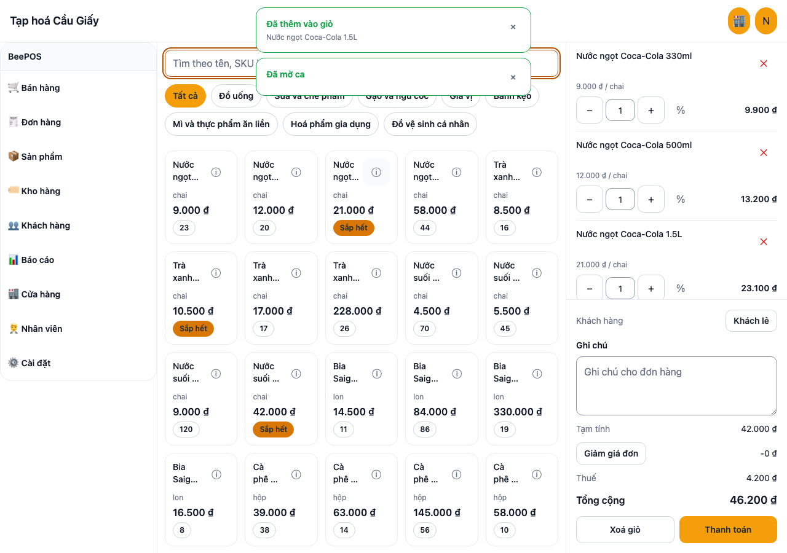
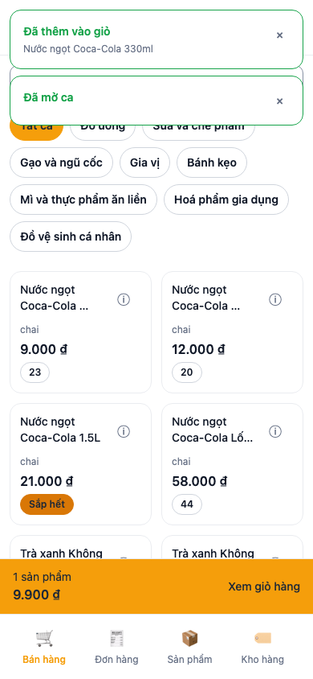
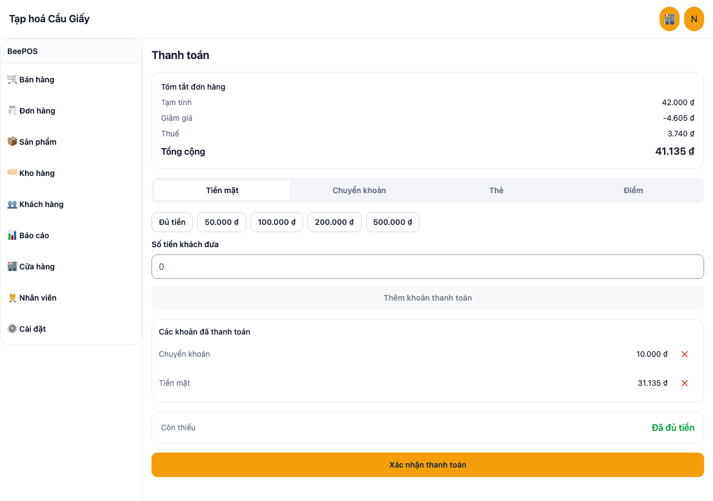
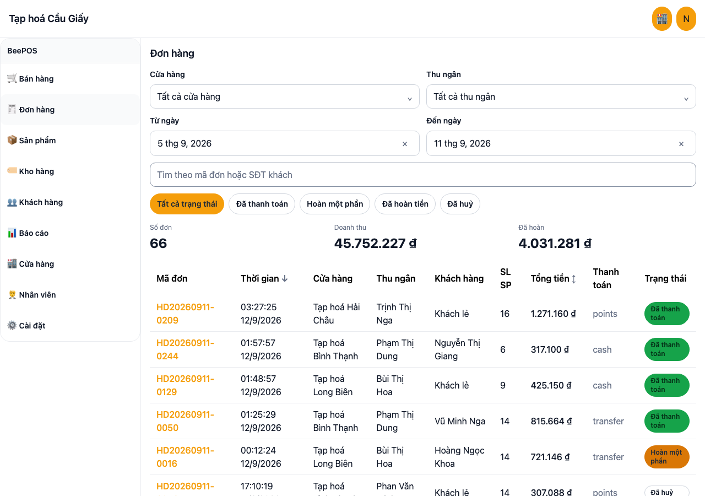
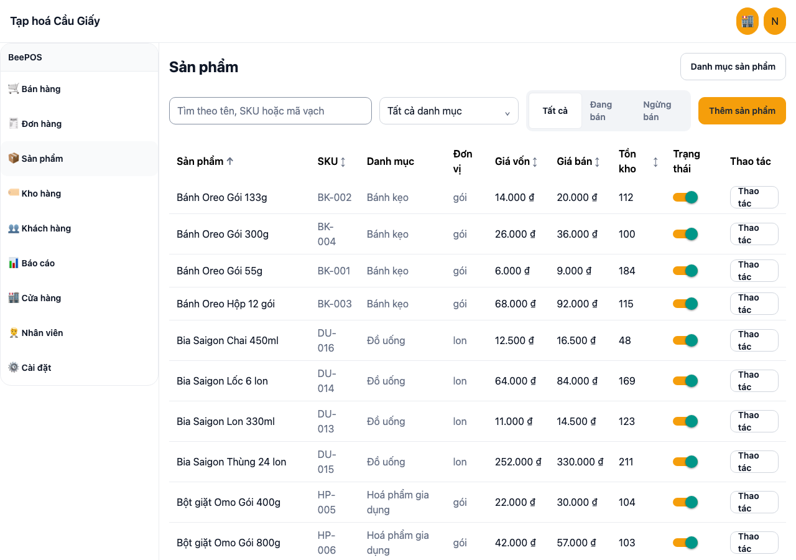
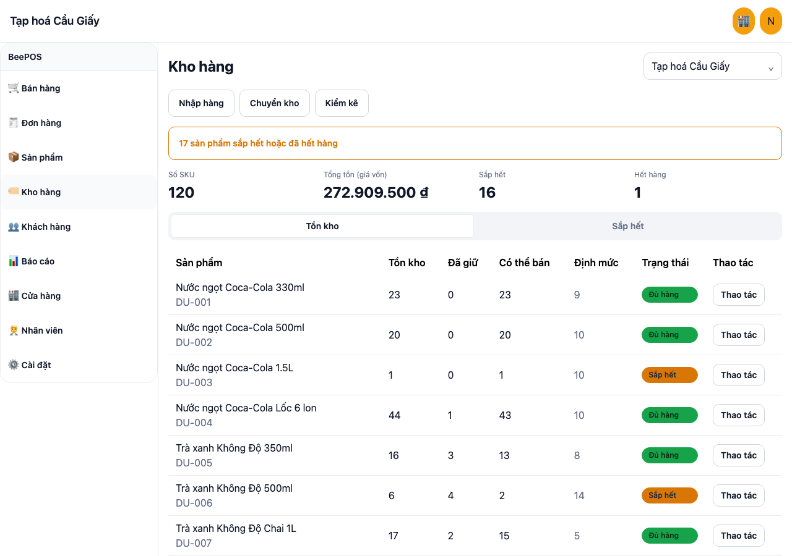
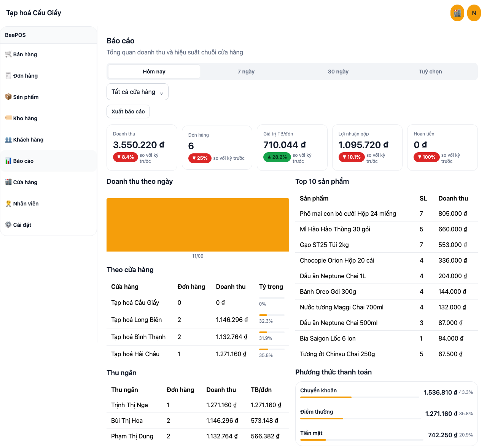
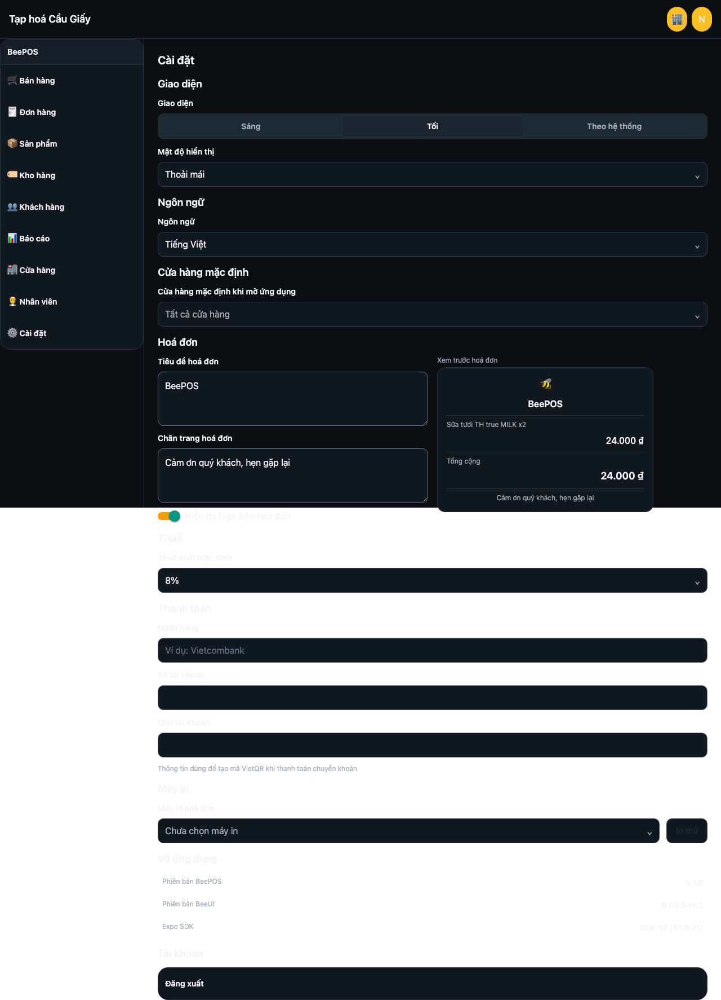

# BeePOS

Live web demo: https://beepos.beemvp.com (store code `HN01`, PIN `1234`). Deployed from `npm run deploy:web` (Expo web export served by Cloudflare Workers static assets, config in `wrangler.jsonc`).

BeePOS is an interactive UI prototype of a point-of-sale system for a Vietnamese grocery
chain (tap hoa). One Expo codebase renders the same product on iOS, Android and Web: a
cashier POS screen, orders and refunds, products and inventory, customers, chain-wide
reports, and store/staff/settings administration.

It is UI plus client-side domain logic only. There is no backend, no auth server and no
printer/scanner SDK; every screen reads and writes a seeded mock dataset that is persisted
on the device (localStorage on web, AsyncStorage on native) and can be reset from Settings.
It is built on `@beemvp/beeui-ui@0.86.2-rc.1` (+core, +tokens) installed
straight from npm, styled with Uniwind and Tailwind, and routed with expo-router.

## Second purpose: a BeeUI field audit

Building 30 screens against BeeUI's public docs, `llms*.txt` files and npm package only
(never its source) doubled as a field test of BeeUI as an outside consumer. Every friction
point was logged, turned into an executable check where possible, and filed upstream.

- Full report: [`docs/beeui-audit/report.md`](docs/beeui-audit/report.md)
- Tracking issue on BeeUI: [beobungbu/BeeUI#234](https://github.com/beobungbu/BeeUI/issues/234)

## Screenshots

| POS (wide) | POS (narrow) | Checkout |
|---|---|---|
|  |  |  |

| Orders | Products | Inventory |
|---|---|---|
|  |  |  |

| Reports | Settings (dark) |
|---|---|
|  |  |

More screenshots, covering every screen at 390px and 1280px in both themes, live under
[`docs/screenshots/`](docs/screenshots/).

## Run it

```bash
npm ci
npm run web       # Expo web dev server
npm run ios       # Expo iOS simulator
npm run android   # Expo Android emulator
```

Log in with any store code from the seed data and PIN `1234`. Store codes are defined in
[`src/data/seed/stores.ts`](src/data/seed/stores.ts) (`HN01`, `HN02`, `HCM01`, `DN01` as of
this writing). Data persists on the device between reloads; Settings has "Đặt lại dữ liệu mẫu"
to restore the seed.

## Features

- Sell screen with several open orders at once (tabs, max 8, rename by double-click or long press,
  `Alt+1..8` / `Alt+N` / `Alt+W` / `Alt+R` on web), image tiles with stock badges, category chips,
  search with `F3`, keyboard-wedge barcode scanning (fast digit burst + Enter adds the product).
- Cart with line and order discounts (5 / 10 / 20 % presets), customer attach with quick-add,
  notes, checkout with cash / transfer (VietQR placeholder) / card / points, split payments,
  formatted tendered input with quick chips, receipt print (web) or share (native).
- Shift open / close with cash count, orders list with filters, preview pane and refunds,
  products and categories, inventory with receipts, transfers and stock counts, customers with
  tiers and points, chain reports with period and custom range, stores, staff, settings
  (theme, language vi / en, density, receipt text, reset demo data).
- Desktop chrome: collapsible sidebar (`[`), 48 pt header with store switcher, one-row
  toolbars, command palette (`Cmd/Ctrl+K`), shortcut help (`?`), CSV export on orders,
  products and inventory.

## Scripts

| Script | What it does |
|---|---|
| `npm run web` / `ios` / `android` | Start the Expo dev server for that platform |
| `npm run typecheck` | Regenerate Uniwind artifacts, then `tsc --noEmit` |
| `npm test` | Run the `src/domain` unit test suite (jest-expo) |
| `npm run export:all` | `expo export` for web, iOS and Android as a build gate |
| `npm run qa:e2e` | Playwright journeys (wide + narrow); `BEEPOS_E2E_BASEURL=https://beepos.beemvp.com` targets production |
| `npm run deploy:web` | Export web and deploy to Cloudflare Workers |

## Architecture map

- `app/`: expo-router routes only. `(auth)` holds login and store selection; `(app)`
  holds the shell and every area (POS, orders, products, inventory, customers, reports,
  stores, staff, settings). Route files stay thin and delegate to `src/features`.
- `src/domain/`: pure, framework-free TypeScript: types (`types.ts`), money formatting
  and rounding (`money.ts`), and the business logic for each area (cart totals, refunds,
  stock, reports). Every module here is unit-tested and has no React or store dependency.
- `src/data/`: zustand stores per entity (`catalog-store.ts`, `order-store.ts`, etc.) and
  the deterministic seed data under `src/data/seed/` that stores load from on init.
- `src/features/`: one folder per screen area (`pos/`, `products/`, `inventory/`,
  `orders/`, `customers/`, `reports/`, `settings/`, ...), each with its screen component(s)
  and area-local UI pieces, wired to `src/domain` and `src/data`.
- `src/components/shell/`: the responsive app shell: persistent sidebar on wide screens,
  bottom tabs plus a "more" sheet on narrow ones, shared header.
- `src/i18n/`: `vi` (default) and `en` dictionaries, merged in `src/i18n/index.ts`.
- `scripts/audit/`: the tooling behind the BeeUI field audit: docs-vs-llms matrix
  builder, props-vs-`.d.ts` checker, executable behavior claims. See the report for how to
  reproduce every number in it.

## From prototype to production

BeePOS is written so a real backend can be plugged in without touching the domain layer.
The seam is the `src/data` stores: each one currently loads its initial state from
`src/data/seed/` and mutates an in-memory zustand store. To wire up a backend, replace the
seed-loading and mutation logic in these files with API calls (fetch on load, mutate via
request, optionally add optimistic updates or a query cache), while keeping the store's
public shape (state fields and actions) the same so `src/features` does not need to change:

- `src/data/catalog-store.ts` (products, categories)
- `src/data/inventory-store.ts` (stock levels, receipts, transfers, counts)
- `src/data/order-store.ts` (orders, refunds)
- `src/data/customer-store.ts` (customers)
- `src/data/cart-store.ts` (active cart)
- `src/data/shift-store.ts` (cashier shifts)
- `src/data/session-store.ts` (logged-in staff/store)
- `src/data/org-store.ts` (stores, staff)
- `src/data/settings-store.ts` (app settings)

`src/domain/` stays untouched either way: it is pure functions over plain data, so it
works the same whether that data came from the seed or from a real API response.

## BeeUI notes

BeePOS carries a few small workarounds for rough edges found in `@beemvp/beeui-ui@0.86.2-rc.1`
during the field audit. Each is documented at its call site and filed upstream:

- **`postinstall: npm run uniwind:types`** runs `uniwind generate-artifacts` on every
  install. It is not documented on BeeUI's setup pages; without it, `tsc` fails on every
  `className` on a fresh clone. ([beobungbu/BeeUI#562](https://github.com/beobungbu/BeeUI/issues/562))
- **A single outer `SafeArea`** wraps the whole app shell (`src/components/shell/app-shell.tsx`)
  instead of the doc-recommended split composition (one `SafeArea` for the header, one for
  the tab bar), because that split made `AppHeader` throw a `styleq` error on mount, on web.
  ([beobungbu/BeeUI#564](https://github.com/beobungbu/BeeUI/issues/564))
- **Empty string instead of `undefined` for conditional `className`**: passing an explicit
  `undefined` as `className` (not simply omitting the prop) throws
  `styleq: tailwind typeof undefined is not "string" or "null"` on every render, even
  though the public type is `string | undefined`. BeePOS uses `''` for the "no class"
  branch instead. ([beobungbu/BeeUI#563](https://github.com/beobungbu/BeeUI/issues/563))

## Status

Prototype with on-device persistence and no backend. Design pass, restyle, native verification
and the feature wave are recorded under `plans/260912-1054-beepos-design-pass/` and
`docs/design/`. The BeeUI field audit lives in `docs/beeui-audit/` (issue map in
`issue-index.md`).

## License

MIT. See [`LICENSE`](LICENSE). Copyright (c) 2026 Tran Duc Lan.
