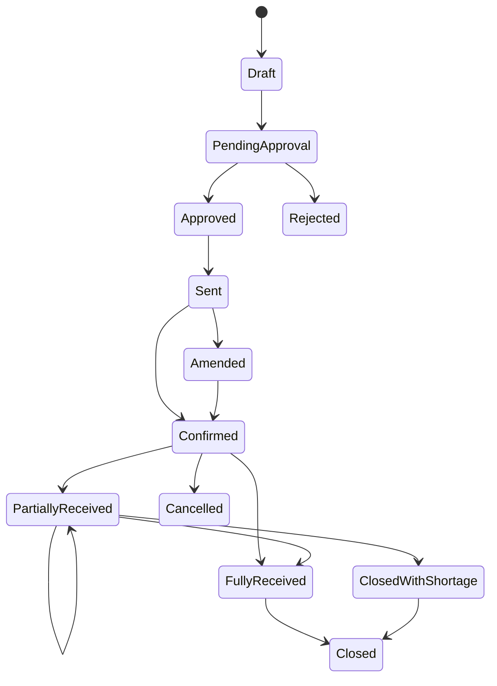

# P01 — Procure-to-Receive

Status: Business process specification · working baseline

## 1. Business purpose

Procure-to-Receive ensures that the business buys the right merchandise from an approved supplier, under agreed commercial terms, and converts the physical delivery into trusted inventory and payable evidence.

The process must protect four outcomes simultaneously:

- product availability;
- purchase-cost and margin control;
- inventory accuracy;
- supplier accountability.

## 2. Scope

Starts when a purchase requirement is identified or approved.

Ends when delivered quantities and discrepancies are resolved, inventory is available for downstream use, and the receiving evidence is complete enough for supplier settlement / finance follow-up.

Out of scope for this process specification:

- supplier sourcing / tendering strategy in depth;
- invoice accounting and payment execution;
- import/customs operations;
- technical system design.

## 3. Primary actors

| Actor | Main responsibility |
|---|---|
| Buyer / Purchasing Officer | converts requirement into supplier order and manages supplier commitment |
| Category / Commercial Manager | owns assortment and commercial guardrails, may approve material exceptions |
| Replenishment Planner | produces or validates demand/replenishment need |
| Supplier | confirms order and delivers goods |
| Receiver / Warehouse Staff | independently verifies physical delivery |
| Store / Warehouse Manager | approves material receiving exceptions |
| Inventory Control | monitors discrepancies, repeated shrinkage / receipt errors |
| Finance / AP | uses approved purchasing and receiving evidence for settlement controls |

## 4. Business objects and documents

- purchase requirement / replenishment recommendation;
- supplier-item commercial terms;
- purchase order (PO);
- supplier confirmation / amendment;
- advance shipping / delivery notice where available;
- delivery note;
- goods receipt;
- discrepancy record;
- rejected / quarantined goods record;
- supplier claim / credit evidence;
- PO completion / closure record.

## 5. Entry conditions

A purchase order should not be released unless:

- supplier is active / approved;
- destination is known;
- merchandise is permitted for the destination;
- order quantity and purchasing UOM are defined;
- agreed unit cost or pricing basis is known;
- expected delivery date / lead-time basis is defined;
- approval requirements have been satisfied.

## 6. Business status lifecycle



These are business lifecycle states, not a software implementation prescription.

## 7. Main flow

### Stage A — Requirement review

1. Requirement originates from replenishment, new assortment, promotion build, seasonal plan, emergency shortage, manual commercial decision, or approved store request.
2. Buyer checks current stock, open orders, in-transit quantity, lead time, MOQ, pack size and expected demand.
3. Duplicate purchasing need is removed or consolidated.
4. Source supplier is selected based on approved commercial terms and availability.

### Stage B — Purchase order preparation

5. Buyer prepares PO with at minimum:
   - supplier;
   - destination;
   - item / SKU;
   - order quantity;
   - purchase UOM / pack;
   - agreed cost / price basis;
   - expected delivery date;
   - commercial notes / terms where required.
6. System- or policy-derived warnings do not replace buyer responsibility for commercial plausibility.
7. PO is submitted for approval where authority rules require it.

### Stage C — Approval and supplier commitment

8. Approver reviews material exceptions: high value, unusual quantity, cost variance, unapproved supplier, emergency purchase, unusually short lead time or off-contract purchase.
9. Approved PO is released to supplier.
10. Supplier confirms, rejects, or proposes changes.
11. Buyer resolves proposed change before treating it as committed supply.
12. Significant changes to quantity, cost, delivery date or item substitution require explicit amendment rather than silent overwrite.

### Stage D — Delivery preparation

13. Receiving location reviews expected receipts for operational planning.
14. Where appointment / dock scheduling applies, delivery is scheduled.
15. Receiver should know what shipment / supplier is expected but should independently count physical goods.

### Stage E — Physical receiving

16. Delivery identity is matched to supplier and intended destination.
17. Delivery documents are checked.
18. Item identity is verified.
19. Physical quantity is counted.
20. Packaging and condition are inspected.
21. For relevant grocery / perishable categories, expiry / remaining shelf life, batch/lot or temperature evidence is checked according to policy.
22. Accepted quantity, rejected quantity and discrepancy reasons are recorded separately.

### Stage F — Discrepancy resolution

23. Receiver compares actual delivery against PO / expected delivery.
24. Shortage, overage, substitution, damage, expiry, packaging mismatch or price/cost issue is routed according to tolerance rules.
25. Manager / buyer approval is required for exceptions outside tolerance.
26. Supplier claim or credit evidence is created where required.

### Stage G — Receipt completion

27. Accepted stock becomes available according to put-away / quality-release policy.
28. Open PO quantity is recalculated.
29. Remaining quantity is either kept open, backordered, cancelled or sourced elsewhere.
30. Receiving evidence becomes available to Finance / AP.
31. PO is closed only when remaining obligations and discrepancies are resolved according to closure policy.

## 8. Exception catalogue

| Exception | Required business treatment |
|---|---|
| Partial delivery | retain remainder, backorder, cancel remainder or source elsewhere |
| Over-delivery | reject excess, accept within tolerance, or approve amendment |
| Wrong item | reject or formally approve substitution; never silently map to another SKU |
| Damaged goods | reject, quarantine, claim, or accept with controlled disposition |
| Expired / short-dated | reject or approve under explicit shelf-life policy |
| Cost mismatch | tolerance approval, supplier correction, PO amendment or escalation |
| UOM / pack mismatch | convert only under approved rule; investigate supplier/item setup |
| Duplicate delivery | stop receipt until original receipt / shipment status is verified |
| Delivery without PO | emergency receiving procedure only; post-approval required |
| Unknown barcode / item | quarantine or resolve master-data issue before normal receipt |
| Late delivery | receive if still commercially valid; record supplier service failure |
| Missing delivery document | receive only under controlled exception policy |

## 9. Tolerance policy categories

Tolerance values are business policy and may differ by supplier/category.

Typical dimensions:

- quantity shortage tolerance;
- quantity overage tolerance;
- purchase cost variance tolerance;
- delivery date tolerance;
- expiry / minimum remaining shelf life;
- damaged quantity threshold;
- minimum order / case-pack constraints.

Material exceptions should be visible rather than normalized away.

## 10. Controls and segregation of duties

Minimum recommended controls:

- only approved suppliers may receive normal POs;
- PO approval is separate from physical receipt for material purchases;
- receiver records actual quantity, not merely the ordered quantity;
- material PO changes remain traceable;
- receipt exceptions require reason code / explanation;
- completed receipt is not silently rewritten to hide discrepancy;
- supplier claims and rejected quantity remain linked to the delivery;
- high-value / high-variance receiving is independently reviewed;
- duplicate receipt checks are mandatory;
- Finance should not pay based only on supplier invoice where receiving evidence is required.

## 11. Three-way business control concept

For businesses using PO-based purchasing, settlement confidence normally comes from comparing:

```text
Purchase Order
      ↓
Goods Receipt
      ↓
Supplier Invoice
```

The commercial question is not whether all three documents are identical, but whether quantity, cost and exceptions are explainable within agreed tolerances.

## 12. KPI set

### Service

- supplier OTIF (on time in full);
- supplier fill rate;
- average delivery lateness;
- overdue open PO value / quantity.

### Accuracy

- receipt discrepancy rate;
- wrong-item rate;
- receiving correction rate;
- damaged / rejected delivery rate.

### Commercial

- purchase price variance;
- emergency purchase rate;
- off-contract purchase rate;
- supplier claim / credit value.

### Productivity

- PO cycle time;
- dock-to-receipt completion time;
- lines received per labor hour where relevant.

## 13. Management questions this process must answer

A competent operating process should allow management to answer:

- What have we ordered but not yet received?
- Which POs are overdue and by how much?
- Which suppliers repeatedly short-ship or deliver late?
- What quantity did the supplier actually deliver versus what was ordered?
- Which receipts were accepted outside tolerance and who approved them?
- How much inventory is quarantined / rejected due to supplier quality?
- Are we paying for quantities we did not receive?
- Which categories suffer the highest receiving discrepancy?

## 14. Worked example

PO: 100 cases of bottled water, 24 bottles/case, delivery due 10 Sep.

Actual delivery:

- 95 good cases;
- 3 damaged cases;
- 2 cases not delivered.

A robust process records three different facts:

- 95 cases accepted into usable inventory;
- 3 cases rejected / claimable due to damage;
- 2 cases remain undelivered or are cancelled/backordered.

It must not simply record `100 received` because a supplier note said 100.

## 15. Research anchors

- APQC PCF and sourcing/procurement definitions: https://www.apqc.org/process-frameworks
- APQC sourcing and procurement process reference: https://www.apqc.org/resource-library/resource/understanding-sourcing-and-procurement-processes
- Oracle Retail shipments and receipts: https://docs.oracle.com/en/industries/retail/retail-merchandising-foundation-cloud/latest/rfiug/shipments-and-receipts.htm
- KiotViet purchase ordering: https://www.kiotviet.vn/huong-dan-su-dung-kiotviet/retail-giao-dich/dat-hang-nhap/

## 16. Open business-policy questions for BeePOS product discovery

These require retailer policy choices, not technical answers:

- Is receipt without PO allowed?
- Which categories require expiry / lot capture?
- What is the minimum remaining shelf life by category?
- Are over-deliveries ever automatically acceptable?
- When does a partial PO automatically close?
- Who may approve purchase-cost variance?
- Is store-level direct purchasing allowed or only central purchasing?
- How is supplier substitution governed?
