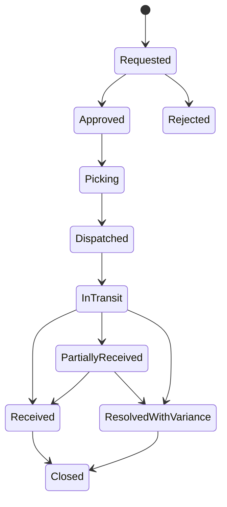

# P02 — Inventory-to-Availability

Status: Business process specification · working baseline

## 1. Business purpose

Inventory-to-Availability ensures that recorded stock reflects physical reality closely enough to support selling, replenishment, transfer, finance and shrinkage control.

The business question is not merely “how much stock do we have?” but:

- where is it;
- is it physically present;
- is it saleable;
- is it already committed;
- is it in transit;
- is it damaged / quarantined / expired;
- can the customer actually buy it now?

## 2. Scope

Includes:

- stock visibility by location;
- transfer between locations;
- cycle / full inventory counts;
- inventory adjustment;
- damage, expiry and shrinkage;
- discrepancy investigation;
- availability monitoring.

Does not prescribe software architecture or stock-ledger implementation.

## 3. Actors

| Actor | Responsibility |
|---|---|
| Store Manager | local stock accountability and exception approval |
| Store Stock Staff | receiving, movement, shelf/backroom handling and count execution |
| Warehouse / DC Staff | warehouse inventory operations where applicable |
| Inventory Controller | accuracy, variance analysis, stock controls |
| Operations Manager | chain-level exception oversight |
| Loss Prevention / Internal Control | investigation of suspicious shrinkage / adjustments |
| Buyer / Planner | consumes trustworthy inventory for supply decisions |
| Finance | consumes stock value and adjustment evidence downstream |

## 4. Business inventory states

A useful business view distinguishes at least:

- **On hand** — physically owned/held at a location according to records;
- **Available** — quantity allowed to be promised/sold after reservations or unavailable status;
- **Reserved / committed** — allocated to customer/order/operation where applicable;
- **In transit** — dispatched from source but not yet accepted at destination;
- **Damaged / quarantine** — physically present but not normally saleable;
- **Expired / disposal pending** — no longer saleable;
- **Expected inbound** — ordered or transferred but not yet physically received.

Exact calculation policy varies by retailer; terminology must be consistent across all processes.

## 5. Main subprocesses

### 5.1 Stock visibility and exception detection

1. Review stock by item/location/status.
2. Identify low, zero, negative, excessive, aged or expiring stock.
3. Compare stock signals with actual store conditions where risk is high.
4. Create investigation / replenishment / transfer / count action as appropriate.

### 5.2 Internal transfer

Business flow:

1. Need for transfer is identified: shortage balancing, overstock, promotion, emergency customer demand, opening/closing store, or DC allocation.
2. Source availability is confirmed.
3. Transfer is requested and approved where policy requires.
4. Source physically picks and verifies quantity.
5. Goods are dispatched; responsibility becomes in-transit.
6. Destination independently counts received quantity.
7. Shortage, overage, wrong item or damage is recorded.
8. Difference is investigated / allocated to source, transit, destination or unresolved loss according to evidence.
9. Transfer closes only after dispatched versus received differences are resolved.

### 5.3 Stock count / physical inventory

1. Define count scope: full store, category, high-risk items, cycle-count group, or incident-driven count.
2. Define count date / period and movement-control policy.
3. Prepare locations/items for count.
4. Perform physical count.
5. Recount material variances independently where required.
6. Compare physical to book stock.
7. Investigate material difference.
8. Assign reason where known.
9. Approve adjustment according to authority threshold.
10. Adjust business stock record to approved physical result.
11. Escalate repeated or unexplained shrinkage.

Blind counts are preferred for high-risk scenarios because displaying expected stock can bias the counter.

### 5.4 Inventory adjustment

Adjustments may originate from:

- damage;
- breakage;
- expiry / spoilage;
- theft / loss;
- found stock;
- administrative correction;
- count variance;
- transfer discrepancy resolution;
- customer return disposition;
- supplier return.

Every non-routine adjustment should have a business reason and accountable actor.

## 6. Transfer exception catalogue

| Exception | Business response |
|---|---|
| Source cannot fill requested qty | partial dispatch, substitute only if explicitly allowed, or cancel remainder |
| Destination receives less than dispatched | recount, inspect documents, investigate transit/source error |
| Destination receives more | verify duplicate / wrong shipment before acceptance |
| Wrong item | quarantine / return / corrected receipt |
| Damage in transit | classify responsibility and disposition |
| Transfer sits in transit too long | aging escalation |
| Transfer cancelled after pick | reverse staging / return stock to source control |
| Wrong destination | controlled redirect or return |

Oracle Retail explicitly treats transfer shortage/overage at sending and receiving locations as inventory-adjustment scenarios, reinforcing the need to preserve discrepancy responsibility rather than silently force quantities to match.

## 7. Stock-count exception catalogue

- count differs from expected;
- second count differs from first count;
- count done during uncontrolled movement;
- item found in wrong location;
- unidentified item / barcode;
- sealed case quantity inconsistent with pack assumption;
- high-value variance;
- repeated variance for same item / employee / store;
- negative expected stock;
- stock exists in system but cannot be located;
- physical stock exists but system shows zero.

## 8. Business rules

Recommended baseline rules:

- physical movement must not be invented merely to “fix the number”;
- material adjustments require reason and approval;
- count variance is corrected by controlled adjustment, not by rewriting historical sales or receipts;
- transfer source and destination quantities remain independently observable;
- damaged / quarantined stock must not inflate customer availability;
- in-transit stock should not be simultaneously available at source and destination;
- negative stock, if operationally permitted, is an exception requiring monitoring rather than a normal state;
- repeated manual corrections trigger root-cause review.

## 9. Segregation of duties

Risk is highest when one person can:

1. move or remove goods;
2. count the same stock;
3. approve their own variance;
4. erase evidence of the adjustment.

Recommended controls by risk level:

- independent recount above threshold;
- separate approval for high-value adjustments;
- mandatory reason / evidence for material loss;
- periodic review of adjustments by store, user, item and reason;
- restricted ability to backdate inventory corrections.

## 10. KPI framework

### Accuracy

- inventory record accuracy %;
- unit / value count variance;
- adjustment rate;
- negative-stock incidence;
- repeat variance rate.

### Loss

- shrinkage % of sales / inventory;
- damaged stock value;
- expired / spoiled stock value;
- unexplained adjustment value.

### Availability

- out-of-stock rate;
- on-shelf availability;
- stockout duration;
- stock exists-but-not-found rate.

### Transfer

- transfer fill rate;
- transfer lead time;
- transfer discrepancy %;
- in-transit aging;
- emergency transfer frequency.

### Working capital

- stock turn;
- days of inventory / weeks of supply;
- excess stock value;
- aging / slow-moving inventory.

## 11. Root-cause taxonomy for variance

A useful investigation taxonomy separates:

- receiving error;
- sales / checkout error;
- return error;
- transfer error;
- count error;
- damage / spoilage;
- theft / suspected theft;
- UOM / pack-master error;
- barcode / item-master error;
- timing / late posting;
- unknown / unexplained.

“Unknown” is necessary, but a high unknown share is itself a control KPI.

## 12. Management questions

The operating model should answer:

- Which stores have the worst inventory accuracy?
- What stock is in transit and overdue?
- What quantity is unavailable due to damage / quarantine?
- Which products repeatedly go negative?
- Which items show repeated count variance?
- Where is shrinkage concentrated by category, store, shift or process?
- Which transfers have unresolved shortages?
- How much stock is excess / slow / near expiry?

## 13. Worked transfer example

Store A sends 10 units to Store B.

- Source dispatch count: 10.
- Destination initial count: 8.
- Recount: 8.
- Package damage: none.

The business record must preserve that 10 left source and 8 reached destination. The missing 2 require an exception resolution; changing dispatch quantity to 8 after the fact would destroy the evidence needed to locate the loss.

## 14. Worked stock-count example

Expected stock = 50.

First count = 44.

Recount = 45.

Approved physical stock = 45.

Variance = -5, with reason initially “unexplained”. The process should post the approved correction and retain the investigation, not rewrite earlier receipts or sales to make history sum to 45.

## 15. Research anchors

- Oracle Retail inventory adjustments: https://docs.oracle.com/en/industries/retail/retail-merchandising-foundation-cloud/21.0/rmsim/inventory-adjustments.htm
- Oracle Retail shipments and receipts: https://docs.oracle.com/en/industries/retail/retail-merchandising-foundation-cloud/latest/rfiug/shipments-and-receipts.htm
- KiotViet inventory count: https://www.kiotviet.vn/huong-dan-su-dung-kiotviet/retail-hang-hoa/kiem-kho/
- KiotViet transfers: https://www.kiotviet.vn/huong-dan-su-dung-kiotviet/retail-hang-hoa/chuyen-hang/
- SAP Retail Store inventory management: https://help.sap.com/docs/SAP_ERP/98c2704cf26a4120ae7168868b2e7da5/b1f0c353b677b44ce10000000a174cb4.html

## 16. Open business-policy questions

- Are negative sales allowed when recorded stock is zero?
- Are stores permitted to transfer stock without central approval?
- What value / variance triggers an independent recount?
- Which reasons require evidence/photo/witness?
- Which categories require FEFO and expiry controls?
- How often is each ABC/risk class counted?
- When is in-transit loss assigned to source, carrier or destination?
- Can damaged stock later be restored to saleable status and under whose approval?
