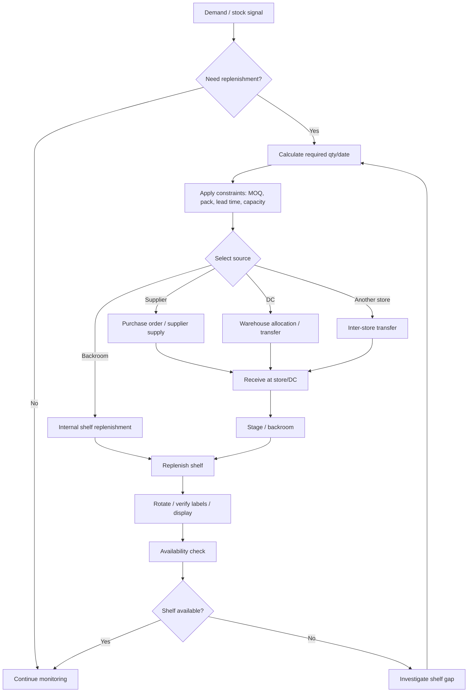

# P03 — Replenish-to-Shelf

Status: Business process specification · working baseline

## 1. Business purpose

Replenish-to-Shelf keeps products available for customers at the right place and time while avoiding excess stock, unnecessary emergency transfers and waste.

The process bridges planning and store execution. A retailer can have stock in the company and still lose sales if the stock is not at the right store or remains in the backroom while the shelf is empty.

## 2. Scope

Includes:

- demand/replenishment signal review;
- replenishment policy execution;
- source selection;
- supplier/DC/store supply;
- store receiving and staging;
- backroom-to-shelf movement;
- shelf-gap detection and resolution;
- FEFO/FIFO rotation where relevant;
- price/promotion display verification.

## 3. Actors

| Actor | Responsibility |
|---|---|
| Demand / Replenishment Planner | identifies required quantity and timing |
| Buyer | supplier-facing order where replenishment source is external |
| DC / Warehouse | fulfills internal replenishment |
| Store Manager | local availability, override and exception accountability |
| Store Stock Staff | receive, stage, replenish shelf, rotate stock |
| Category / Commercial Team | assortment, promotional and presentation requirements |
| Operations Manager | chain availability and exception management |

## 4. Key business inputs

- historical sales;
- current stock;
- expected receipts;
- in-transit stock;
- forecast / planned demand;
- seasonality;
- promotion / event uplift;
- reorder point;
- safety stock;
- min / max / target stock;
- lead time;
- supplier MOQ;
- case pack / order multiple;
- shelf capacity / presentation minimum;
- store assortment / listing status.

SAP Retail describes store replenishment as calculating optimal procurement quantities and dates from demand, current stock, planned receipts and target stock, with the source potentially being a DC or external supplier.

## 5. Main flow

## 6. Stage A — Identify replenishment need

A replenishment need may arise from:

- stock below reorder / target threshold;
- forecast shortage before next delivery;
- zero stock / stockout;
- shelf gap detected by staff;
- upcoming promotion;
- seasonal / event demand;
- manual store request;
- store opening / expansion;
- excess stock balancing from another location.

Business rule: a low recorded stock quantity is not the only valid trigger. Shelf availability, in-transit timing and upcoming demand matter.

## 7. Stage B — Determine target quantity

Planner / policy should consider:

- forecast demand until next viable replenishment;
- desired safety stock;
- current saleable stock;
- expected inbound;
- committed/reserved quantity;
- minimum order;
- case pack / purchase multiple;
- shelf / backroom capacity;
- expiry risk;
- promotion uplift;
- supplier/DC service constraints.

The calculated quantity may be overridden, but override reason should be visible for meaningful review.

## 8. Stage C — Select source

Potential sources:

1. external supplier;
2. central / regional distribution center;
3. another store;
4. store backroom;
5. special emergency source approved by management.

Source selection should balance:

- available quantity;
- lead time;
- transport cost;
- purchase cost;
- minimum order / case pack;
- expiry risk;
- impact on source location service level.

## 9. Stage D — Store receiving and staging

When replenishment reaches store:

1. expected shipment is identified;
2. actual quantity and condition are checked;
3. discrepancy is recorded;
4. accepted goods are staged in appropriate location;
5. priority items may move directly to shelf;
6. chilled/frozen/perishable items follow category handling policy;
7. remaining shelf life is checked where applicable.

## 10. Stage E — Backroom-to-shelf execution

1. Shelf gap / low presentation is identified.
2. Staff locate backroom stock.
3. Stock is moved to shelf.
4. FEFO/FIFO is applied by product policy.
5. Old / damaged / expired stock is removed from saleable shelf.
6. Facing / presentation requirements are restored.
7. Shelf label is checked against current selling condition.
8. Promotion material / location is verified where relevant.
9. Unresolved availability exception is escalated.

## 11. Shelf-gap taxonomy

A shelf gap can mean very different business problems:

| Situation | Likely response |
|---|---|
| Stock truly zero | trigger external/internal replenishment |
| Stock in backroom | replenish shelf immediately |
| Stock record positive but item not found | investigate inventory accuracy |
| Goods in transit | evaluate ETA / emergency alternative |
| Product delisted / not ranged | do not replenish; correct display |
| Product blocked / quarantined | maintain unavailable status |
| Price / label issue prevents sale | correct execution, not inventory |
| Promotion demand exceeded plan | expedite / reallocate stock |

This distinction is critical: “out of stock on shelf” is not always “no inventory in system”.

## 12. FEFO / FIFO business rules

For date-sensitive products:

- FEFO (first expiry, first out) is generally preferred;
- short-dated stock should be identified before it becomes unsaleable;
- replenishment should not bury older stock behind newer stock;
- receiving policy and shelf policy must use compatible expiry rules;
- material expiry write-off is an operational KPI, not just an inventory adjustment.

## 13. Exception catalogue

- supplier delay;
- DC short shipment;
- inter-store transfer delayed;
- stock exists but cannot be located;
- order multiple creates excessive stock;
- store storage capacity exceeded;
- wrong assortment / item not ranged;
- promotion stock insufficient;
- short shelf life;
- repeated shelf gap despite positive stock;
- new product without reliable demand history;
- forecast spike / event demand;
- store manually over-orders;
- replenishment recommendation suppressed or overridden.

## 14. Controls

Recommended controls:

- replenishment override has actor/reason where material;
- emergency orders / transfers are reviewed;
- shelf gaps with positive stock trigger operational investigation;
- promotion stock build is separated from normal baseline where needed;
- expiring stock receives proactive action;
- repeated stockout and excess stock are reviewed together;
- source-store transfers must not create a second stockout worse than the first;
- non-ranged items must not be repeatedly replenished by error.

## 15. KPI framework

### Availability

- on-shelf availability (OSA);
- out-of-stock rate;
- stockout duration;
- lost-sales proxy;
- shelf-gap resolution time.

### Supply service

- replenishment fill rate;
- lead time;
- supplier/DC OTIF;
- emergency replenishment rate.

### Inventory efficiency

- stock turn;
- weeks/days of supply;
- excess stock value;
- aged stock;
- expiry/spoilage rate.

### Planning quality

- forecast bias / error where forecasting exists;
- manual override rate;
- repeated override by SKU/store;
- promotional forecast variance.

## 16. Management questions

- Which stores/products lose availability most frequently?
- How many shelf gaps occur while backroom stock exists?
- Which replenishment source has the worst fill rate?
- Are store overrides improving or worsening stock outcomes?
- Which products are simultaneously overstocked in one store and stocked out in another?
- How much stock will expire before likely sale?
- How much emergency transfer activity is compensating for poor planning?
- Which promotions were understocked?

## 17. Worked example

Product sells 8 units/day.

- current saleable stock: 12;
- planned receipt in 3 days: 24;
- safety stock target: 8;
- no promotion.

Expected demand before receipt = 24 units. Current stock = 12, so the store faces a projected shortfall before the planned receipt. A competent process flags the risk even though stock is currently positive.

If another nearby store has 80 units and low demand, inter-store transfer may be a better emergency response than a supplier order, depending on transport and policy.

## 18. Research anchors

- SAP Replenishment Planning for Stores: https://help.sap.com/docs/SAP_S4HANA_CLOUD_BEST_PRACTICES/213926733b2ca93ae8f209142315cfe1/12648c82fa6746b8b5978e5e565c1124.html
- SAP Replenishment example scenarios: https://help.sap.com/docs/SAP_S4HANA_ON-PREMISE/9905622a5c1f49ba84e9076fc83a9c2c/239fc7536e8e2a4be10000000a174cb4.html
- SAP Replenishment article/site master data: https://help.sap.com/docs/SAP_S4HANA_CLOUD/64609d0ecac54654b0837cba34555b82/419fc7536e8e2a4be10000000a174cb4.html
- APQC Retail PCF: https://www.apqc.org/resource-library/resource-listing/apqc-process-classification-framework-pcf-retail-pdf-version-721

## 19. Open business-policy questions

- Centralized or store-led replenishment?
- Are store managers allowed to override recommendations freely?
- What are min/max/safety-stock policies by category?
- Which products require promotion uplift planning?
- What counts as acceptable OSA by category?
- When may one store take stock from another store?
- What shelf-life threshold blocks replenishment to store?
- How should new items be replenished before enough sales history exists?
