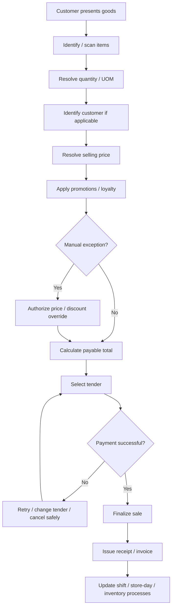

# P04 — Store-to-Cash

Status: Business process specification · working baseline

## 1. Business purpose

Store-to-Cash converts customer demand into a complete, accurately priced, authorized and auditable retail sale, with the correct tender collected and the transaction available for inventory, customer, cash and management processes.

The objective is not only fast checkout. A strong process balances:

- customer speed and convenience;
- price/promotion accuracy;
- tender integrity;
- fraud / override control;
- correct inventory impact;
- receipt / fiscal compliance;
- reliable downstream sales reporting.

## 2. Scope

Starts when a customer presents merchandise / initiates checkout.

Ends when the sale is finalized, tender is accepted, receipt/invoice obligation is fulfilled, and the sale is available for shift and store-day reconciliation.

Includes suspended / abandoned basket, price dispute, promotion exception and payment failure.

Returns are handled in P05.

## 3. Actors

| Actor | Responsibility |
|---|---|
| Customer | selects goods and provides payment / customer identity where desired |
| Cashier | executes checkout and follows authorization policy |
| Store Manager / Supervisor | approves overrides and resolves exceptions |
| Customer Service | supports complex customer issue where applicable |
| Payment Provider / Bank | authorizes non-cash tender |
| Commercial / Pricing Team | owns published prices/promotions upstream |
| Finance / Store Control | consumes tender/sales records downstream |

## 4. Preconditions

Normal sale should require:

- authorized cashier or operator;
- active selling location / register;
- active business day / shift according to policy;
- product allowed for sale;
- valid price or approved exception method;
- payment methods enabled for the store.

## 5. High-level flow

## 6. Stage A — Basket creation

1. Cashier scans or identifies item.
2. Item identity and sale eligibility are checked.
3. Quantity is confirmed.
4. Where multiple units/pack sizes exist, the selling UOM must be understood.
5. Customer may be identified before or during checkout.
6. Basket can be suspended/held according to store policy without being treated as completed sale.

### Product-not-found exception

Possible response:

- search by name / alternate identifier;
- verify shelf label / product information;
- request supervisor assistance;
- create controlled open-price/open-item only if retailer policy explicitly allows it.

A cashier should not invent a tracked product or arbitrary price to make the queue move faster.

## 7. Stage B — Price determination

The operational question is: “What price is the customer entitled to pay here, now, for this item?”

Possible influences:

- regular price;
- store/zone/channel-specific price;
- scheduled price change;
- markdown / clearance;
- customer group or contract price where allowed;
- promotion;
- coupon / voucher;
- loyalty benefit;
- approved manual override.

Price resolution and promotion are related but distinct business concepts.

## 8. Price dispute process

When customer disputes price:

1. Do not silently alter price.
2. Verify shelf / advertisement / approved campaign evidence.
3. Determine whether store execution is wrong or customer expectation is wrong.
4. Apply retailer's customer-service / price-match / labeling-error policy.
5. Require supervisor approval above configured/value policy.
6. Record material override reason.
7. Correct upstream shelf/label issue so later customers do not repeat the same dispute.

## 9. Stage C — Promotion and loyalty execution

1. Evaluate customer/item/basket eligibility.
2. Apply valid offers.
3. Make excluded products / conditions clear where customer challenge arises.
4. Avoid double application where programs are non-stackable.
5. Ensure gifts/free items are physically delivered and transactionally recognized according to policy.
6. Loyalty points / redemption should be visible to customer where practical.

### Promotion-not-applied exception

Check:

- start/end time;
- participating store;
- item/SKU eligibility;
- required quantity / basket threshold;
- customer group;
- coupon code / usage conditions;
- conflicting promotion;
- shelf material executed before/after valid period.

Manual compensation should follow policy rather than disguising a promotion defect as a generic discount.

## 10. Stage D — Manual discount / override

Manual discount is a controlled exception, not the primary pricing mechanism.

Recommended controls:

- reason mandatory above trivial threshold;
- cashier limit by value / percentage;
- manager approval above cashier limit;
- high discount frequency reviewed by employee/store;
- no self-approval where material;
- price override and discount remain distinguishable for analysis.

## 11. Stage E — Tender and payment

Common tender types:

- cash;
- bank card;
- bank transfer / QR payment;
- store credit / voucher;
- loyalty points where permitted;
- mixed/split tender.

Business rules:

- tender must cover payable amount before normal completion;
- cash change is calculated and returned;
- external payment authorization must not be assumed from customer screenshot alone where provider confirmation is required;
- duplicate charge prevention is critical after timeout/retry;
- split tender must retain each component for later refund/reconciliation;
- cash received and change given affect expected till cash.

## 12. Payment failure scenarios

### Card / electronic decline

- inform customer;
- retry only according to provider/store policy;
- offer another tender;
- transaction remains unpaid until confirmed.

### Timeout / uncertain status

This is more dangerous than a clean decline.

Business response:

1. Check provider/payment status if available.
2. Avoid blindly retrying and double-charging.
3. Escalate uncertain payments according to store procedure.
4. If a later duplicate settlement occurs, it enters reconciliation/customer-resolution workflow.

### Customer abandons after failed payment

Basket is cancelled/held according to policy; no completed sale should be created without approved tender outcome.

## 13. Stage F — Sale finalization

On completion:

- commercial amount is fixed for the sale;
- payment/tender outcome is attached;
- sale becomes part of shift/store-day totals;
- inventory is treated as sold according to retailer policy;
- customer/loyalty effect is recognized;
- receipt and required fiscal process are triggered;
- later correction occurs through controlled void/return/adjustment rather than silent deletion.

## 14. Void / cancel distinction

Useful business distinction:

- **Basket cancellation**: sale was never finalized.
- **Void before finalization**: line/basket is removed under current transaction controls.
- **Post-void / cancellation of completed sale**: high-risk corrective action requiring stronger authorization and audit.
- **Return/refund**: customer gives back value/merchandise after completed sale; handled separately.

Terminology must be chosen consistently by the retailer.

## 15. Receipt / invoice

A completed sale should provide required customer evidence and fiscal output according to law/policy.

The business must distinguish:

- customer receipt;
- electronic invoice / fiscal document;
- card/payment slip where applicable;
- reprint / copy.

Receipt reprint is not a new sale.

## 16. Controls

Recommended minimum:

- unique operator accountability;
- role-based discount / override authority;
- material manual price override reason;
- completed transactions cannot disappear silently;
- repeated void/refund/discount patterns are reviewed;
- payment retries are controlled;
- till cash is reconciled to transaction activity;
- restricted item/category rules enforced where applicable;
- store selling price execution periodically checked against approved commercial price.

## 17. Key exception catalogue

| Exception | Business response |
|---|---|
| Barcode not found | search/verify; do not invent tracked product |
| No price | supervisor/commercial exception procedure |
| Shelf price differs | verify and apply retailer price-dispute policy |
| Promo not applied | validate eligibility/timing; controlled compensation if policy allows |
| Item blocked / recalled | prevent sale and escalate |
| Customer wants quantity change | update before finalization |
| Cashier discount exceeds limit | manager approval |
| Payment declined | alternative tender or cancel |
| Payment status uncertain | verify before retry to prevent duplicate capture |
| Insufficient cash for change | store cash procedure / alternate tender |
| Register/printer problem | preserve sale evidence; follow contingency process |

## 18. KPI framework

### Commercial

- gross sales / net sales;
- transaction count;
- average basket value;
- units per transaction;
- gross margin;
- discount % of sales;
- promotion % of sales.

### Customer / productivity

- checkout time;
- transactions per cashier hour;
- abandoned checkout rate;
- price dispute frequency;
- payment failure rate.

### Control

- manual discount rate;
- price override rate;
- void rate;
- no-sale drawer-open rate where tracked;
- suspicious cashier pattern count;
- tender mismatch downstream.

## 19. Management questions

- Which stores/cashiers have unusually high manual discounts?
- Which SKUs generate repeated price disputes?
- Which promotion mechanics generate the most cashier exceptions?
- How often do electronic payments have uncertain/duplicate outcomes?
- What percentage of baskets are abandoned at checkout?
- Which tender methods drive the most reconciliation differences?
- Do high checkout speeds correlate with higher errors or voids?

## 20. Worked example — promotion + manual exception

Basket:

- 3 beverages at regular price;
- approved promotion = buy 2, get 1 free;
- one beverage has damaged packaging and manager additionally authorizes 10% manual discount on the payable item.

The business should be able to distinguish:

- benefit from promotion;
- manual goodwill/condition discount;
- final customer amount.

Combining all reductions into one anonymous `discount` destroys promotional ROI and cashier-control analysis.

## 21. Research anchors

- APQC Retail PCF: https://www.apqc.org/resource-library/resource-listing/apqc-process-classification-framework-pcf-retail-pdf-version-721
- Oracle Retail Pricing introduction: https://docs.oracle.com/en/industries/retail/retail-pricing-cloud/latest/pcsog/introduction.htm
- KiotViet promotions: https://www.kiotviet.vn/huong-dan-su-dung-kiotviet/retail-khuyen-mai/khuyen-mai/
- Oracle Retail Sales Audit overview: https://docs.oracle.com/en/industries/retail/retail-merchandising-foundation-cloud/24.0.101.0/rsaat/sales-audit-overview.htm

## 22. Open business-policy questions

- Are open-price items ever allowed?
- What is the cashier manual discount limit?
- What manager override requires reason/evidence?
- Which tenders may be mixed?
- What is the procedure for uncertain QR/card payment?
- Can a customer receipt be reprinted without manager approval?
- How does store handle incorrect shelf labels?
- Which goods are non-returnable / restricted-sale?
