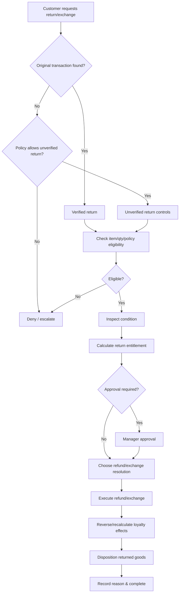

# P05 — Return-to-Resolution

Status: Business process specification · working baseline

## 1. Business purpose

Return-to-Resolution resolves post-sale customer returns, exchanges and refunds fairly while protecting customer trust, inventory integrity, margin and fraud controls.

Returns are not simply “negative sales”. They require policy decisions about eligibility, original commercial value, tender, customer behavior and the physical condition of returned merchandise.

## 2. Scope

Starts when a customer asks to return or exchange a previously purchased item.

Ends when:

- customer financial resolution is completed or denied;
- merchandise disposition is decided;
- loyalty / promotion implications are resolved;
- return reason and approval evidence are retained;
- the event is available for operational/fraud analysis.

## 3. Actors

| Actor | Responsibility |
|---|---|
| Customer | presents item and purchase evidence where available |
| Cashier / Customer Service | verifies transaction, item and policy |
| Store Manager / Supervisor | approves high-value or policy-exception returns |
| Inventory Staff | classifies returned merchandise disposition |
| Customer / Loyalty Team | resolves loyalty impacts where complex |
| Loss Prevention / Internal Control | reviews suspicious patterns |
| Finance / Payment Provider | supports refund settlement / reconciliation |

## 4. Return classes

A professional retail process should distinguish:

### Verified return

Original transaction is found and item/quantity/value can be linked to the original purchase.

### Unverified return

Customer presents some evidence but original transaction cannot be verified.

### No-receipt / blind return

No verifiable original transaction is available.

### Exchange

Returned value is offset against replacement merchandise, potentially with additional payment or refund.

### Order/channel return

Purchase originated through another store/channel such as ecommerce, subject to cross-channel policy.

Oracle Xstore explicitly distinguishes verified returns from blind/unverified returns and can use customer purchase history to recover verification where receipt evidence is unavailable.

## 5. High-level flow

## 6. Eligibility review

Typical policy checks:

- return window;
- item/category returnability;
- original transaction / purchase evidence;
- original purchased quantity less prior returns;
- product condition;
- hygiene / food / regulated-product restrictions;
- serial/lot identity where relevant;
- cross-store / cross-channel allowance;
- promotion / bundle conditions;
- abuse / fraud indicators.

The exact policy is retailer-specific and should be configurable at business-policy level rather than assumed universal.

## 7. Original commercial value

For a verified return, the customer should normally not receive more value than the commercial amount actually attributable to the returned item after original price, promotion and discount effects.

Examples that complicate value:

- buy 2 get 1 free;
- bundle price;
- order-level coupon allocated across lines;
- loyalty redemption;
- points earned on original sale;
- clearance markdown;
- partial previous return;
- split tender.

A retailer must define allocation policy consistently enough to prevent both customer unfairness and refund leakage.

## 8. Partial return rules

For a multi-item transaction:

1. Identify returnable quantity remaining.
2. Determine allocated original value for returned quantity.
3. Recalculate / reverse promotion impact according to policy.
4. Ensure cumulative refunds do not exceed permitted original value.
5. Update loyalty effects where necessary.
6. Preserve links to prior partial returns so the same unit/value cannot be repeatedly refunded.

## 9. Promotion examples

### Buy 2 get 1 free

Customer buys A, B, C and C is the free item.

Possible retailer policies for returning one item include:

- refund only the allocated net amount after promotion;
- require return of free gift for full refund;
- recalculate promotion on retained items;
- deny refund value on a free line while accepting physical return.

The chosen policy must be explicit and consistent.

### Basket voucher

A 30,000 VND voucher applied to a 300,000 VND basket may need proportional allocation across eligible lines so a partial return has a defensible refund amount.

## 10. Tender / refund method

Typical principle: refund to original tender where feasible and legally/policy appropriate.

Possible complications:

- original card unavailable;
- QR/bank transfer refund is operationally separate from card reversal;
- split tender;
- cash refund limit;
- store credit / voucher substitute;
- loyalty points used;
- tender provider outage.

High-value cash refund may require stronger approval or cashier-float handling.

## 11. Condition and disposition

Returned merchandise should not automatically become saleable inventory.

Possible dispositions:

- saleable / resellable;
- opened but resellable under policy;
- quarantine / quality review;
- damaged;
- expired / spoiled;
- supplier return;
- repair / refurbish;
- disposal;
- investigation hold.

For grocery/perishable goods, safety and shelf-life policy may make return-to-saleable-stock inappropriate even when packaging appears acceptable.

## 12. Return reason taxonomy

Recommended standardized reasons:

- customer changed mind;
- wrong product purchased;
- defective;
- damaged before purchase;
- damaged in use / customer-caused;
- expired / quality issue;
- incorrect price;
- incorrect quantity;
- duplicate purchase;
- delivery issue;
- promotion dispute;
- other / documented.

Reason taxonomy supports supplier quality and store-control analysis.

## 13. No-receipt / unverified return controls

Higher-risk controls may include:

- customer identification;
- lower refund limit;
- manager approval;
- store credit instead of cash;
- lowest recent selling price policy where legally/policy appropriate;
- frequency / value threshold per customer;
- exclusion of high-risk categories;
- explicit fraud review trigger.

Oracle Xstore's blind/unverified return model reinforces the need for a distinct process rather than pretending every return is verified.

## 14. Offline / unavailable-original-sale case

Business policy must decide whether to:

- defer return until transaction can be verified;
- permit controlled offline/unverified return;
- cap offline value;
- require supervisor approval;
- require customer identity;
- review offline return before store-day close.

## 15. Exceptions

| Exception | Business treatment |
|---|---|
| Original receipt cannot be found | unverified-return policy |
| Return window exceeded | deny or manager-approved exception |
| Quantity already fully returned | reject duplicate return |
| Bundle partially returned | promotion recalculation policy |
| Loyalty points already spent | recovery/negative balance/manager policy |
| Original tender unavailable | alternate refund policy |
| Suspected fraud | stop/escalate according to loss-prevention policy |
| Product unsafe to resell | quarantine/disposal |
| Cross-store/channel return | channel policy and inventory disposition |
| Electronic refund uncertain | verify settlement before retry |

## 16. Controls

Recommended minimum:

- return reason required;
- link to original transaction where available;
- returnable quantity checked against prior returns;
- material exception requires manager authority;
- no cumulative refund above permitted original value;
- unverified returns monitored separately;
- returned-item disposition recorded;
- suspicious return concentration by customer/cashier/store reviewed;
- refund tender reconciled downstream;
- completed return cannot be silently deleted.

## 17. Fraud / abuse signals

Potential signals include:

- high no-receipt return frequency;
- repeated returns just under approval threshold;
- same cashier/manager pair approving unusual volume;
- frequent high-value return to cash;
- repeated return of items bought on promotion;
- customer repeatedly returns without purchase history;
- high return rate immediately after purchase;
- return quantity inconsistent with original sale;
- repeated “damaged” reason without corresponding supplier/store quality issue.

Signals are for investigation, not automatic accusation.

## 18. KPI framework

### Customer / operational

- return rate by transactions/units/value;
- average return handling time;
- exchange versus refund ratio;
- policy-exception approval rate.

### Commercial

- refund value / net sales;
- promotion-related return value;
- lost margin due to returns;
- recovered resaleable value.

### Control

- no-receipt return rate;
- manager override rate;
- repeated return customer count;
- return concentration by cashier/store;
- rejected return rate.

### Inventory / quality

- returned-to-saleable %;
- damaged/disposal %;
- supplier-defect return rate;
- expired/quality return rate.

## 19. Management questions

- Which SKUs/categories have the highest return rate?
- Is the driver product quality, pricing, promotion or store execution?
- Which stores approve the most policy exceptions?
- How much returned merchandise returns to saleable inventory?
- Are no-receipt returns concentrated among specific customers/employees?
- Which suppliers correlate with defect returns?
- Are refunds being issued above original net value?

## 20. Worked example — partial promo return

Customer buys 3 items at 100,000 each under “buy 3 for 240,000”.

If customer returns one item, simply refunding 100,000 would leave two retained items costing only 140,000, potentially breaking promotion intent.

The retailer must define a rule such as:

- allocate the 240,000 net price across the three lines, or
- reprice retained items under the applicable remaining-quantity rule.

The important BA conclusion is that return value depends on original commercial context, not just today's shelf price.

## 21. Research anchors

- Oracle Xstore Return Transactions: https://docs.oracle.com/en/industries/retail/retail-xstore-point-of-service/24.0/rpxmo/return-transactions.htm
- Oracle Xstore 25 Return Transactions: https://docs.oracle.com/en/industries/retail/retail-xstore-point-of-service/25.0/rpxug/return-transactions.htm
- KiotViet returns: https://www.kiotviet.vn/huong-dan-su-dung-kiotviet/retail-tra-hang/tra-hang/

## 22. Open business-policy questions

- Return window by category?
- Which items are non-returnable?
- Are no-receipt returns allowed?
- Can goods bought in one store be returned to another?
- How are ecommerce/channel returns handled?
- What refund method is allowed when original tender is unavailable?
- What threshold requires manager approval?
- How are promotion bundles recalculated on partial return?
- How are earned/spent loyalty points handled?
- Which returned grocery items may ever return to saleable stock?
