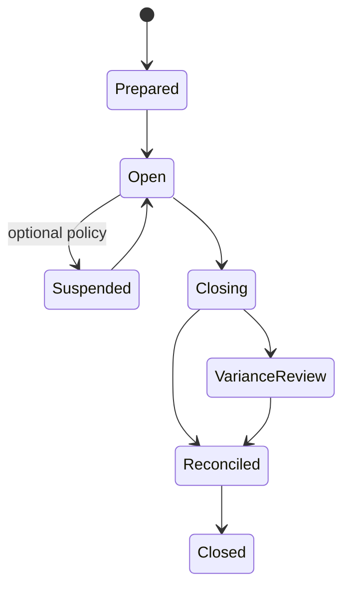

# P06 — Shift-to-Reconciliation

Status: Business process specification · working baseline

## 1. Business purpose

Shift-to-Reconciliation ensures that every cashier/register session can explain the movement of cash and other tenders from opening float through sales, refunds, paid-in/out and closing count.

The purpose is accountability, not punishment. Variance is a business exception that must be visible, investigated and resolved proportionately.

## 2. Scope

Includes:

- shift/register opening;
- opening float;
- cash sales and refunds;
- authorized cash movements;
- non-cash tender totals;
- safe drops / handovers where used;
- shift close;
- physical cash count;
- expected-versus-actual reconciliation;
- manager review;
- store-day / Z-summary relationship.

Does not prescribe banking integration or accounting-journal design.

## 3. Actors

| Actor | Responsibility |
|---|---|
| Cashier | operates assigned till/register and declares closing cash |
| Store Manager / Supervisor | approves opening exceptions, paid-out, material variance and close |
| Cash Office / Store Admin | consolidates cash, deposits and store-day evidence where applicable |
| Finance / Treasury | consumes settlement/deposit information downstream |
| Internal Control / Loss Prevention | reviews suspicious or repeated variance |
| Payment Provider / Bank | supplies electronic settlement evidence |

## 4. Core business concepts

### Shift / cashier session

Operational period during which a specific cashier is accountable for a register/till under defined store rules.

### Opening float

Cash provided for making change at shift start.

### Expected cash

The amount the business expects to be physically present after considering opening float and all recorded cash-affecting events.

Conceptually:

```text
Opening float
+ cash sales received
+ cash paid-in
- cash refunds
- cash paid-out
- safe drops / authorized removals
= expected closing cash
```

Exact inclusions depend on retailer policy.

### Declared / actual cash

Physical cash counted at close.

### Variance

```text
Actual cash - Expected cash = over / short
```

### Business day / store day

Retail operating period used to group transactions for management and audit; it may not equal midnight-to-midnight calendar date.

Oracle Retail Sales Audit explicitly uses a “store day” as all transactions occurring in one business day at one location and supports balancing cashiers, registers and store-day totals.

## 5. Shift lifecycle



## 6. Stage A — Shift opening

1. Cashier identifies themselves under store procedure.
2. Assigned register/till is confirmed.
3. Opening float is issued or carried forward according to policy.
4. Cashier counts/confirms float where required.
5. Opening discrepancy is resolved before normal selling or explicitly accepted by supervisor.
6. Shift opens and accountability begins.

Controls:

- avoid shared till accountability where practical;
- opening float source and amount should be known;
- discrepancy at open should not be blamed on current cashier if inherited without evidence.

## 7. Stage B — During-shift cash events

Cash-affecting events may include:

- cash sale;
- cash refund;
- paid-in;
- paid-out;
- petty cash expense;
- cash pickup / safe drop;
- float increase/decrease;
- cash exchange/change replenishment;
- correction under authorized procedure.

Each non-sale cash movement should have:

- amount;
- direction;
- reason;
- actor;
- approval where required;
- supporting note/document if policy requires.

A drawer opening alone must never be treated as evidence of a legitimate movement.

## 8. Paid-in / paid-out examples

### Paid-in

Possible legitimate cases:

- additional float supplied;
- recovered customer debt/cash event where retailer permits;
- approved cash correction.

### Paid-out

Possible cases:

- petty store expense;
- supplier/local expense under controlled policy;
- customer cash refund outside same transaction flow;
- cash transfer to safe/bank preparation.

The retailer should minimize ambiguous “miscellaneous paid-out” usage because it weakens control.

## 9. Safe drop / cash pickup

Where stores reduce till cash during busy periods:

1. Cashier/supervisor initiates cash removal.
2. Amount is counted/confirmed.
3. Removal reason/type is recorded.
4. Custody transfers to safe/cash office/authorized person.
5. Expected till cash reduces by the recorded amount.
6. Safe/cash-office accountability increases according to local process.

## 10. Stage C — Shift closing

1. Stop/hand off selling according to store procedure.
2. Ensure pending/suspended payment issues are resolved or clearly outstanding.
3. Determine recorded tender totals.
4. Cashier physically counts cash.
5. Cashier declares amount; blind declaration is preferred where control level warrants it.
6. Expected cash is compared with actual cash.
7. Non-cash tenders are compared with provider/terminal totals where possible.
8. Variance is classified.
9. Manager reviews material difference.
10. Cash/tender custody is handed over.
11. Shift is marked reconciled/closed only when policy conditions are met.

## 11. Blind count principle

If cashier sees expected cash before declaring count, there is incentive/ability to “count toward the expected amount”.

For stronger control:

- cashier declares physical count first;
- system/manager then compares to expectation;
- recount occurs for material variance.

This is a business-control design choice, especially relevant to higher-risk stores.

## 12. Cash variance workflow

### Small variance within tolerance

- record over/short;
- close shift;
- retain for trend monitoring.

### Material variance

1. recount cash;
2. verify opening float;
3. check paid-in/out and safe drops;
4. check refunds / voids;
5. inspect payment mix and transaction anomalies;
6. review handover or till-sharing incidents;
7. manager classifies explanation;
8. unresolved material variance is escalated.

Do not “fix” a cash variance by editing historical sales without evidence.

## 13. Non-cash reconciliation

Electronic tender can differ from POS totals due to:

- payment captured but POS timeout;
- POS sale completed but payment not captured;
- duplicate payment retry;
- refund not settled yet;
- provider fee/net settlement difference;
- settlement timing across business days;
- manual transfer/QR evidence mismatch.

Operational reconciliation should distinguish gross customer payment from later net bank settlement/fees.

## 14. Split tender

Example sale 500,000 VND:

- 200,000 cash;
- 300,000 card.

The shift should retain both tender components. If returned later, refund policy may depend on the original tender allocation.

Treating the sale only as “paid 500,000” loses essential reconciliation information.

## 15. Store-day close / Z-style summary

A store-day close should consolidate at least conceptually:

- opening/closing shifts;
- gross/net sales;
- return/refund value;
- tender totals by method;
- cash movements;
- over/short variance;
- unresolved payment exceptions;
- major void/discount exception totals;
- count of closed/open shifts/registers.

The retailer must define whether a Z/final close is immutable business evidence or can be reopened under exceptional authorization.

## 16. Overnight stores

Calendar date is not always business date.

Example:

- store day starts 06:00 on 13 Sep;
- operations continue through 01:30 on 14 Sep;
- those late-night transactions may still belong to business day 13 Sep under retailer policy.

This matters for sales audit, cash close, finance and KPI comparability.

## 17. Exceptions

| Exception | Business response |
|---|---|
| Opening float differs | recount and supervisor resolution before selling |
| Shared till | record handoff / responsibility; elevated control risk |
| Cash drawer cannot be counted | contingency close and follow-up count |
| Material cash shortage | recount/investigate/escalate |
| Cash overage | record/investigate, do not net anonymously against shortages |
| Provider totals unavailable | provisional close with unresolved settlement exception |
| Duplicate card/QR capture suspected | payment investigation, no blind retry |
| Shift remains open overnight | explicit handover/business-day policy |
| Refund exceeds till cash | supervisor/cash-office alternative process |
| Register crash | reconstruct from retained business evidence; do not invent totals |

## 18. Controls

Recommended minimum:

- unique cashier accountability where practical;
- manager cannot casually erase variance;
- non-sale cash movements require reason;
- material paid-out requires approval;
- cashier should not approve own material variance;
- completed reconciliation evidence retained;
- repeated shortage/overage monitored by employee/register/store;
- cash movement and sales totals reviewed independently of physical cash count;
- cash deposit/handover amount tied to store reconciliation.

## 19. KPI framework

### Cash control

- cash over/short value;
- variance % of cash sales;
- variance frequency by cashier/register/store;
- unresolved material variance count;
- paid-out value and frequency.

### Payment control

- electronic tender mismatch value;
- uncertain payment count;
- duplicate payment incidents;
- unresolved settlement aging.

### Operations

- late shift close count;
- open shift at store-day close;
- reconciliation cycle time;
- manager override / exception-close rate.

## 20. Management questions

- Which stores/cashiers repeatedly show cash shortage?
- Are shortages linked to specific shifts, managers or registers?
- How much cash is leaving tills through paid-out/safe-drop and why?
- How often do electronic tender totals fail to match sales?
- Which business days remain unreconciled?
- Are managers using broad adjustments to hide operational errors?
- Do shifts overlap/share tills in a way that prevents accountability?

## 21. Worked example

Opening float: 1,000,000

During shift:

- cash sales received: +8,500,000
- cash refunds: -400,000
- safe drop: -5,000,000
- approved petty cash paid-out: -100,000

Expected closing cash:

1,000,000 + 8,500,000 - 400,000 - 5,000,000 - 100,000 = 4,000,000

Actual counted cash: 3,970,000

Variance: -30,000.

Whether -30,000 is auto-accepted, manager-reviewed or formally investigated is business policy. The process must preserve the variance either way.

## 22. Research anchors

- Oracle Retail Sales Audit overview: https://docs.oracle.com/en/industries/retail/retail-merchandising-foundation-cloud/24.0.101.0/rsaat/sales-audit-overview.htm
- Oracle Retail Sales Audit process: https://docs.oracle.com/en/industries/retail/retail-merchandising-foundation-cloud/latest/rmsoa/sales-audit.htm
- APQC process frameworks: https://www.apqc.org/process-frameworks

## 23. Open business-policy questions

- One cashier per till or shared registers?
- Is closing count blind?
- What over/short threshold requires manager review?
- What paid-out types are allowed?
- Who may perform safe drop?
- What time defines business-day boundary?
- Can a store day close with unresolved shift/payment exception?
- Is final Z close reopenable, by whom and under what evidence?
- How are cash deposits/handover evidenced?
