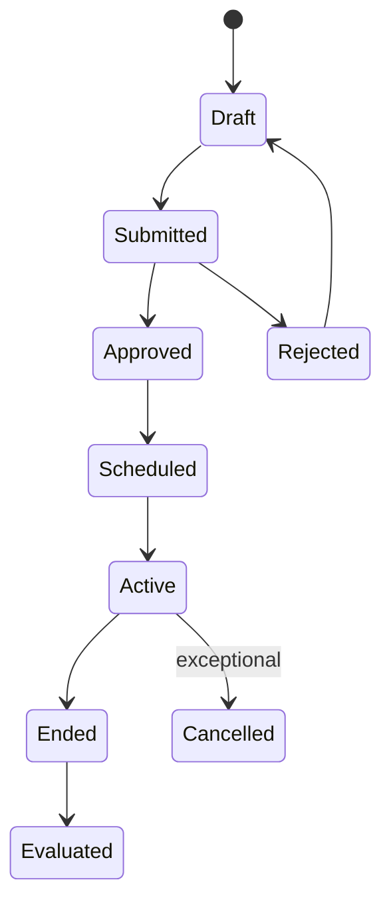

# P07 — Pricing and Promotion Lifecycle

Status: Business process specification · working baseline

## 1. Business purpose

Pricing and Promotion Lifecycle ensures that selling prices and temporary offers are commercially intentional, approved, correctly executed, measurable and reversible when their effective period ends.

The process protects:

- gross margin;
- price consistency;
- customer trust;
- promotional ROI;
- markdown control;
- store execution accuracy.

## 2. Scope

Includes:

- initial / regular price establishment;
- scheduled price change;
- store/zone/customer applicability;
- markdown / clearance;
- promotion planning and execution;
- offer mechanics;
- approval;
- publication to stores/channels;
- store execution check;
- conflict / exception resolution;
- post-event performance review.

Does not prescribe a technical promotion engine or pricing data model.

## 3. Core business distinctions

### Regular price

Normal selling price for an item/location or pricing scope.

### Price change

A change to the regular price, usually persistent until a later price event.

### Markdown / clearance

A permanent or lifecycle-driven reduction intended to clear stock / manage end-of-life inventory.

### Promotion

A temporary offer with explicit start/end conditions and reward mechanics.

### Targeted / customer-specific offer

Price or benefit restricted to a customer segment / customer / membership condition.

### Manual discount

Operational exception granted during sale by authorized staff; should not be treated as a substitute for commercial pricing/promotion planning.

Oracle Retail Pricing explicitly distinguishes regular price changes, clearance markdowns and promotions. Promotions are temporary and can contain item-level or transaction-level offers.

## 4. Actors

| Actor | Responsibility |
|---|---|
| Category / Commercial Manager | owns price strategy and margin |
| Pricing Analyst / Merchandiser | prepares price events and analysis |
| Marketing / CRM | plans campaigns and customer offers |
| Finance / Margin Control | reviews economics / budget where applicable |
| Operations / Store Manager | executes store communication / label changes |
| Cashier / Customer Service | applies approved offer and resolves customer challenge |
| Management Approver | approves material price/promotion changes |

## 5. Commercial lifecycle

Clearance may have repeated markdown stages rather than a simple end date.

## 6. Regular price change process

1. Trigger is identified:
   - supplier cost change;
   - margin strategy;
   - competitor / market response;
   - tax / regulatory change;
   - new item introduction;
   - correction of erroneous price;
   - price-zone / store strategy.
2. Analyst identifies affected item/location scope.
3. Current cost, price, margin and relevant constraints are reviewed.
4. Proposed price and effective date are prepared.
5. Conflict with other scheduled price/promotion events is checked.
6. Approval occurs according to authority policy.
7. Approved price is communicated before effective date to affected selling locations/channels.
8. Store/channel executes new price at effective time.
9. Shelf/label/display execution is checked where relevant.
10. Material execution exceptions are resolved.

## 7. Emergency price change

Emergency price change is higher risk because normal preparation time is compressed.

Possible triggers:

- wrong price currently live;
- regulatory/tax requirement;
- urgent competitor response;
- customer-impacting configuration mistake.

Recommended controls:

- restricted authority;
- reason mandatory;
- effective scope verified;
- post-event review;
- communication to stores prioritized.

Oracle Retail uses a separate emergency-price privilege concept when normal processing lead time cannot be met.

## 8. Markdown / clearance process

Typical lifecycle:

1. Identify slow-moving, seasonal or end-of-life stock.
2. Define sell-through target / exit objective.
3. Select item/location scope.
4. Define markdown depth and effective date.
5. Review margin / stock exposure.
6. Approve.
7. Execute markdown.
8. Monitor sell-through and remaining inventory.
9. Apply next markdown stage if needed.
10. End/reset/close clearance according to merchandise strategy.

Key distinction: clearance is an inventory-lifecycle decision, not just “promotion with a bigger discount”.

## 9. Promotion planning process

### Stage A — Objective

Define objective such as:

- drive traffic;
- increase units;
- increase basket size;
- clear selected stock;
- launch product;
- reward loyalty;
- acquire customer;
- respond to competitor;
- support seasonal campaign.

### Stage B — Scope

Define:

- products / categories;
- stores / zones / channels;
- customer segments;
- dates/times;
- budget / funding;
- supplier contribution where relevant.

### Stage C — Mechanic

Common mechanics:

- percentage off item;
- amount off item;
- fixed promotional price;
- buy X get Y;
- bundle price;
- basket threshold discount;
- gift item;
- loyalty points bonus;
- coupon / voucher;
- member-only price.

### Stage D — Commercial simulation

Review:

- baseline price/cost;
- expected volume uplift;
- gross margin impact;
- available inventory;
- supplier funding;
- cannibalization risk;
- likely stockout risk;
- operational complexity.

### Stage E — Approval

Approval should consider:

- discount depth;
- margin floor;
- campaign budget;
- affected stores;
- duration;
- strategic importance;
- stock availability.

### Stage F — Execution

1. Promotion is published to selling locations/channels.
2. Store receives campaign instructions / signage if physical execution is needed.
3. Promotion becomes active at defined time.
4. Checkout applies eligibility rules.
5. Store handles exception according to policy.
6. Stock and sales are monitored during event.

### Stage G — End and evaluation

1. Promotion ends on schedule or approved early stop.
2. Normal price/next event is restored.
3. Store removes outdated signage.
4. Sales, margin, units, stockout and customer response are analyzed.
5. Learnings feed future campaigns.

## 10. Promotion eligibility dimensions

Potential dimensions include:

- item / category;
- quantity;
- basket value;
- store;
- region/zone;
- channel;
- date/time;
- customer group;
- loyalty tier;
- coupon/voucher;
- payment method where legally/commercially appropriate;
- first purchase / frequency condition.

## 11. Stacking / conflict policy

A retailer must explicitly decide what happens when multiple benefits match.

Potential policies:

- highest benefit wins;
- explicit priority wins;
- selected offers stack;
- only one item promotion plus one basket promotion;
- member price replaces regular price but can/cannot stack with coupon;
- manual discount requires manager approval if applied on promoted item.

A deterministic business policy is needed to avoid cashier-by-cashier interpretation.

## 12. Price/promotion conflict examples

### Scheduled regular price change during promotion

Need rule: does promotion reference a fixed promotional price, percent off current regular price, or original baseline?

### Clearance plus promotion

Need rule: can a clearance item participate in promotion?

### Customer-specific price plus coupon

Need rule: stack or choose one?

### Two concurrent buy-X-get-Y offers

Need rule to prevent unintended multiple free gifts.

## 13. Store execution controls

A commercially correct price event still fails if the shelf/store executes incorrectly.

Controls may include:

- advance notification;
- price-label task completion;
- signage placement/removal;
- spot check of shelf-to-checkout price;
- store exception queue;
- emergency correction process.

## 14. Promotion stock readiness

Before activation:

- confirm participating store assortment;
- compare expected uplift to available/inbound stock;
- identify likely stockouts;
- allocate/replenish campaign stock;
- define substitution/rain-check policy if used;
- ensure free-gift inventory is present where required.

A promotion that increases demand without inventory readiness can damage customer trust and margin.

## 15. Exceptions

| Exception | Business response |
|---|---|
| Price event overlaps another | conflict review / priority decision |
| Promotion active but no stock | replenish/reallocate/communicate according to policy |
| Store label differs from checkout | price-dispute policy + execution correction |
| Promotion fails at checkout | validate eligibility and controlled customer remedy |
| Free gift out of stock | substitute/rain-check/no-benefit policy must be explicit |
| Price below allowed margin | escalation / exception approval |
| Promotion starts late at store | execution incident and customer-resolution policy |
| Old signage remains after end | immediate removal + customer dispute handling |
| Wrong store included | emergency stop/correction and impact review |

## 16. Controls

Recommended minimum:

- maker/checker approval for material price changes;
- scheduled effective date/time;
- reason for emergency changes;
- price/promotion conflict validation;
- margin-floor or loss-leading exception approval;
- campaign scope review;
- promotion end-date control;
- store execution evidence for high-impact campaigns;
- manual cashier compensation visible separately from planned promotion.

## 17. KPI framework

### Pricing

- gross margin %;
- price change frequency;
- price override/dispute rate;
- price execution accuracy;
- emergency price-change frequency.

### Promotion

- promotional sales uplift;
- incremental units;
- incremental revenue;
- promotional gross margin;
- redemption rate;
- campaign ROI;
- supplier-funded benefit recovery;
- promotional stockout rate;
- halo/cannibalization where analytics maturity allows.

### Markdown

- sell-through;
- markdown %;
- remaining stock after clearance;
- margin recovered versus disposal/salvage;
- time to exit inventory.

## 18. Promotion evaluation caution

Comparing campaign sales only to zero is misleading. Where possible, evaluate against a baseline / expected sales level and consider:

- volume that would have sold anyway;
- margin sacrificed;
- stockout during campaign;
- pull-forward of future demand;
- cannibalization of similar items;
- supplier funding;
- repeat-customer effect.

## 19. Management questions

- Which promotions produce revenue but destroy margin?
- Which stores fail price/signage execution most often?
- Which promotions repeatedly stock out?
- How much discount comes from planned promotions versus manual cashier discounts?
- Which clearance items still remain after final markdown?
- Are emergency price changes becoming normal behavior?
- Which customer segments redeem offers profitably?

## 20. Worked example — price versus promotion

Regular price: 100,000.

Price event: new regular price 110,000 effective 1 Oct.

Promotion: 20% off from 28 Sep through 5 Oct.

The business must explicitly define whether 1–5 Oct promotional price is:

- 80,000 based on original 100,000;
- 88,000 based on current regular 110,000;
- a fixed campaign price independent of regular price.

Without this rule, stores/channels can legally execute different customer prices from the same commercial intent.

## 21. Research anchors

- Oracle Retail Pricing introduction: https://docs.oracle.com/en/industries/retail/retail-pricing-cloud/latest/pcsog/introduction.htm
- Oracle Retail Pricing use / price changes / promotions: https://docs.oracle.com/en/industries/retail/retail-pricing-cloud/latest/use.html
- Oracle Clearance overview: https://docs.oracle.com/en/industries/retail/retail-pricing-cloud/latest/rprcl/clearance-overview.htm
- Oracle pricing implementation concepts: https://docs.oracle.com/cd/E79623_01/rms/pdf/160027/html/impl_guide/Pricing.htm
- KiotViet promotions: https://www.kiotviet.vn/huong-dan-su-dung-kiotviet/retail-khuyen-mai/khuyen-mai/

## 22. Open business-policy questions

- Who owns regular price versus promotion approval?
- Which stores may have local price differences?
- What margin floor requires escalation?
- Which promotions can stack?
- Are clearance items eligible for promotions?
- How are order-level benefits allocated for later return?
- How much advance notice do stores need for price changes?
- What is the emergency-price process?
- What happens when free-gift stock runs out?
- Which KPIs define a successful promotion?
