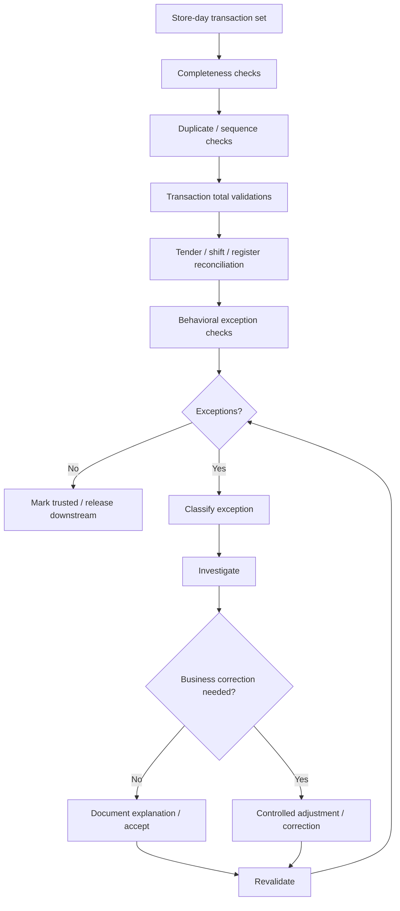
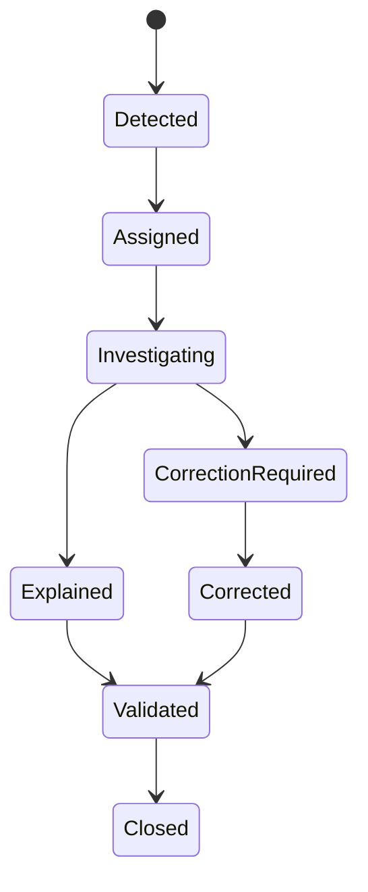

# P08 — Sales-to-Assurance

Status: Business process specification · working baseline

## 1. Business purpose

Sales-to-Assurance ensures that store sales data is complete, internally consistent, explainable and suitable for management, finance, inventory and compliance use.

The process treats POS output as operational evidence that still requires business validation. A successful checkout does not guarantee that the total set of store-day data is complete or free from duplicate, missing, suspicious or settlement-related exceptions.

## 2. Scope

Includes:

- store-day completeness review;
- transaction sequence / session completeness;
- sales-to-tender balancing;
- duplicate and missing transaction detection;
- suspicious void/refund/discount review;
- cashier/register/store-day balancing;
- exception classification;
- controlled correction / adjustment;
- release of trusted sales information downstream.

Does not define accounting-journal design or technical integration architecture.

## 3. Actors

| Actor | Responsibility |
|---|---|
| Store Manager | first-line store-day completeness and operational explanation |
| Sales Auditor / Finance Operations | validates totals, exceptions and downstream readiness |
| Cash Office / Store Admin | supports till/register balancing evidence |
| Internal Control / Loss Prevention | investigates suspicious patterns |
| IT / Support | resolves technical missing/duplicate data incidents where needed |
| Finance / Accounting | consumes trusted sales/tender outputs |
| Inventory / Merchandising | consumes clean item-level sales for stock and performance |

## 4. Business unit of control — store day

Oracle Retail Sales Audit uses the concept of a **store day**: all transactions occurring in one business day at one store/location.

This is important because assurance normally asks:

- Did this store submit all expected transactions for this business day?
- Do transaction totals reconcile to tenders?
- Are cashiers/registers balanced?
- Are anomalies explained before downstream use?

The store day can differ from a calendar date for late-night / overnight operations.

## 5. High-level process

## 6. Stage A — Completeness checks

Typical questions:

- Were all expected registers/locations open or closed as planned?
- Are all cashier shifts accounted for?
- Are there missing transaction ranges / sequence gaps where sequence controls exist?
- Are there stores with no data despite being open?
- Are there unexpectedly low transaction counts?
- Are electronic payment batches present for the same operating period?
- Are returns/refunds/voids included?

A missing store-day feed should not silently look like “zero sales”.

## 7. Stage B — Duplicate checks

Potential duplicate signals:

- same transaction identifier repeated;
- same tender authorization linked to multiple sales unexpectedly;
- same store/register/sequence submitted twice;
- delayed resend creates duplicate record;
- retry after technical timeout creates two financial events.

Business treatment:

1. determine whether duplicate is data duplication or real duplicate customer charge/sale;
2. retain evidence;
3. correct through controlled process;
4. investigate repeated root cause.

## 8. Stage C — Transaction integrity checks

Possible checks:

- line totals add to transaction subtotal;
- discounts/promotion/tax reconcile to payable total;
- tender total matches transaction obligation;
- refund value is supported by return transaction;
- sale has valid store/register/operator context;
- transaction is not both completed and cancelled without explanation;
- suspicious zero / negative values are reviewed;
- open/suspended basket is not counted as completed sale.

The purpose is trusted business totals, not merely syntactic validation.

## 9. Stage D — Tender balancing

Validation levels can include:

### Transaction level

Tender allocation equals amount due subject to approved rounding / outstanding policy.

### Cashier / shift level

Recorded tender totals reconcile to shift expectations and declared counts.

### Register level

All shift activity on register is accounted for.

### Store-day level

Tender mix and store operational totals are consistent with store close / settlement evidence.

### Provider / bank level

Electronic settlements are later matched to provider/bank records, accounting for timing/fees where relevant.

## 10. Stage E — Suspicious / control exceptions

Examples:

- unusually high void rate;
- unusually high refund rate;
- high manual discount rate;
- repeated price override;
- many no-receipt returns;
- cash shortages combined with void/refund patterns;
- repeated manager override pairings;
- transactions outside expected operating hours;
- unusually high use of manual/open-price item;
- unusual split tender or refund tender patterns;
- high volume of sales exactly below approval thresholds.

These are investigation signals, not automatic proof of fraud.

## 11. Exception classification

A useful taxonomy:

### Data / integration

- missing store-day data;
- duplicate feed;
- late transaction;
- corrupted/incomplete data;
- delayed payment settlement.

### Store operational

- shift not closed;
- cash variance;
- missed paid-in/out;
- register handoff issue;
- wrong business date.

### Commercial

- price execution error;
- promotion execution error;
- unauthorized discount;
- wrong tax/price condition.

### Customer service

- refund/return exception;
- duplicate charge;
- disputed payment.

### Control / suspicious

- unexplained void/refund/discount pattern;
- repeated manual override;
- suspected cash leakage.

## 12. Exception lifecycle

Exceptions should not disappear just because totals were manually changed.

## 13. Controlled correction principles

When correction is necessary:

- original evidence remains identifiable;
- correction has actor and reason;
- high-risk correction requires approval;
- financial/tender implications are reconciled;
- downstream consumers receive corrected result through controlled method;
- store history is not rewritten in a way that hides the incident.

## 14. Store-day readiness criteria

A retailer may define a store day as “ready for downstream release” when:

- expected store/register activity is present;
- major shifts are closed/reconciled;
- tender totals are within accepted exception state;
- mandatory sales-audit rules pass;
- material exceptions are resolved or formally accepted;
- duplicate/missing transaction risks are cleared;
- management/audit sign-off is complete where required.

Not every minor exception must necessarily block all reporting; severity policy is required.

## 15. Reconciliation examples

### Example A — cash shortage

POS cash sales = 12,000,000.

Expected cash after opening float/refunds/safe drops = 5,500,000.

Actual count = 5,450,000.

Sales-to-Assurance should retain the -50,000 shift/store exception and its resolution status.

### Example B — duplicate electronic payment

POS shows one sale of 300,000.

Provider settlement shows two captures of 300,000 with same customer context.

This is not a sales duplication problem unless there are also two sales. It is a payment exception requiring customer/provider resolution.

### Example C — missing transaction feed

Store's local close says 850 transactions, central sales data contains 812.

The difference must trigger completeness investigation, not be accepted as lower sales.

## 16. Controls

Recommended minimum:

- missing store-day data is explicit;
- duplicate detection exists conceptually;
- material sales/tender mismatch blocks or flags downstream readiness;
- manual correction requires reason;
- suspicious pattern review is separated from normal data cleansing;
- store manager cannot erase high-risk audit exceptions without trace;
- late-arriving transactions are assigned to correct business date according to policy;
- resolution aging is monitored.

## 17. KPI framework

### Data quality

- missing transaction rate;
- duplicate transaction rate;
- late transaction rate;
- store-day completeness %.

### Reconciliation

- tender mismatch value/rate;
- cashier/register over-short;
- unreconciled store-day count;
- electronic settlement mismatch.

### Audit operations

- exception count per 1,000 transactions;
- average exception age;
- first-pass clean store-day %;
- manual correction rate;
- reopened exception rate.

### Risk

- suspicious void rate;
- suspicious refund rate;
- manual discount exception rate;
- high-risk override incidence.

## 18. Exception severity model

Example classification:

### Critical

- missing entire store day;
- material unexplained tender loss;
- duplicate customer charge at scale;
- suspected fraud / manipulation;
- material fiscal/compliance issue.

### High

- missing register/shift data;
- material refund/discount anomaly;
- major transaction/tender mismatch.

### Medium

- small unexplained variance;
- delayed electronic settlement;
- repeated operational warning.

### Low

- informational timing mismatch or accepted tolerance.

Thresholds are retailer-specific.

## 19. Management questions

- Which stores produce the most sales-audit exceptions?
- What percentage of store days are clean on first pass?
- How long do material exceptions remain unresolved?
- Which cashiers/registers show repeated tender mismatch?
- Is manual correction being overused?
- Are duplicate/missing transactions linked to operational or technical causes?
- Which anomaly patterns warrant loss-prevention review?
- Does reporting use data before material exceptions are resolved?

## 20. Relationship to other processes

Sales-to-Assurance consumes evidence from:

- P04 Store-to-Cash;
- P05 Return-to-Resolution;
- P06 Shift-to-Reconciliation;
- P07 Pricing and Promotion Lifecycle.

It feeds trusted information to:

- management reporting;
- finance/accounting;
- inventory / replenishment analytics;
- margin analysis;
- loss prevention / internal control;
- supplier/category analysis where item sales matter.

## 21. Research anchors

- Oracle Retail Sales Audit overview: https://docs.oracle.com/en/industries/retail/retail-merchandising-foundation-cloud/24.0.101.0/rsaat/sales-audit-overview.htm
- Oracle Retail Sales Audit: https://docs.oracle.com/en/industries/retail/retail-merchandising-foundation-cloud/latest/rmsoa/sales-audit.htm
- APQC PCF definitions/KPI collection: https://www.apqc.org/resource-library/resource-collection/pcf-version-80-process-definitions-and-key-measures-collection

## 22. Open business-policy questions

- What makes a store day “complete”?
- Which exceptions block downstream finance/reporting?
- Who owns first-line resolution: store manager or central auditor?
- What is the acceptable cash/tender tolerance?
- How are late transactions assigned across business days?
- Which suspicious patterns trigger formal investigation?
- Who may perform business correction and who approves it?
- How long are unresolved exceptions allowed to remain open?
