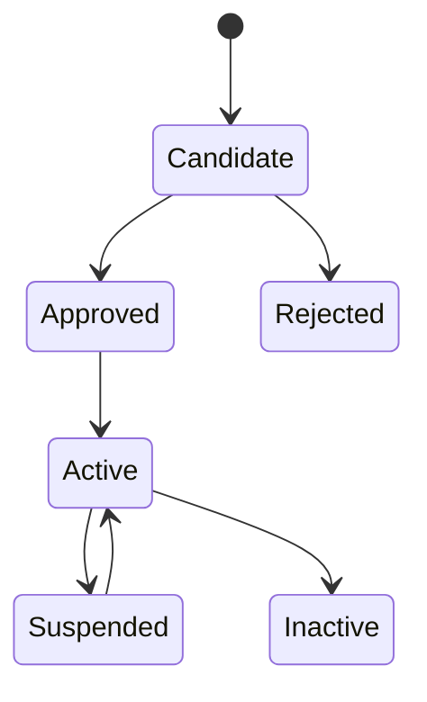

# P09 — Supplier-to-Settlement

Status: Business process specification · working baseline

## 1. Business purpose

Supplier-to-Settlement governs the commercial relationship from supplier approval through invoice verification, discrepancy resolution and payment authorization.

The process protects the retailer from paying for goods that were not ordered, not received, incorrectly priced or otherwise outside agreed terms.

## 2. Scope

Includes:

- supplier onboarding / approval;
- supplier commercial terms;
- supplier-item relationship;
- invoice intake;
- PO / receipt / invoice matching;
- quantity/cost/tax discrepancies;
- debit/credit claims;
- payment authorization;
- supplier performance review.

Payment execution itself may occur in a separate finance system/process.

## 3. Actors

| Actor | Responsibility |
|---|---|
| Procurement / Buyer | supplier and commercial relationship |
| Supplier | provides merchandise and invoice/credit evidence |
| Receiving | provides independent receipt evidence |
| Accounts Payable | verifies invoice and authorizes valid liability |
| Finance Manager | approves material discrepancy/write-off/prepayment |
| Category Manager | resolves commercial price/assortment disputes |
| Inventory Control | resolves receipt/quantity evidence issues |
| Internal Control | reviews supplier/payment anomalies |

## 4. Supplier lifecycle



Approval should consider relevant legal/tax/commercial/quality evidence according to retailer policy.

## 5. Commercial master terms

Typical business terms include:

- supplier legal/billing identity;
- payment terms;
- currency;
- lead time;
- MOQ / pack constraints;
- delivery locations;
- purchase cost / cost basis;
- discounts/rebates;
- return-to-vendor terms;
- quality/shelf-life terms;
- tax treatment;
- settlement method;
- credit/debit claim process.

## 6. Invoice verification principle

For PO-based merchandise buying, the strongest normal control is:

```text
Purchase Order (what we agreed to buy)
        ↓
Goods Receipt (what we physically accepted)
        ↓
Supplier Invoice (what supplier asks us to pay)
```

Oracle Retail Invoice Matching explicitly describes matching supplier invoice quantity/cost against purchase orders and receipt evidence within retailer-defined tolerances before payment authorization.

## 7. Main flow

1. Supplier invoice is received.
2. Supplier identity and invoice validity are checked.
3. Invoice is associated with relevant PO(s)/receipt(s).
4. Quantity is compared to accepted receipt quantity.
5. Unit cost / allowance / tax is compared to agreed terms.
6. Differences within permitted tolerance may be auto/standard accepted.
7. Differences outside tolerance become discrepancies.
8. Discrepancy is routed to responsible owner.
9. Resolution may produce supplier credit/debit, PO/receipt correction where factually justified, approved variance or rejection.
10. Once verified, invoice is authorized for payment.
11. Payment terms/due dates are applied downstream.
12. Supplier performance and dispute history remain measurable.

## 8. Discrepancy categories

### Quantity discrepancy

- supplier invoices more than received;
- receipt missing/late;
- partial receipt not reflected;
- duplicate invoice quantity.

### Cost discrepancy

- invoice price exceeds PO/agreed cost;
- promotion/deal allowance missing;
- price change timing dispute;
- freight/charge incorrectly included.

### Tax discrepancy

- tax rate/code differs from agreed/legal basis;
- tax applied to wrong line/amount.

### Document discrepancy

- duplicate invoice;
- invalid supplier invoice number/date;
- wrong entity/location/currency.

## 9. Resolution actions

Possible business actions:

- supplier issues credit note;
- retailer issues debit/chargeback claim;
- approved PO amendment where original agreement genuinely changed;
- receipt correction only if receiving fact was recorded incorrectly;
- accept variance under authorized tolerance/exception;
- hold invoice;
- reject invoice;
- write off immaterial difference according to policy.

A receipt should not be altered merely to force invoice match if physical evidence says otherwise.

## 10. Prepayment / non-standard cases

Some suppliers may require prepayment or deposits. These should have stronger controls because receipt evidence does not yet exist.

Possible controls:

- approved supplier/category only;
- specific purchase/management authorization;
- deposit tracking;
- later reconciliation to actual receipt/invoice;
- unresolved advance aging review.

## 11. Supplier claims and return-to-vendor

Claims may result from:

- damaged delivery;
- short delivery billed in full;
- defective merchandise;
- supplier return;
- promotion/deal funding;
- cost discrepancy.

Claims should remain traceable until financial settlement/credit is confirmed.

## 12. Controls

- supplier approval separate from payment creation where practical;
- duplicate invoice detection;
- PO/receipt/invoice matching for merchandise purchasing;
- tolerance rules explicitly approved;
- material discrepancy routed, not silently written off;
- payment bank/detail changes receive independent verification;
- credit/debit notes linked to original dispute;
- aged unmatched receipts and invoices reviewed;
- supplier performance includes dispute quality, not only delivery speed.

## 13. KPI framework

### AP / matching

- first-pass match rate;
- invoice discrepancy rate;
- average discrepancy resolution time;
- unmatched invoice aging;
- unmatched receipt aging;
- duplicate invoice incidents.

### Supplier

- OTIF;
- fill rate;
- purchase price variance;
- claim rate;
- quality rejection rate;
- invoice accuracy rate.

### Working capital

- days payable outstanding where finance uses it;
- early-payment discount capture;
- overdue payment rate;
- supplier dispute aging.

## 14. Worked example

PO: 100 units × 50,000 = 5,000,000.

Receipt: 95 accepted, 5 rejected/damaged.

Supplier invoice: 100 × 50,000 = 5,000,000.

The process should not authorize full payment merely because invoice matches PO. Receipt evidence says only 95 were accepted. Resolution may require credit for 5 units or other agreed claim treatment.

## 15. Research anchors

- Oracle Retail Invoice Matching introduction: https://docs.oracle.com/en/industries/retail/retail-invoice-matching-cloud/latest/rimog/introduction.htm
- Oracle Retail Invoice Matching service overview: https://docs.oracle.com/en/industries/retail/retail-invoice-matching-cloud/latest/
- Oracle Retail financial integration / procure-to-pay: https://docs.oracle.com/en/industries/retail/retail-integration-cloud/latest/fiimp/understanding-oracle-retail-financial-integration-oracle-retail-merchandise-operations-management-a.htm
- Oracle Financials matching principle: https://docs.oracle.com/en/cloud/saas/financials/25d/fappp/matching-invoice-lines.html

## 16. Open business-policy questions

- Which suppliers/categories permit prepayment?
- What invoice matching tolerances apply by value/category?
- Who resolves quantity vs cost discrepancy?
- What difference may be written off without supplier claim?
- What approval is required to change supplier banking details?
- How are rebates/deal funding settled?
- How long may an unmatched invoice remain open?
- Which supplier performance failures trigger suspension?
