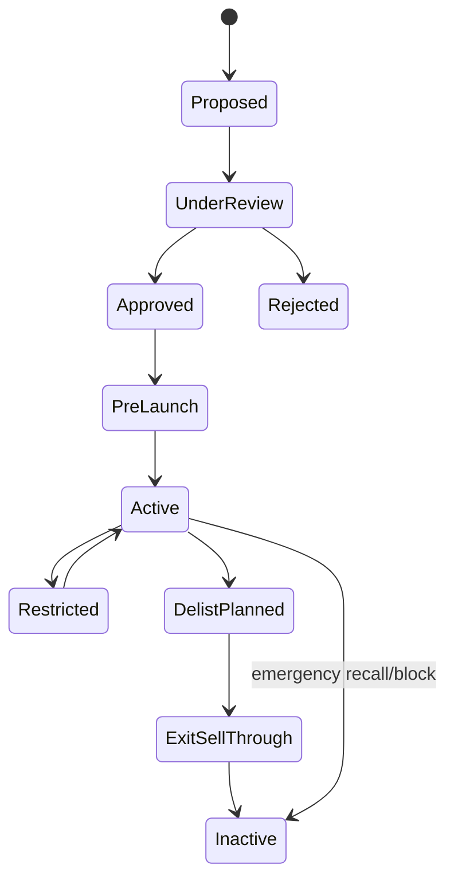

# P10 — Category, Assortment & Product Lifecycle

Status: Business process specification · working baseline

## 1. Business purpose

Category, Assortment & Product Lifecycle ensures the retailer decides **what to sell, where to sell it, under what commercial/operational conditions, and when to exit it**.

This process links commercial strategy to store execution. A product should not become sellable merely because a name and barcode exist; it must be commercially approved, operationally ready, ranged to the correct selling locations and supported by replenishment, pricing and compliance information.

## 2. Scope

Includes:

- category strategy;
- merchandise hierarchy;
- assortment breadth/depth;
- store/cluster/channel ranging;
- new product introduction;
- product operational readiness;
- launch;
- performance review;
- lifecycle status;
- delist/end-of-life;
- residual stock exit.

Out of scope:

- technical product master schema;
- detailed supplier contracting;
- campaign execution beyond product lifecycle implications.

## 3. Actors

| Actor | Responsibility |
|---|---|
| Category Manager / Merchandiser | category strategy, assortment and lifecycle decisions |
| Buyer / Procurement | supplier/commercial availability and terms |
| Pricing / Commercial | regular price, margin and price positioning |
| Replenishment / Supply Chain | source, lead time and stock-readiness implications |
| Quality / Compliance | category-specific legal/quality requirements |
| Store Operations | validates execution feasibility and store readiness |
| Marketing | launch/campaign coordination where applicable |
| Finance | margin/working-capital visibility |
| Supplier | product and commercial information, samples/certificates where needed |

## 4. Core business concepts

### Category

A commercially managed group of products serving a customer need or business strategy.

### Merchandise hierarchy

Structured classification used for planning, reporting and responsibility, for example:

```text
Division
  → Department
    → Category
      → Subcategory
        → Product / SKU
```

The exact levels vary by retailer.

### Assortment

The set of products authorized to be sold in a store, cluster, region or channel.

### Breadth

How many different product types/categories/options are offered.

### Depth

How many alternatives/variants are offered within a product/category choice.

### Ranging / listing

Business decision that an item is allowed/expected to be carried by a selling location or channel.

### Delist

Decision to stop carrying an item for future normal replenishment/sale after an exit process.

## 5. Category strategy process

1. Define customer mission / need served by category.
2. Review category sales, margin, growth, space, stock turn and customer behavior.
3. Review supplier landscape and competitive context.
4. Define category role, such as traffic builder, margin driver, convenience, destination, seasonal or image category.
5. Define assortment principles and store-format differences.
6. Define pricing/promotion posture.
7. Define availability/service target.
8. Define strategic supplier and innovation pipeline where relevant.
9. Review strategy periodically and after major market change.

## 6. Assortment planning process

Oracle Retail Assortment Planning treats assortment planning as the selection of the right mix of products by location/channel using historical performance, space/location characteristics and customer/market signals.

Business flow:

1. Define planning scope: season, category, store cluster, region, channel.
2. Review historical sales/margin/stock-turn and substitution behavior.
3. Review store format, customer profile, capacity and local constraints.
4. Define target assortment breadth/depth.
5. Identify core items carried broadly.
6. Identify local/cluster-specific items.
7. Evaluate new items and items to exit.
8. Review supplier/source availability.
9. Review inventory investment and shelf/backroom constraints.
10. Approve assortment.
11. Publish range/listing to relevant operations.
12. Monitor execution and performance.

## 7. New product introduction (NPI)

### Stage A — Proposal

A new item may originate from:

- supplier proposal;
- customer trend / demand;
- category gap;
- competitive response;
- seasonal plan;
- private-label strategy;
- innovation launch.

### Stage B — Commercial evaluation

Review at minimum:

- category fit;
- expected customer demand;
- supplier reliability;
- purchase cost and margin;
- recommended retail price / price positioning;
- MOQ/case pack;
- lead time;
- expected stock turn;
- cannibalization / substitution;
- supplier funding or launch terms.

### Stage C — Operational readiness

Before launch confirm:

- product identity is clear;
- selling/purchase unit is understood;
- barcode/identifier is usable;
- packaging/case information is available;
- tax/compliance classification is known;
- shelf-life/lot/expiry requirements are known if applicable;
- storage requirements are known;
- approved supplier/source exists;
- store/channel assortment is defined;
- initial selling price exists;
- initial stock / replenishment plan exists;
- store communication / merchandising requirements are ready.

### Stage D — Launch

1. Product becomes active for planned locations/channels.
2. Initial stock is distributed / ordered.
3. Store execution is verified.
4. Launch marketing/promotion occurs if applicable.
5. Early availability, sales and quality issues are monitored.

### Stage E — Post-launch review

Review after an agreed period:

- sales vs plan;
- margin;
- stock turn;
- stockouts;
- customer returns/complaints;
- supplier service;
- waste/expiry where relevant;
- cannibalization/halo;
- store compliance.

Decision: continue, expand range, reduce range, reprice, promote, or exit.

## 8. Product business lifecycle



These are business lifecycle concepts, not technical status-field requirements.

## 9. Store / cluster assortment logic

A chain may carry different products by:

- store format;
- store size;
- customer demographic;
- region/climate;
- local demand;
- neighborhood type;
- shelf/storage capacity;
- competition;
- legal/local restriction;
- channel (store/ecommerce/B2B).

A product being active chain-wide does not imply every store should stock it.

## 10. Delisting / end-of-life process

Triggers:

- poor sales / margin;
- persistent low stock turn;
- supplier discontinuation;
- quality / compliance issue;
- category rationalization;
- new replacement item;
- seasonal end;
- packaging/barcode transition;
- strategic exit.

Flow:

1. Identify candidate for delist.
2. Review sales/margin/stock/supplier/customer impact.
3. Check replacement/substitute need.
4. Approve delist.
5. Stop or limit future replenishment.
6. Resolve open POs / supplier commitments.
7. Plan residual stock exit:
   - normal sell-through;
   - markdown;
   - promotion;
   - transfer/reallocation;
   - supplier return;
   - disposal where appropriate.
8. Remove product from future assortment.
9. Remove shelf/signage/marketing references.
10. Close lifecycle after residual obligations are resolved.

## 11. Emergency block / recall

Some product exits cannot wait for normal sell-through.

Potential triggers:

- safety recall;
- regulatory notice;
- supplier quality incident;
- contamination concern;
- counterfeit/fraud concern;
- critical labeling issue.

Business response may include:

- immediately stop sale;
- identify affected lots/items/locations;
- remove from shelf;
- quarantine inventory;
- contact customers where required;
- return/dispose under controlled process;
- document completion.

Recall handling is expanded in P11 Grocery Quality / Expiry / Waste.

## 12. Assortment exception catalogue

| Exception | Business treatment |
|---|---|
| Product active but not ranged at store | do not auto-replenish; correct shelf/listing issue |
| Product ranged but source unavailable | escalate sourcing / substitute / temporary range action |
| New item launch without stock | launch-readiness exception |
| Duplicate/near-duplicate SKU | commercial/master review before launch |
| Wrong pack/UOM | stop normal receiving/selling until clarified |
| Low sales but high strategic importance | category-owner exception |
| Delisted item still being replenished | stop order and investigate rule/execution gap |
| Residual stock remains after delist | markdown/transfer/RTV/disposal plan |

## 13. Controls

Recommended minimum:

- new item approval before broad activation;
- clear category owner;
- supplier/source readiness before launch;
- assortment scope explicitly approved;
- lifecycle changes traceable;
- delist stops new normal replenishment;
- emergency blocks communicated rapidly;
- residual stock has exit owner;
- duplicate/product-identity issues resolved before launch;
- material local assortment deviations are reviewed.

## 14. KPI framework

### Category performance

- sales growth;
- gross margin % and value;
- stock turn;
- weeks/days of supply;
- GMROI where used;
- category share / penetration.

### Assortment productivity

- sales per SKU;
- margin per SKU;
- SKU productivity by store/cluster;
- long-tail/slow-moving share;
- % ranged items with zero sales;
- assortment compliance.

### New product

- launch sales vs plan;
- time to first sale;
- launch stockout rate;
- launch return/quality rate;
- new-item survival/continuation rate.

### Delist

- residual stock value;
- days to clear;
- markdown cost;
- supplier return recovery;
- stranded inventory rate.

## 15. Management questions

- Which SKUs consume inventory/shelf space but add little sales or margin?
- Which store clusters need materially different assortments?
- Which new items fail because of demand versus execution/availability?
- How much cash is tied up in long-tail assortment?
- Which delisted items still have residual/open-order stock?
- Are local assortment overrides improving performance?
- Which suppliers contribute the most successful innovation?

## 16. Worked example

A premium imported snack is proposed for all 40 stores.

Evidence shows:

- high margin;
- low expected velocity;
- long lead time;
- 6-month shelf life;
- strong historical premium-category demand in only 12 urban stores.

A professional assortment decision may range it only to the 12-store premium cluster initially rather than chain-wide, limiting working-capital and expiry exposure while preserving the option to expand after post-launch evidence.

## 17. Research anchors

- Oracle Retail Assortment Planning User Guide: https://docs.oracle.com/en/industries/retail/retail-assortment-planning-cloud/latest/apcsu/
- Oracle Retail Assortment Planning overview: https://docs.oracle.com/en/industries/retail/retail-assortment-planning-cloud/latest/
- Oracle Retail Assortment Planning implementation: https://docs.oracle.com/en/industries/retail/retail-assortment-planning-cloud/latest/apcsig/
- APQC Retail PCF: https://www.apqc.org/resource-library/resource-listing/apqc-process-classification-framework-pcf-retail-pdf-version-721

## 18. Open business-policy questions

- What hierarchy levels does the retailer manage commercially?
- Who may approve a new product?
- What evidence is mandatory before launch?
- How are stores clustered for assortment?
- What makes an item “core” versus local/optional?
- What sales/margin/turn thresholds trigger delist review?
- What is the standard NPI review period?
- Can stores locally add/remove items from range?
- Who owns residual stock after delist?
- How is emergency product block/recall authority defined?
