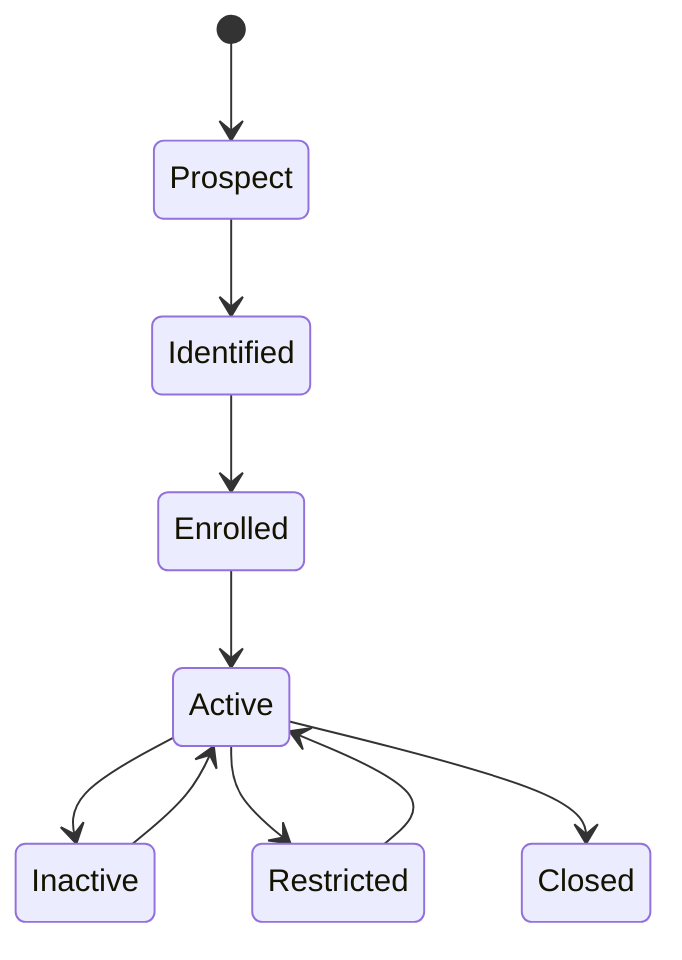

# P12 — Customer & Loyalty Lifecycle

Status: Business process specification · working baseline

## 1. Business purpose

Customer & Loyalty Lifecycle creates a consistent way to identify customers, recognize valuable behavior, award/redeem benefits and protect the retailer from incorrect or abusive loyalty use while respecting customer privacy choices.

The business objective is not merely “store phone numbers and points”. A mature loyalty process connects:

- customer identity;
- consent/preferences;
- earning rules;
- redemption rules;
- tiers/status;
- returns/reversals;
- expiry;
- service recovery;
- abuse/fraud control;
- program performance.

## 2. Scope

Includes:

- customer enrollment / identification;
- customer profile maintenance;
- consent/preferences at business-policy level;
- loyalty membership;
- points/benefit earning;
- redemption;
- tier qualification;
- points expiry;
- return/refund reversal;
- account merge/correction;
- abuse investigation;
- program KPI review.

Does not prescribe identity-management technology or privacy-system architecture.

## 3. Actors

| Actor | Responsibility |
|---|---|
| Customer | chooses enrollment, identity and benefit use |
| Cashier / Customer Service | enrolls/identifies customer and resolves routine issues |
| CRM / Loyalty Manager | program rules, tiers, campaigns and performance |
| Store Manager | approves selected service exceptions |
| Marketing | customer communication and targeted campaign use |
| Finance | benefit liability / cost visibility where required |
| Internal Control / Fraud | monitors abuse / unauthorized adjustments |
| Data Privacy / Legal | defines customer-data use and consent policy |

## 4. Customer lifecycle

A customer relationship may exist without loyalty enrollment, depending on retailer policy.

## 5. Enrollment process

1. Explain membership purpose / benefits according to retailer policy.
2. Collect minimum required customer information.
3. Capture consent/preferences where required.
4. Check for likely existing customer to avoid duplicate profile.
5. Create/confirm membership.
6. Communicate membership identifier / method of identification.
7. Apply welcome benefit only if program rules permit.

Principle: collect what the business legitimately needs; do not force unnecessary profile data purely because software fields exist.

## 6. Customer identification at sale

Potential methods:

- phone number;
- membership barcode/QR;
- app/account identifier;
- email or other approved identifier;
- customer lookup by authorized staff.

Business controls:

- avoid disclosing customer information during lookup;
- avoid attaching the wrong customer merely to grant points;
- define what evidence is needed for profile-sensitive actions;
- shared household/business accounts, if allowed, need explicit policy.

## 7. Earning lifecycle

A loyalty transaction may earn:

- base points per spend;
- points per quantity/category;
- promotional bonus points;
- tier multiplier;
- campaign-specific reward;
- non-point benefit such as stamps/credits.

Business questions:

- Which transaction statuses qualify?
- Are taxes/fees/excluded products included in earn base?
- Do manual discounts reduce earn?
- Are gift cards/vouchers purchase/redemption eligible?
- When do points become available: immediately or after return window?

## 8. Redemption process

1. Customer is identified.
2. Available balance/benefit is confirmed.
3. Basket eligibility is checked.
4. Minimum/maximum redemption rules are applied.
5. Customer confirms redemption.
6. Benefit reduces payable amount or creates allowed reward.
7. Redemption evidence is retained.
8. Remaining balance is communicated where practical.

Controls may include:

- redemption PIN/OTP/app confirmation for higher-value programs;
- daily/transaction redemption cap;
- excluded items/categories;
- no redemption below zero balance;
- manager approval for manual balance adjustment.

## 9. Return / refund impact

Returns must address both benefits **earned** and benefits **spent**.

### Points earned on returned purchase

Possible policies:

- reverse proportional points;
- reverse exact transaction points;
- allow negative balance if customer already spent them;
- require manager/service resolution instead of negative balance.

### Points used as tender/benefit

Possible policies:

- return points to account;
- return original tender composition;
- issue equivalent store credit under defined policy.

The key principle is consistency with original commercial transaction and no double benefit.

## 10. Tier lifecycle

Possible tiers: Member / Silver / Gold / Platinum, etc.

Qualification may use:

- rolling 12-month spend;
- calendar-year spend;
- visit frequency;
- points earned;
- mixed criteria.

The retailer must define:

- qualification period;
- upgrade timing;
- downgrade timing;
- grace period;
- tier benefits;
- treatment of returns after qualification;
- manual VIP override authority.

## 11. Points expiry

If points expire:

1. Rule and expiry horizon are communicated.
2. Customer balance distinguishes expiring value where feasible.
3. Expiry occurs under consistent rule.
4. Manual restoration is an exception with authority/reason.
5. Expiry rate is measured because excessive expiry may harm program trust.

## 12. Duplicate / merge process

Common scenario: same customer enrolled multiple times with different phone/email/old identifiers.

Controlled merge requires:

- sufficient evidence profiles belong to same person/account;
- benefit/points balances reconciled;
- duplicate promotional rewards considered;
- transaction history retained;
- merge actor/reason visible;
- irreversible merge rules carefully controlled.

## 13. Manual loyalty adjustment

Reasons may include:

- service recovery;
- missing points from proven transaction;
- correction of enrollment/profile error;
- campaign issue;
- approved goodwill.

Controls:

- reason required;
- amount/points threshold;
- manager/CRM approval for material adjustment;
- adjustments distinguishable from earned transactions;
- repeated adjustment by employee/customer monitored.

## 14. Abuse / fraud signals

Potential signals:

- many unrelated purchases attached to one employee/customer account;
- cashier attaches their own membership to anonymous customers;
- repeated manual points adjustment;
- unusually high redemption shortly after manual credit;
- duplicate welcome benefits across merged profiles;
- returns after points already redeemed;
- repeated high-value redemption across stores in short period.

Signals support investigation; they do not prove misconduct automatically.

## 15. Customer privacy / communication policy

Business documentation should distinguish:

- operational identification needed to service membership;
- marketing communication preference;
- personalized-offer usage;
- legally required consent/notice;
- account closure/deletion requests where applicable.

The process must not assume loyalty enrollment automatically grants permission for every marketing use.

## 16. Exceptions

| Exception | Business response |
|---|---|
| Customer cannot access old phone/account | identity verification / recovery policy |
| Duplicate profile | controlled merge |
| Missing points | verify sale, controlled adjustment |
| Points already spent before return | negative/recovery/service policy |
| Customer disputes expiry | explain rule / approved restoration exception |
| Membership used by family | household/shared policy |
| Suspected cashier self-credit | control investigation |
| Loyalty service unavailable | offline/deferred earn/redemption policy |

## 17. Controls

Recommended minimum:

- unique customer/profile controls appropriate to chosen identifiers;
- material manual adjustment requires reason/authority;
- earned, redeemed, expired and adjusted benefits remain distinguishable;
- returns reverse/recalculate relevant benefits;
- customer communication preferences respected;
- duplicate account merge is controlled;
- suspicious cashier/customer patterns are reviewed;
- program rules effective dates are managed explicitly.

## 18. KPI framework

### Program growth

- member enrollment rate;
- active member rate;
- identified-sales %;
- duplicate profile rate.

### Engagement

- member purchase frequency;
- average member basket vs non-member;
- active redemption rate;
- earn-to-redeem cycle time;
- tier migration.

### Economics

- incremental member revenue/margin;
- loyalty benefit cost;
- promotional reward cost;
- points liability where measured;
- breakage/expiry rate.

### Control / quality

- manual adjustment rate;
- missing-points claims;
- suspicious redemption count;
- merge rate;
- return-after-redemption exceptions.

## 19. Management questions

- Are members actually more valuable, or are high-value customers simply more likely to enroll?
- Which benefits drive repeat behavior without destroying margin?
- What share of sales is identifiable to customers?
- Are points balances/adjustments becoming a fraud or service burden?
- Which tiers are too easy/hard to achieve?
- How many customers have duplicate profiles?
- Do returns create uncollected negative loyalty value?
- Is expiry improving economics at the expense of trust?

## 20. Worked example

Customer spends 1,000,000 and earns 10,000 points, then spends those points next day. A week later they return half of the original purchase.

The retailer needs an explicit rule. Options include:

- reverse 5,000 points and allow account balance to become -5,000;
- recover equivalent value from refund;
- require service/manager resolution;
- use delayed earn until return window closes.

There is no universal answer, but the policy must exist before consistent operations are possible.

## 21. Research anchors

- Oracle Retail Customer Engagement documentation: https://docs.oracle.com/en/industries/retail/retail-customer-engagement/
- Oracle Retail Customer Engagement loyalty concepts: https://docs.oracle.com/en/industries/retail/retail-customer-engagement/latest/
- Oracle Xstore customer / loyalty integration guidance: https://docs.oracle.com/en/industries/retail/retail-xstore-point-of-service/

## 22. Open business-policy questions

- Is loyalty optional or required for customer profiles?
- Minimum enrollment data?
- What identifiers are accepted?
- How are points earned and when do they become usable?
- Which products/tenders are excluded?
- What redemption caps/security checks apply?
- How do returns reverse earned/redeemed benefits?
- Do points expire?
- Tier qualification/downgrade rules?
- Are household/shared accounts allowed?
- Who can manually adjust loyalty balances?
- What customer data/marketing consent rules apply?
