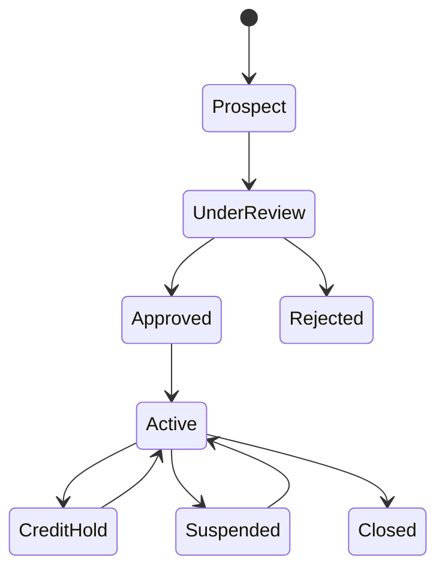
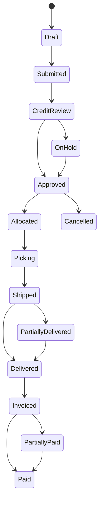

# P13 — Wholesale Order-to-Cash

Status: Business process specification · working baseline

## 1. Business purpose

Wholesale Order-to-Cash manages B2B sales from customer/account qualification through order acceptance, credit control, allocation, delivery, invoicing, collection and return/credit-note resolution.

Wholesale differs materially from store retail because the buyer may receive goods before paying, may have negotiated prices/terms, and may order for later fulfillment rather than immediate possession.

## 2. Scope

Includes:

- B2B customer/account onboarding;
- commercial terms and price agreement;
- quotation/order capture;
- credit check;
- order approval;
- availability/allocation;
- pick/ship/delivery;
- invoice;
- collection / AR aging;
- return / credit note;
- customer service exceptions.

## 3. Actors

| Actor | Responsibility |
|---|---|
| B2B Customer / Dealer | places order, receives goods, pays according to terms |
| Sales Representative / Account Manager | manages relationship and order/commercial context |
| Sales Administration | validates order and commercial terms |
| Credit Control | sets/monitors credit limit and overdue exposure |
| Warehouse / Fulfillment | allocates, picks, packs, dispatches |
| Logistics / Carrier | delivers goods and returns proof of delivery |
| Finance / AR | invoices, collects and manages aging |
| Commercial Manager | approves exceptional price/discount/terms |
| Customer Service | resolves shortages, claims and returns |

## 4. B2B customer/account lifecycle



## 5. Commercial account setup

Typical business terms:

- legal/billing identity;
- delivery addresses;
- price list / contract price;
- discount/rebate terms;
- payment terms;
- credit limit;
- tax treatment;
- minimum order;
- delivery schedule/cutoff;
- salesperson/territory;
- return policy;
- rebate/volume agreement where applicable.

## 6. Order lifecycle



Exact statuses vary, but business milestones should distinguish commercial acceptance, credit authorization, physical fulfillment and financial settlement.

## 7. Stage A — Order capture

Order can originate from:

- salesperson / telesales;
- customer portal / ecommerce B2B;
- EDI/integration;
- recurring order;
- field presales;
- customer service.

Order captures at minimum:

- customer/account;
- requested products/quantities/UOM;
- requested delivery date/location;
- commercial price/discount basis;
- customer PO/reference if required;
- payment terms;
- notes/instructions.

## 8. Stage B — Commercial validation

Check:

- account active;
- requested product allowed for account/channel;
- price/discount within agreement;
- minimum order / pack rules;
- requested delivery date feasible;
- exceptional price/terms approved.

## 9. Stage C — Credit check

Unlike immediate retail tender, B2B may create receivable exposure.

Credit assessment can consider:

```text
Current open AR
+ overdue AR
+ open unbilled/shipped exposure
+ new order value
versus
approved credit limit / policy
```

Possible outcomes:

- approve;
- hold for credit review;
- require partial/full prepayment;
- reduce order;
- cancel/reject.

SAP sales credit management supports credit checks that can block sales orders/deliveries and require authorized release, demonstrating that credit approval is an operational gate rather than merely a finance report.

## 10. Stage D — Availability and allocation

After commercial/credit acceptance:

1. Check saleable stock / expected supply.
2. Allocate quantity according to customer/service priority.
3. Handle shortage:
   - partial fulfillment;
   - backorder;
   - substitute with approval;
   - split shipment;
   - alternate source;
   - cancellation.
4. Communicate committed quantity/date to customer where applicable.

## 11. Stage E — Pick, ship and delivery

1. Release approved order for fulfillment.
2. Pick correct item/lot/UOM/quantity.
3. Check/pack.
4. Dispatch.
5. Create delivery evidence.
6. Customer receives and confirms quantity/condition.
7. Shortage/damage/refusal is recorded.
8. Proof of delivery / receiving evidence is returned.
9. Delivered quantity becomes invoicing basis according to policy.

## 12. Partial delivery

Wholesale orders often need partial fulfillment.

Policy must decide:

- invoice each shipment or only final order;
- leave residual backorder open or cancel;
- customer minimum delivery threshold;
- freight treatment;
- price/rebate implications if final quantity differs.

## 13. Stage F — Invoice and receivable

1. Invoice is generated according to delivered/accepted commercial basis.
2. Payment due date derives from customer terms.
3. Invoice and supporting documentation are delivered to customer.
4. Open receivable enters AR aging.
5. Credit exposure updates.

## 14. Stage G — Collection

Collection process:

- monitor due/overdue invoices;
- customer statement / reminder;
- salesperson/credit-control follow-up;
- receive payment;
- allocate payment to invoices;
- resolve short/over/unidentified payment;
- release credit hold when exposure returns within policy.

## 15. AR aging

Common buckets:

- current/not due;
- 1–30 overdue;
- 31–60;
- 61–90;
- >90.

Buckets are policy/reporting choices, but the business must see total exposure and overdue risk by account/salesperson/territory.

## 16. Return / credit note

Wholesale return may arise from:

- damage;
- wrong shipment;
- quality issue;
- customer-authorized return;
- recall;
- agreed stock rotation/expiry program.

Flow:

1. return request;
2. validate original order/invoice and policy;
3. authorize return;
4. physically receive/inspect goods;
5. determine disposition;
6. issue credit note/financial adjustment where approved;
7. update customer AR/exposure;
8. capture reason for supplier/sales analysis.

## 17. Rebate / volume deal concept

B2B commercial agreements may include retrospective rebate based on:

- total quarterly/yearly volume;
- product/category mix;
- growth target;
- payment behavior;
- promotional cooperation.

These are distinct from line price discounts and should be measured separately for true margin analysis.

## 18. Exceptions

| Exception | Business response |
|---|---|
| Customer over credit limit | hold/prepay/authorized release |
| Customer overdue | credit hold or management exception |
| Price differs from contract | commercial review |
| Stock shortage | partial/backorder/substitution/cancel |
| Delivery refused | return/claim investigation |
| POD missing | logistics follow-up before dispute closure |
| Payment unallocated | AR suspense investigation |
| Customer short-pays invoice | dispute/collection workflow |
| Rebate disputed | commercial evidence review |
| Return without authorization | reject/quarantine pending decision |

## 19. Controls

Recommended minimum:

- customer approval before credit sales;
- credit limit/payment terms owned by authorized function;
- sales rep cannot freely override credit hold/material price;
- delivery evidence supports invoicing;
- return/credit note linked to original commercial transaction;
- overdue exposure monitored;
- unidentified payments resolved;
- customer master/bank/payment changes controlled;
- retrospective rebates accrued/reviewed separately from ordinary price discount.

## 20. KPI framework

### Sales/service

- order fill rate;
- OTIF delivery;
- order cycle time;
- backorder rate;
- average order value;
- customer service level.

### Commercial

- gross margin by account;
- discount/rebate %;
- sales vs target;
- price exception rate.

### Credit/AR

- DSO;
- overdue AR %;
- bad debt / write-off;
- credit-hold order value;
- collection effectiveness;
- unapplied cash aging.

### Returns/logistics

- delivery discrepancy rate;
- return/credit-note rate;
- POD exception rate.

## 21. Management questions

- Which customers grow revenue but destroy cash flow through overdue debt?
- How much order value is blocked by credit?
- Which customers receive the most price/rebate exceptions?
- Which sales reps carry the worst overdue portfolio?
- How much demand is lost through stock shortage/backorder?
- Are credit notes concentrated by customer/product/logistics route?
- What is account profitability after delivery, discount, rebate and return cost?

## 22. Worked example

Dealer credit limit: 200m.

Current open invoices: 140m, including 40m overdue.

Open shipped/unbilled: 20m.

New order: 80m.

Potential exposure = 240m, above limit. Even if the new order itself is only 80m, credit policy may place it on hold until payment or authorized override. Immediate retail checkout logic would not be sufficient for this scenario.

## 23. Research anchors

- SAP Credit Management sales-order credit check: https://help.sap.com/docs/SAP_S4HANA_CLOUD/0f69f8fb28ac4bf48d2b57b9637e81fa/6532d2531a4d424de10000000a174cb4.html
- SAP Sales credit-block processing: https://help.sap.com/docs/SAP_S4HANA_ON-PREMISE/1a4c574d0f5f4cb78ecf7e3c8b3bb8c5/6532d2531a4d424de10000000a174cb4.html
- APQC Order-to-Cash / PCF frameworks: https://www.apqc.org/process-frameworks

## 24. Open business-policy questions

- Which customers may buy on credit?
- Who sets/changes credit limit and terms?
- What overdue condition automatically blocks orders?
- What authority can release a credit hold?
- Are customer-specific price lists/contracts used?
- How are partial deliveries/invoices handled?
- What is backorder cancellation policy?
- What proof of delivery is required?
- What wholesale return/stock-rotation rights exist?
- How are volume rebates calculated/approved?
