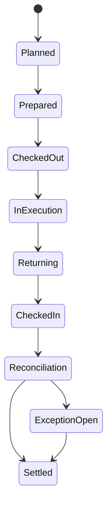

# P14 — Distribution / Route-to-Settlement

Status: Business process specification · working baseline

## 1. Business purpose

Distribution / Route-to-Settlement governs field distribution where merchandise is loaded onto a route/vehicle, delivered or sold to customers/dealers, payments/returns are collected, and the route is reconciled back to stock, sales and cash/tender evidence.

This process is common in FMCG/direct-store-delivery models and is materially different from both fixed-store POS and warehouse-shipped wholesale.

## 2. Scope

Includes:

- route/customer planning;
- presales and direct/van sales patterns;
- route preparation;
- vehicle stock loading;
- route checkout;
- customer visit;
- order/delivery/sale;
- collection;
- return/empties where relevant;
- truck-to-truck transfer where policy allows;
- route check-in;
- stock/tender reconciliation;
- settlement and exception review.

## 3. Operating models

### Presales / delivery route

Sales representative takes order in advance; warehouse prepares goods; delivery route later fulfills it.

### Van sales / direct sales

Vehicle carries inventory and the field operator sells/delivers directly from available route stock during visits.

### Hybrid

A route may combine presales/merchandising activity, ordered-goods delivery and van sales according to operating model.

SAP Last Mile Distribution for Direct Distribution explicitly supports presales, delivery and van-sales routes, route preparation/execution, truck-to-truck transfers and route settlement.

## 4. Actors

| Actor | Responsibility |
|---|---|
| Sales Representative | customer relationship/order capture |
| Driver / Van Seller | route execution and custody of vehicle stock/tender |
| Route Supervisor | route planning, dispatch and exception review |
| Warehouse / Load Crew | prepares and issues route stock |
| Customer / Dealer | receives/buys goods and pays/accepts receivable |
| Cashier / Settlement Clerk | reconciles route cash/tender/documents |
| Inventory Control | reconciles route stock and returns |
| Credit Control | governs credit accounts/collections |
| Logistics | route productivity and delivery performance |

## 5. Route lifecycle



## 6. Route planning

1. Define route date/territory.
2. Identify customers due for visit/delivery.
3. Consider customer time windows and priority.
4. Consider open presales orders.
5. Consider vehicle capacity and product constraints.
6. Plan visit sequence.
7. Assign route personnel/vehicle.
8. Estimate product load and collection exposure.

SAP route preparation models a route/freight order with multiple visits plus assigned vehicle and driver; this is a useful enterprise reference for the operational accountability boundary.

## 7. Route preparation / loading

For van sales, route inventory is a controlled custody handoff.

1. Determine planned vehicle stock.
2. Warehouse picks by item/lot/UOM as required.
3. Route operator verifies or accepts load under defined procedure.
4. Opening vehicle stock is documented.
5. Preloaded customer deliveries are distinguished from free-sale van stock where necessary.
6. Cash float, documents, devices and promotional material are issued.
7. Route checks out.

The business must know what stock left the warehouse on each route.

## 8. Customer visit — presales model

Typical field sales visit:

1. identify customer/account;
2. review outstanding orders/AR where relevant;
3. inspect stock/display where business uses this practice;
4. capture requested products/quantities;
5. apply customer price/terms;
6. perform credit/business-rule checks;
7. confirm order/delivery expectation;
8. capture visit outcome / reason if no order.

## 9. Customer visit — van sales model

1. Arrive and identify customer.
2. Review account/credit status if sale is on credit.
3. Select goods from actual vehicle stock.
4. Apply customer price/discount policy.
5. Record sale/delivery.
6. Obtain proof/acknowledgment.
7. Collect cash/electronic payment or create receivable according to account terms.
8. Accept authorized return/empties where relevant.
9. Update route stock responsibility.
10. Continue route.

SAP's van-sales execution reference records route activities for later settlement and maintains visibility of route stock from warehouse loading through customer visits and final check-in.

## 10. Collection process

A route may collect:

- payment for current delivery;
- payment for older invoice;
- partial payment;
- cash;
- electronic payment;
- cheque/other approved instrument where relevant.

Controls:

- payment must identify customer/account;
- receipt/evidence given where required;
- collected cash becomes route custody;
- payment for old AR must not be confused with current-sale tender;
- unapplied collection becomes explicit exception.

## 11. Returns / empties / reusable assets

Some distribution models manage:

- customer product returns;
- damaged/expired goods;
- empty bottles/crates/kegs;
- pallets/totes;
- promotional assets.

The route process should distinguish merchandise value from reusable-container custody where relevant.

## 12. Truck-to-truck / route stock transfer

If allowed operationally:

1. donor route confirms available stock;
2. receiving route confirms need;
3. transfer quantity is counted by both parties;
4. custody moves explicitly;
5. donor route stock decreases;
6. receiving route stock increases;
7. both routes retain evidence for settlement.

SAP specifically supports stock transfer between van-sales routes, directly vehicle-to-vehicle or through a temporary storage location, and requires issuing/receiving route evidence. This reinforces why vehicle stock must be treated as controlled custody.

## 13. Route check-in

At route end:

1. vehicle returns to depot/warehouse;
2. remaining saleable stock is counted;
3. returns/damaged goods/empties are counted separately;
4. delivery/sales documents are submitted;
5. cash/tender/collection evidence is submitted;
6. missed customers / failed deliveries are classified;
7. route proceeds to settlement/reconciliation.

## 14. Route stock reconciliation

Conceptually:

```text
Opening route stock
+ stock transferred in
- sales/deliveries
- stock transferred out
- approved damage/loss
- customer return effect
= expected closing route stock
```

Expected is compared with actual check-in stock.

Difference is investigated rather than erased.

## 15. Route cash / tender reconciliation

Conceptually:

```text
Opening cash float
+ cash sales
+ AR collections
+ approved paid-in
- customer cash refunds
- approved route expenses / paid-out
- cash drops/handovers
= expected cash
```

Actual cash and electronic evidence are reconciled separately.

SAP route settlement explicitly checks expected versus actual product and payment data; differences and tolerance breaches become settlement work rather than being normalized away.

## 16. Failed delivery / visit outcomes

Standardized reasons may include:

- customer closed;
- customer refused delivery;
- no cash / credit hold;
- wrong order;
- stock unavailable;
- access/route problem;
- customer requested reschedule;
- quality/damage issue;
- visit completed/no order.

These reasons feed route/service improvement.

## 17. Exceptions

| Exception | Business response |
|---|---|
| Load differs from route issue document | resolve before checkout or record custody exception |
| Van sells item not planned but in stock | allow under assortment/price policy |
| Customer over credit limit | hold/prepayment/authorized exception |
| Customer refuses part of delivery | record accepted/refused quantity and reason |
| Route stock shortage at check-in | recount/investigate/escalate |
| Route cash shortage | reconcile collections/sales/expenses and investigate |
| Missed customer | classify and reschedule if needed |
| Electronic payment uncertain | settlement investigation before duplicate collection |
| Vehicle breakdown | transfer/rescue/return plan with custody evidence |
| Truck-to-truck transfer | bilateral count/evidence |

## 18. Controls

Recommended baseline:

- route/vehicle stock issued and returned under count/custody;
- sales/returns/collections attributable to route/operator/customer;
- credit rules enforced for account sales;
- customer cash collections receipted and reconciled;
- material route stock/cash variance independently reviewed;
- route expenses/payouts authorized;
- failed visits/deliveries reason-coded;
- truck-to-truck transfer controlled;
- route settlement cannot simply net unknown stock loss against cash overage or vice versa.

## 19. KPI framework

### Sales/service

- route sales;
- sales per visit;
- strike rate (visits with order/sale);
- average drop/order value;
- OTIF delivery;
- failed delivery rate;
- visit adherence.

### Distribution productivity

- drops per route/day;
- distance/time per drop;
- vehicle utilization;
- route completion %;
- cases/units delivered per route.

### Inventory

- route stock variance;
- returns/damage %;
- stockout-on-route rate;
- truck transfer frequency.

### Cash/credit

- route cash over/short;
- collection rate;
- unapplied collection aging;
- overdue AR collected per route;
- credit-hold visit rate.

## 20. Management questions

- Which routes have high sales but poor cash/stock reconciliation?
- Which customers are repeatedly missed or refuse delivery?
- How much vehicle stock returns unsold every day?
- Are van-sales loads optimized or habitually overstocked?
- Which route/customer combinations have the worst credit collection?
- Are truck-to-truck transfers compensating for poor load planning?
- Which drivers/sellers have repeated stock variance?
- What is the cost-to-serve per route/customer?

## 21. Worked example

Van loads:

- 100 cases product A.

During route:

- sells/delivers 70;
- transfers 10 to another van;
- records 2 damaged;
- should return 18.

Actual return count = 16.

The route has unexplained shortage of 2 cases. The process should preserve load, sales, transfer and damage evidence, then investigate the 2-case difference rather than altering a customer sale or original load.

## 22. Research anchors

- SAP Getting Started with Last Mile Distribution: https://help.sap.com/docs/SAP_S4HANA_ON-PREMISE/e322becd165844e5868e590bc8efafaf/7ba9e0272efb4d02bcb8f75970093ca0.html
- SAP Route Preparation: https://help.sap.com/docs/SAP_S4HANA_ON-PREMISE/e322becd165844e5868e590bc8efafaf/0b7ed2e3469a41cabaf05322f5a707de.html
- SAP Execution of Van Sales Routes: https://help.sap.com/docs/SAP_S4HANA_ON-PREMISE/e322becd165844e5868e590bc8efafaf/966e5a1b8f1d4f828e4a14d0a57875a4.html
- SAP Truck-to-Truck Stock Transfers: https://help.sap.com/docs/SAP_S4HANA_ON-PREMISE/e322becd165844e5868e590bc8efafaf/d9a6eff6f9854141857c9c0a1d024be2.html
- SAP Route Settlement: https://help.sap.com/docs/SAP_S4HANA_ON-PREMISE/e322becd165844e5868e590bc8efafaf/19729401d8814f1d99afa814cf2f83ab.html
- SAP Settlement of Different Route Types: https://help.sap.com/docs/SAP_S4HANA_ON-PREMISE/e322becd165844e5868e590bc8efafaf/7786a46e210047839038d91d75bc8f32.html

## 23. Open business-policy questions

- Presales, van sales or hybrid by channel/territory?
- Who owns route stock custody?
- Is route selling restricted to planned customer assortment?
- Which customers can buy on credit in the field?
- How are old AR collections allocated?
- Are truck-to-truck transfers permitted?
- What stock/cash variance threshold requires investigation?
- Which route expenses may be paid from collected cash?
- How are empties/reusable containers valued and controlled?
- What proof of delivery is mandatory?
