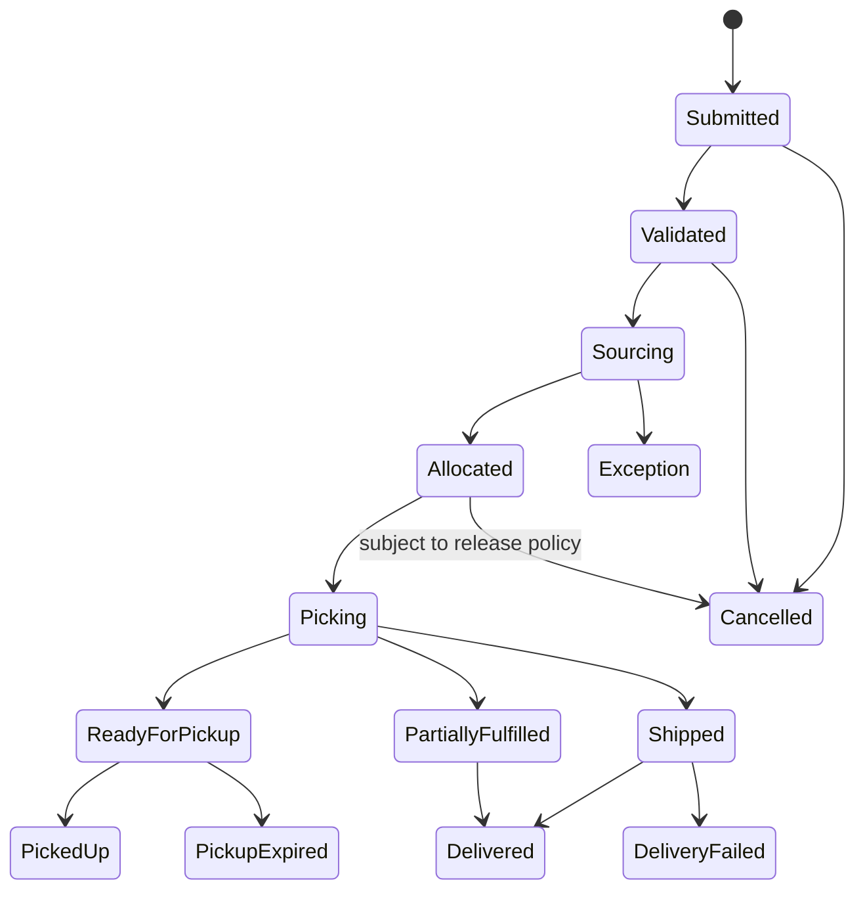

# P15 — Omnichannel Order-to-Fulfillment

Status: Business process specification · working baseline

## 1. Business purpose

Omnichannel Order-to-Fulfillment coordinates customer orders across digital and physical selling channels so the retailer promises stock responsibly, selects a fulfillment source, prepares the order, hands it to the customer/carrier and resolves cancellations, failed pickup/delivery and returns consistently.

The operating problem is not simply “online order”. The same inventory may be serving walk-in customers, pickup orders, delivery orders and transfers simultaneously.

## 2. Scope

Includes:

- order capture;
- customer/order validation;
- availability promise;
- fulfillment source selection;
- reserve/allocate;
- store pickup / click-and-collect;
- ship-from-store;
- warehouse fulfillment;
- ship-to-store/pickup where used;
- picking, substitution and shortage;
- ready-for-pickup/customer notification;
- pickup/handover/delivery;
- failed pickup/delivery;
- cancellation;
- cross-channel return entry.

## 3. Actors

| Actor | Responsibility |
|---|---|
| Customer | places order, selects fulfillment, receives/collects |
| Ecommerce / Customer Service | captures and services order |
| Order Management / Operations | governs sourcing/exception policy |
| Store Fulfillment Staff | picks, stages and hands over store orders |
| Warehouse / DC | fulfills centrally sourced orders |
| Carrier / Delivery Partner | transports delivery |
| Store Manager | manages local capacity and exception escalation |
| Inventory / Replenishment | monitors availability effects |
| Payment / Finance | handles payment/refund settlement |

## 4. Fulfillment methods

Typical modes:

- buy online, pick up in store (BOPIS / click-and-collect);
- ship from store;
- warehouse/DC ship to customer;
- ship to store for customer pickup;
- reserve online, pay in store where retailer allows;
- same-day/local delivery;
- mixed fulfillment for multi-line order where policy permits.

## 5. Order lifecycle

## 6. Stage A — Order capture and validation

1. Customer submits basket/order.
2. Customer identity/contact and destination/pickup store are validated according to policy.
3. Selling price/promotion/payment terms are confirmed.
4. Requested fulfillment method is validated.
5. Restricted product / delivery constraints are checked.
6. Order moves to sourcing only when commercially acceptable.

## 7. Stage B — Availability promise

Customer-facing availability should distinguish:

- stock physically recorded;
- stock already committed;
- stock unavailable/quarantined;
- stock expected inbound;
- stock needed to protect walk-in service level;
- fulfillment lead time/cutoff.

A retailer may deliberately reserve a safety buffer and promise less than recorded on-hand quantity to reduce cancellations.

## 8. Source selection

Potential source:

- selected pickup store;
- nearest capable store;
- store with excess stock;
- DC/warehouse;
- supplier/drop-ship source where model permits.

Source decision may consider:

- available stock;
- fulfillment capacity;
- promised date;
- distance/shipping cost;
- store workload;
- split-shipment cost;
- item handling constraints;
- inventory aging/strategic balancing.

Oracle Retail Order Broker provides a useful enterprise reference: its routing engine evaluates enterprise inventory availability and applies business rules to select fulfillment locations, while Store Connect supports store associates fulfilling omnichannel orders.

## 9. Store-pick process

1. Order enters store fulfillment queue.
2. Staff locate item.
3. Pick actual quantity.
4. Verify item/variant/condition/expiry where relevant.
5. Handle shortage/substitution.
6. Stage separately from normal saleable shelf where appropriate.
7. Mark ready only after physical pick is confirmed.
8. Notify customer.

A positive system stock balance does not guarantee physical pick success; “not found” must feed inventory-accuracy and replenishment processes.

## 10. Substitution policy

Especially relevant to grocery.

Possible choices:

- no substitution;
- customer-selected substitutes;
- equivalent brand/size within price range;
- contact customer during pick;
- automatic approved substitute rules.

Policy must cover:

- price difference;
- promotion effect;
- dietary/allergen restrictions;
- loyalty benefit;
- customer acceptance.

## 11. Click-and-collect / pickup

1. Order is physically ready and staged.
2. Customer receives ready notification.
3. Customer arrives within pickup window.
4. Staff verifies customer/order according to handover policy.
5. Payment balance, if any, is resolved.
6. Goods are handed over.
7. Pickup completion is recorded.
8. Staging inventory is cleared.

Oracle Xstore's Order Broker pickup flow provides a concrete retail reference: an associate opens the order, selects items ready for pickup and can scan them before adding them to the pickup transaction to confirm the correct merchandise.

### Pickup expiry

If customer does not collect:

- send reminder;
- hold for configured period;
- cancel/refund according to payment policy;
- return merchandise to saleable stock after condition check;
- handle perishables separately.

## 12. Ship-from-store / delivery

1. Store accepts fulfillment task.
2. Pick and pack.
3. Create carrier handoff/delivery evidence.
4. Carrier picks up.
5. Shipment is tracked.
6. Customer receives delivery.
7. Failed delivery is reason-coded.
8. Returned-to-store/carrier stock is reconciled if delivery fails.

## 13. Partial fulfillment

If order cannot be fully fulfilled:

Possible policies:

- partial shipment;
- split across sources;
- wait/backorder;
- substitute;
- cancel unavailable line;
- cancel whole order.

The customer should receive clear commercial/payment adjustment, not merely an internal stock exception.

## 14. Cancellation

Cancellation rights depend on stage:

- before allocation: normally easiest;
- after allocation: release reserved stock;
- during picking: controlled stop/reversal;
- after shipment: may become return/refusal rather than cancellation;
- after pickup: normal return policy.

Payment authorization/refund must follow actual fulfillment/cancellation outcome.

## 15. Failed delivery

Reason examples:

- customer unavailable;
- invalid address;
- customer refusal;
- carrier failure;
- damage;
- payment/COD failure;
- access restriction.

Business response:

- reattempt;
- return to source;
- alternate pickup;
- cancel/refund;
- customer service resolution.

## 16. Cross-channel return

If ecommerce purchase can be returned in store:

1. original order is verified;
2. channel return policy checked;
3. refund entitlement determined from original commercial value;
4. product condition/disposition assessed;
5. refund/payment-channel implications resolved;
6. returned inventory assigned to appropriate location/status;
7. original order/channel reporting updated consistently.

## 17. Capacity management

A store with stock may still be unable to fulfill unlimited digital orders.

Capacity dimensions:

- picker labor;
- staging space;
- pickup slots;
- delivery cutoff;
- cold/frozen storage;
- carrier pickup capacity;
- store peak customer traffic.

Therefore fulfillment promise may depend on both inventory and operational capacity.

## 18. Exceptions

| Exception | Business response |
|---|---|
| System says stock exists but picker cannot find | inventory exception, alternate source/substitute/cancel |
| Wrong item picked | repick before handoff |
| Perishable item expires during staging | replace/cancel; waste process |
| Pickup customer never arrives | expiry/cancel/restock policy |
| Carrier misses pickup | capacity/escalation/re-promise |
| Delivery fails | reattempt/return/refund policy |
| Payment captured but line cancelled | partial refund/adjustment |
| Split sources create multiple customer deliveries | communicate clearly, evaluate cost/service |
| Store overwhelmed | reroute/limit slots/extend promise |

## 19. Controls

Recommended baseline:

- customer promise based on available/capable supply, not raw stock alone;
- physical pick confirmation before ready notification;
- staged orders remain identifiable and protected from walk-in sale;
- substitution is customer/policy controlled;
- cancellation releases committed stock;
- payment/refund follows actual fulfillment status;
- perishable staging observes quality/expiry rules;
- failed pickup/delivery reason recorded;
- order handover/proof captured according to risk;
- cross-channel returns remain linked to original order.

## 20. KPI framework

### Customer service

- order fill rate;
- perfect order rate;
- promise accuracy;
- cancellation rate;
- substitution rate;
- pickup wait time;
- on-time delivery;
- failed pickup/delivery rate.

### Fulfillment productivity

- pick time/order;
- pick accuracy;
- orders per labor hour;
- store fulfillment acceptance rate;
- staging dwell time.

### Inventory

- item-not-found rate;
- inventory-related cancellation rate;
- digital stockout rate;
- aged staged order value.

### Economics

- fulfillment cost/order;
- split-shipment rate/cost;
- delivery subsidy;
- return rate by fulfillment method.

## 21. Management questions

- Which stores have high digital cancellation despite positive stock?
- How much customer promise failure comes from inventory inaccuracy versus capacity?
- Is ship-from-store reducing stock imbalance or harming walk-in availability?
- Which substitutions are most often rejected?
- How long do orders sit staged before pickup?
- What is cost-to-serve by fulfillment method?
- Which stores should not be fulfillment nodes at peak hours?

## 22. Worked example

Store shows 5 units on hand. Two are already reserved for pickup orders, one is damaged/quarantined, and the retailer keeps a 1-unit safety buffer for walk-in service.

Raw on-hand = 5, but omnichannel promiseable quantity may be only 1. Promising all 5 would create avoidable cancellation/customer disappointment.

## 23. Research anchors

- Oracle Retail Order Broker Cloud Service 21.1: https://docs.oracle.com/en/industries/retail/retail-order-broker-cloud/21.1/
- Oracle Xstore 25 — Order Transactions Through Order Orchestration/Order Broker: https://docs.oracle.com/en/industries/retail/retail-xstore-point-of-service/25.0/rpxmo/order-transactions-order-broker-cloud-service.htm
- Oracle Retail product documentation index: https://docs.oracle.com/en/industries/retail/

## 24. Open business-policy questions

- Which stores can fulfill digital orders?
- What safety stock/buffer protects walk-in demand?
- Are split shipments allowed?
- What substitution policy applies by category?
- How long is pickup hold period?
- When is customer charged: order, pick, ship, pickup?
- What happens to uncollected perishables?
- How is store fulfillment capacity capped?
- Are cross-channel returns allowed?
- Who bears delivery/failure cost?
