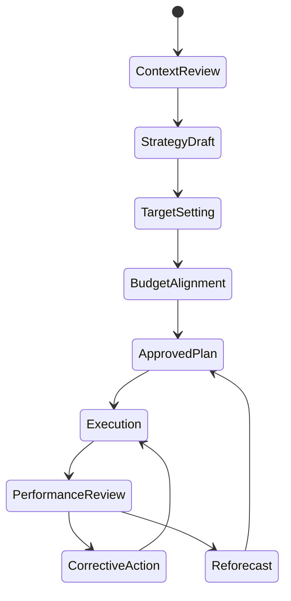

# P17 — Strategy-to-Performance

Status: SOP-level business process specification · desk-research baseline

## 1. Purpose

Translate enterprise direction into measurable retail operating priorities, targets, budgets, initiatives and recurring performance reviews.

## 2. Scope

Includes:

- strategic context review;
- annual and medium-term planning;
- store/network priorities;
- financial and operational target setting;
- target cascade to functions/stores;
- initiative portfolio governance;
- monthly/quarterly performance review;
- corrective-action governance;
- plan refresh when assumptions materially change.

## 3. Actors

CEO/Owner, COO, Finance, Commercial/Category, Supply Chain, Store Operations, HR/Workforce, Digital/IT, Business Analytics, regional/store managers.

## 4. Business evidence

- strategy paper / annual operating plan;
- budget and forecast;
- target/KPI scorecard;
- store/region target sheet;
- initiative portfolio;
- monthly business review pack;
- action log;
- revised forecast / reforecast.

## 5. Process lifecycle

## 6. Stage A — Context review

Review external and internal evidence:

- market/category growth;
- competitor changes;
- customer behavior;
- supplier and cost pressure;
- store productivity;
- inventory/working-capital position;
- shrinkage/waste;
- labor productivity;
- digital/omnichannel mix;
- cash/credit exposure;
- regulatory/compliance changes.

## 7. Stage B — Strategic choices

Decide major priorities such as:

- store expansion/closure/remodel;
- category growth/exit;
- private-label strategy;
- margin vs volume tradeoff;
- inventory investment;
- wholesale/distribution expansion;
- omnichannel/service promise;
- cost-productivity program;
- technology/transformation initiatives.

Each choice should state desired business outcome and tradeoffs.

## 8. Stage C — Target setting

Targets may include:

- net sales;
- gross margin;
- EBITDA/contribution where used;
- inventory turns / days of supply;
- OSA / stockout;
- shrinkage / waste;
- supplier OTIF;
- labor cost / productivity;
- return/refund rate;
- cash variance;
- DSO / overdue AR for B2B;
- customer retention/loyalty;
- omnichannel service levels.

Target hierarchy must reconcile enterprise → region/channel → store/function.

## 9. Stage D — Budget and resource alignment

Align plan with:

- headcount and labor budget;
- inventory/open-to-buy;
- capex;
- promotion/trade spend;
- logistics capacity;
- technology investment;
- working-capital constraints.

Unfunded targets are escalated rather than silently accepted.

## 10. Stage E — Initiative portfolio

For each strategic initiative define:

- accountable owner;
- outcome/KPI;
- milestone;
- budget/resources;
- dependencies;
- risk;
- review cadence;
- stop/continue criteria.

## 11. Stage F — Performance review

Monthly/quarterly review should separate:

1. result vs target;
2. forecast vs target;
3. root cause;
4. controllable vs external driver;
5. action owner/date;
6. decision required from leadership.

Avoid review packs that only explain past variance without action.

## 12. Exception / trigger for reforecast

Possible triggers:

- material sales/margin deviation;
- supplier/currency/cost shock;
- store opening delay;
- major stock shortage;
- regulatory change;
- unexpected promotion performance;
- severe shrinkage/quality event;
- significant credit/working-capital stress.

## 13. Controls

- one approved target hierarchy;
- finance reconciliation of financial targets;
- KPI definition ownership;
- version control for plan/forecast;
- initiative owner and due date mandatory;
- action closure evidence;
- no silent target restatement after period close;
- assumptions documented for major forecast changes.

## 14. KPIs

- target attainment by business outcome;
- forecast accuracy;
- action closure rate;
- initiative milestone adherence;
- budget variance;
- store performance dispersion;
- percentage of material variances with root cause/action;
- benefits realized vs business case.

## 15. Worked example

Chain target: +12% sales with flat inventory days.

If a region proposes +25% safety stock to achieve availability, the planning process must surface the working-capital conflict and decide whether to change assortment, supplier lead time, replenishment frequency or target—not simply approve both targets independently.

## 16. Research anchors

- APQC PCF 8.0 and process definitions/key measures: https://www.apqc.org/process-frameworks
- APQC strategic planning guidance: https://www.apqc.org/How-Can-I-Improve-My-Companys-Strategic-Planning-Process

## 17. Open retailer-policy questions

- planning horizon and calendar;
- budget vs rolling forecast model;
- target ownership by level;
- threshold for mandatory corrective action;
- threshold for reforecast;
- standard executive/store review cadence;
- initiative benefit-validation method.
