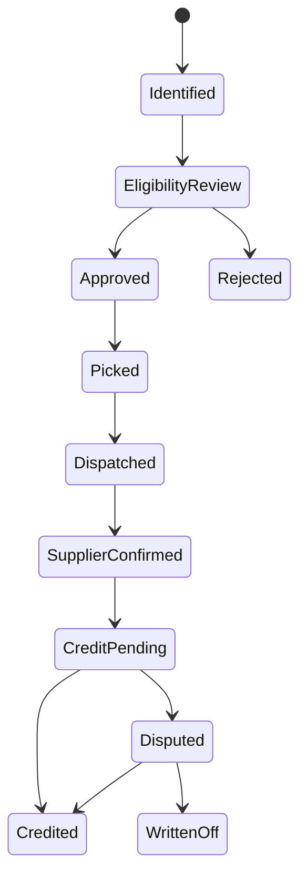

# P18 — Supplier Return-to-Credit

Status: SOP-level business process specification · desk-research baseline

## 1. Purpose

Control the return of merchandise to suppliers and ensure physical stock, supplier claims, credit notes and settlement adjustments remain aligned.

## 2. Scope

Includes:

- identify returnable stock;
- validate supplier return right;
- obtain authorization;
- pick/stage/count;
- dispatch/collection;
- supplier receipt confirmation;
- credit/claim resolution;
- payable adjustment;
- unresolved claim escalation.

## 3. Typical triggers

- damaged delivery accepted under claim;
- quality defect;
- recall;
- expired/short-dated stock covered by agreement;
- over-delivery;
- wrong item;
- vendor stock rotation agreement;
- delisted or discontinued merchandise return right.

## 4. Actors

Buyer/Category, Supplier, Inventory Control, Warehouse/Store Stock Staff, Receiving/Dispatch, Quality, Finance/AP.

## 5. Evidence

- original PO/receipt;
- supplier return authorization / RMA where used;
- return request;
- pick/count record;
- dispatch note;
- carrier/supplier collection proof;
- supplier credit note;
- claim/dispute record.

## 6. Lifecycle

## 7. Flow

1. Identify stock and reason.
2. Link to supplier/product and supporting purchase evidence where applicable.
3. Check return agreement/window/condition.
4. Obtain required commercial or quality approval.
5. Separate stock from saleable inventory.
6. Count and document actual return quantity/UOM/lot where relevant.
7. Dispatch or hand over to supplier/carrier.
8. Retain proof of handover.
9. Monitor supplier acceptance/credit.
10. Match credit note to actual accepted quantity/value.
11. Resolve short credit/rejection.
12. Adjust supplier payable only through approved financial evidence.
13. Close when physical and financial resolution are complete.

## 8. Exceptions

- supplier refuses return;
- dispatched quantity differs from authorized quantity;
- supplier receives less than dispatched;
- return right expired;
- credit note value differs from claim;
- product already written off;
- return stock lost in transit;
- supplier issues replacement instead of credit.

## 9. Controls

- mandatory reason code;
- return right/approval evidence;
- non-saleable segregation before dispatch;
- actual count at dispatch;
- proof of handover;
- no AP net-off without supplier credit/approved claim basis;
- unresolved claims aged and escalated;
- recall/quality returns traceable by lot where required.

## 10. KPIs

- supplier return value/rate;
- claim recovery %;
- credit-note cycle time;
- disputed claim aging;
- supplier rejection rate;
- return-related write-off;
- recurring return reason by supplier/SKU.

## 11. Worked example

100 cases are approved for return. Warehouse dispatches 98 after recount. Supplier confirms 96 and credits 96. The business must retain three facts—100 approved, 98 dispatched, 96 accepted—and investigate the 2-case transit/receipt discrepancy rather than editing the return request to 96.

## 12. Open retailer-policy questions

- who can authorize supplier return;
- supplier return window;
- transport ownership/risk;
- treatment of expired/short-dated merchandise;
- replacement vs credit policy;
- claim aging escalation threshold;
- write-off authority.
