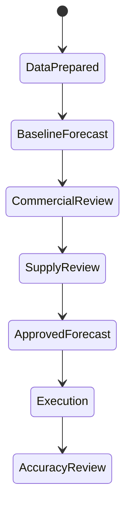

# P19 — Demand Planning and Allocation

Status: SOP-level business process specification · desk-research baseline

## 1. Purpose

Convert demand signals into an agreed forecast and allocate constrained/new/promotional inventory across locations/channels using explicit service and commercial priorities.

## 2. Scope

Includes:

- demand history preparation;
- baseline forecast;
- event/promotion/seasonality uplift;
- forecast review/override;
- consensus demand plan;
- constrained supply review;
- allocation rules;
- launch/promotion allocation;
- shortage reallocation;
- post-event forecast learning.

## 3. Actors

Demand Planner, Category/Commercial, Replenishment, Supply/Procurement, Store Operations, Omnichannel, Wholesale Sales, Finance/Analytics.

## 4. Inputs / evidence

- sales history;
- lost-sales/OOS signal where available;
- current stock and in-transit;
- promotion calendar;
- product/store lifecycle;
- seasonality/event calendar;
- supplier lead time/capacity;
- store/channel priority;
- forecast override log.

## 5. Forecast lifecycle

## 6. Flow A — Demand plan

1. Prepare clean history and identify stockout/distortion periods.
2. Produce baseline by SKU-location/time bucket or appropriate aggregate.
3. Apply known event/seasonal/promotion effects.
4. Review new/delisted products separately from mature items.
5. Capture manual overrides with reason and owner.
6. Review supply feasibility and major constraints.
7. Approve consensus forecast.
8. Publish to replenishment/procurement/allocation.
9. Measure forecast error and bias after the period.

## 7. Flow B — Allocation under constraint

When supply < demand:

1. determine allocatable quantity;
2. identify eligible stores/channels/customers;
3. protect contractual/strategic obligations where applicable;
4. define service priority or fair-share logic;
5. apply store capacity/assortment constraints;
6. allocate initial quantity;
7. monitor sell-through/availability;
8. reallocate residual or scarce stock if policy allows;
9. record overrides and business rationale.

## 8. Allocation scenarios

- new-product launch;
- promotion stock build;
- seasonal item;
- scarce supplier delivery;
- store opening;
- omnichannel safety stock;
- wholesale contractual commitment;
- emergency redistribution.

## 9. Exceptions

- no reliable history;
- prolonged stockout corrupts sales history;
- promotion uplift unsupported;
- supplier capacity cut;
- forecast override creates excessive inventory;
- store cannot hold allocated quantity;
- channel conflict;
- launch delay;
- sudden demand spike.

## 10. Controls

- override reason mandatory;
- forecast version/date ownership;
- promotion uplift tied to promotion/event;
- constrained allocation rule visible;
- commercial overrides above material threshold approved;
- post-event forecast bias reviewed;
- allocation does not silently bypass assortment or legal/customer constraints.

## 11. KPIs

- forecast accuracy/error;
- forecast bias;
- service level/fill rate;
- stockout/OOS rate;
- excess/aged stock resulting from forecast;
- allocation override rate;
- launch/promotion sell-through;
- lost sales due to constraint;
- reallocation rate.

## 12. Worked example

A promotion needs 10,000 units but supplier confirms 7,000. Allocation should not default to equal quantity per store. It should consider store demand, promotion participation, capacity, strategic commitments and channel protection, while keeping manual exceptions visible.

## 13. Research anchors

- ASCM SCOR Digital Standard — Plan/Order/Fulfill concepts.
- Oracle Retail replenishment and allocation references.
- APQC PCF 8.0 process definitions/key measures.

## 14. Open retailer-policy questions

- forecast level/time bucket;
- accepted error/bias threshold;
- who can override forecast;
- allocation priority hierarchy;
- omnichannel safety-stock policy;
- new-store/new-product allocation method;
- constrained supply escalation threshold.
