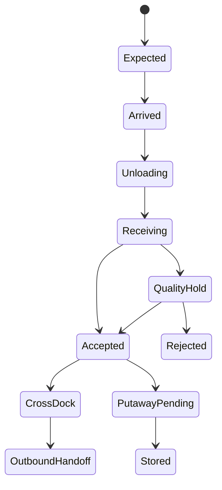

# P20 — Warehouse Inbound, Storage and Cross-Dock

Status: SOP-level business process specification · desk-research baseline

## 1. Purpose

Control inbound receiving, putaway, storage, internal replenishment and cross-dock decisions so warehouse stock is identifiable, quality-controlled and available for downstream fulfillment.

## 2. Scope

Includes:

- inbound appointment/arrival;
- unloading and receiving;
- quantity/quality/lot/expiry checks;
- quarantine;
- directed/manual putaway;
- storage/location discipline;
- pick-face/internal replenishment;
- cross-dock/flow-through;
- warehouse exception handling;
- custody evidence.

Outbound pick/pack/dispatch is already covered by P13–P15 and referenced here only at handoff.

## 3. Actors

Warehouse Manager, Inbound Planner, Receiver, Quality, Putaway Operator, Inventory Control, Replenishment Operator, Picker, Transport/Carrier, Procurement/Supply.

## 4. Business evidence

- ASN/PO/shipment advice;
- dock/arrival record;
- receipt/count record;
- quality/expiry evidence;
- quarantine/disposition record;
- putaway task/evidence;
- location inventory;
- internal replenishment task;
- cross-dock instruction;
- discrepancy record.

## 5. Inbound lifecycle

## 6. Stage A — Arrival and receiving

1. Verify supplier/carrier/shipment identity.
2. Assign dock or receiving area.
3. Compare expected vs actual handling units/quantity.
4. Record damage/tamper/temperature or quality evidence where relevant.
5. Capture lot/expiry/manufacture data where required.
6. Separate rejected/quarantine stock.
7. Accept actual quantity into warehouse custody.
8. Create discrepancy for shortage/overage/wrong goods.

## 7. Stage B — Putaway

Putaway decision considers:

- product storage requirement;
- temperature/hazard/quality constraints;
- item velocity;
- location capacity;
- lot/expiry compatibility;
- pick-face need;
- consolidation rules;
- security/value.

Operator confirms physical destination; stock should not appear stored at a location that was not physically confirmed.

## 8. Stage C — Storage discipline

Minimum operational rules:

- every stored unit has a known location/status;
- blocked/quarantine stock separated from saleable;
- lot/expiry rotation observed where relevant;
- damaged stock reason-coded;
- location corrections require evidence;
- empty/full location mismatches trigger investigation.

## 9. Stage D — Internal replenishment

1. detect pick-face/minimum shortage;
2. identify reserve stock;
3. create replenishment task;
4. pick reserve quantity;
5. confirm source decrement;
6. move physical stock;
7. confirm destination quantity;
8. resolve partial/short move.

## 10. Cross-dock / flow-through

Cross-dock is appropriate when inbound stock can satisfy an eligible outbound requirement without normal storage.

Flow:

1. receipt identifies eligible inventory;
2. validate outbound demand/order and quality/expiry criteria;
3. assign/allocate inbound handling unit/quantity;
4. route to outbound staging rather than reserve storage;
5. preserve inbound and outbound evidence;
6. if criteria fail, fall back to normal putaway.

Oracle WMS 26c documents cross-dock eligibility, receiving cross-dock, expiry checks and putaway/cross-dock fallbacks, providing a mature reference for this business pattern.

## 11. Exceptions

- unexpected shipment;
- dock congestion;
- quantity mismatch;
- damaged/temperature breach;
- missing lot/expiry evidence;
- no valid storage location;
- location full;
- putaway mis-scan/misplacement;
- cross-dock order cancelled;
- cross-dock item fails quality/expiry criteria;
- reserve stock not found;
- internal replenishment partial move.

## 12. Controls

- receiving count separated from supplier expectation where risk requires;
- quarantine prevents saleable use;
- putaway destination physically confirmed;
- high-value/regulated storage restrictions;
- stock status and location changes attributable to actor/reason;
- cross-dock criteria explicit;
- cycle count targeted at high-risk locations;
- unresolved warehouse discrepancy aged/escalated.

## 13. KPIs

- dock-to-stock time;
- receiving accuracy;
- putaway time;
- putaway accuracy;
- warehouse inventory accuracy;
- pick-face stockout rate;
- internal replenishment response time;
- cross-dock rate;
- cross-dock exception rate;
- space utilization;
- damaged/quality-hold rate.

## 14. Worked example

An inbound pallet exactly satisfies a pending store order, but expiry is shorter than the destination store's minimum remaining-shelf-life rule. The warehouse should not cross-dock it merely because SKU/quantity match; it should fail eligibility and route to normal disposition/putaway or quality handling.

## 15. Research anchors

- Oracle WMS Cloud 26c Cross-Dock Configuration: https://docs.oracle.com/en/cloud/saas/warehouse-management/26c/owmol/cross-dock-configuation.html
- Oracle WMS Directed Putaway / Putaway Rules documentation.
- ASCM SCOR Source/Fulfill processes.

## 16. Open retailer-policy questions

- appointment rules;
- blind receiving threshold;
- QC sampling/hold rules;
- storage-zone hierarchy;
- putaway priority;
- cross-dock eligibility;
- pick-face min/max;
- warehouse count frequency;
- unresolved discrepancy SLA.
