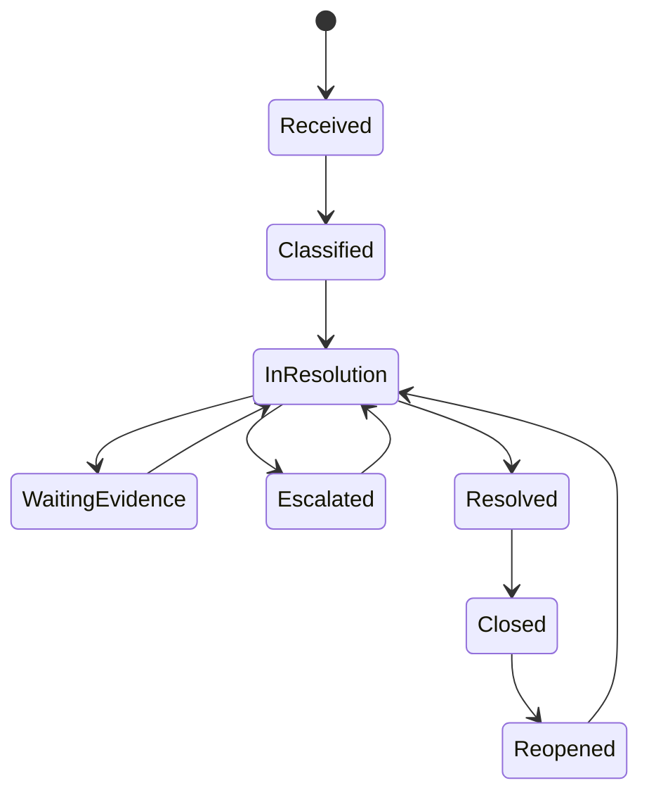

# P22 — Customer Service-to-Recovery

Status: SOP-level business process specification · desk-research baseline

## 1. Purpose

Resolve customer issues consistently while protecting trust, margin, fraud controls and operational learning.

## 2. Scope

Includes:

- complaint/intake;
- issue classification;
- ownership and SLA;
- immediate service recovery;
- investigation;
- compensation approval;
- customer communication;
- escalation;
- closure;
- root-cause feedback to operations/product/supplier.

## 3. Channels

- in-store;
- phone/contact center;
- email/chat/social;
- ecommerce/omnichannel;
- B2B account manager;
- route sales/service.

## 4. Actors

Customer, Cashier/Service Desk, Store Manager, Customer Service, Ecommerce/Operations, Category/Quality, Finance, Logistics, Supplier/Partner where relevant.

## 5. Issue categories

- price/promotion dispute;
- product quality/safety;
- service behavior;
- missing/wrong item;
- payment/refund issue;
- loyalty issue;
- delivery/pickup failure;
- return-policy exception;
- privacy/consent concern;
- B2B delivery/credit dispute.

## 6. Lifecycle

## 7. Flow

1. Receive issue and identify customer/order/transaction if possible.
2. Capture customer expectation and factual description.
3. Classify severity/category/channel.
4. Assign owner and SLA.
5. Provide immediate recovery when policy allows.
6. Gather evidence: receipt, price label, delivery/POD, payment status, loyalty ledger, product/quality evidence.
7. Determine root cause and entitlement.
8. Approve compensation/exception above threshold.
9. Communicate resolution clearly.
10. Execute refund/replacement/credit/points/other action through the correct underlying process.
11. Confirm customer outcome.
12. Close with reason/root-cause coding.
13. Feed recurring issues into corrective-action review.

## 8. Recovery options

- explanation/apology;
- price correction;
- refund/exchange;
- replacement/re-delivery;
- voucher/store credit where policy allows;
- loyalty points adjustment;
- fee/shipping waiver;
- B2B credit note/claim;
- supplier escalation;
- safety recall/quality escalation.

## 9. High-risk escalation

Immediate escalation for:

- food/product safety;
- injury/security incident;
- suspected fraud;
- personal-data issue;
- repeated payment capture;
- high-value B2B claim;
- social/public incident with material reputation risk.

## 10. Controls

- compensation authority matrix;
- link compensation to issue evidence;
- no duplicate refund/compensation;
- manual loyalty adjustment reason/approval;
- high-value or repeated customer claims reviewed;
- product-safety complaint routed to quality process;
- root cause not overwritten by compensation outcome.

## 11. KPIs

- first-contact resolution;
- time to resolution;
- reopen rate;
- compensation cost;
- complaint rate per 1,000 transactions/orders;
- repeated issue rate;
- customer satisfaction after resolution;
- root-cause recurrence;
- escalation rate.

## 12. Worked example

Customer reports an advertised promotion did not apply and requests double compensation. Service recovery should first verify transaction/promotion eligibility and actual loss. Compensation above the verified entitlement should follow policy/approval rather than be granted ad hoc by the cashier.

## 13. Open retailer-policy questions

- service-level targets by channel/severity;
- compensation authority limits;
- goodwill compensation forms;
- no-receipt complaint handling;
- product-safety escalation protocol;
- customer abuse/repeated-claim rules;
- public/social escalation ownership.
