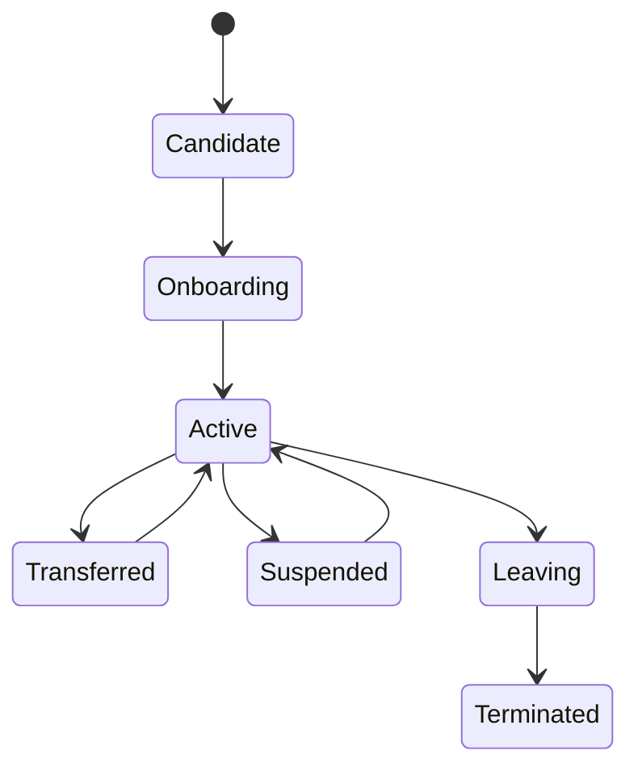

# P24 — Workforce Lifecycle, Authority and Scheduling

Status: SOP-level business process specification · desk-research baseline

## 1. Purpose

Ensure the right people are authorized, scheduled and accountable for retail work while preventing incompatible duties and unmanaged access.

## 2. Scope

Includes:

- employee onboarding/offboarding;
- store/region assignment;
- role and authority assignment;
- training/readiness confirmation;
- shift planning/scheduling;
- attendance and absence handling;
- temporary transfer/coverage;
- manager override authority;
- segregation-of-duties review;
- access review and termination.

## 3. Actors

HR/People, Store/Regional Manager, Operations, Finance/Control, Security/IT Access Administration, Employee, Payroll/Timekeeping where applicable.

## 4. Evidence

- employee profile/status;
- role/authority matrix;
- store assignment;
- training/qualification record;
- work schedule;
- attendance/absence evidence;
- temporary coverage approval;
- access/authority change log;
- periodic access-review record;
- termination/handover checklist.

## 5. Employee lifecycle

## 6. Onboarding flow

1. confirm employment/engagement approval;
2. assign employee identity;
3. assign home store/function;
4. assign role and authority according to job;
5. confirm required training/qualification;
6. issue required keys/device/register/access custody;
7. schedule first working period;
8. manager confirms readiness;
9. employee becomes active for approved duties.

## 7. Authority model

Authority should distinguish at minimum:

- ordinary cashier/sales action;
- price override;
- manual discount;
- void/cancel;
- return/refund;
- cash paid-in/out;
- stock adjustment;
- receiving/PO approval;
- credit-hold release;
- supplier/customer master change;
- business-day close;
- sensitive report/access.

Job title alone should not imply unlimited authority.

## 8. Segregation of duties

High-risk combinations to review:

- buyer creates and approves own high-value PO;
- receiver also resolves supplier invoice discrepancy without independent review;
- cashier approves own material cash variance;
- employee creates stock adjustment and approves it;
- salesperson changes customer credit limit and releases own blocked order;
- user creates supplier bank/master change and authorizes payment.

Small stores may require compensating review rather than perfect separation.

## 9. Scheduling process

1. forecast workload by store/day/daypart;
2. identify required roles and minimum coverage;
3. consider employee availability, legal/contractual constraints and skill;
4. build schedule;
5. manager reviews gaps/overtime;
6. publish schedule;
7. handle swap/leave/absence;
8. record actual attendance/coverage;
9. compare labor used vs workload/service;
10. improve next schedule.

## 10. Staffing exception handling

- no-show;
- late arrival;
- unexpected demand spike;
- critical role absent;
- employee moved to another store;
- overtime approval;
- schedule change after publication;
- temporary manager/cashier authority;
- training expired/incomplete.

## 11. Offboarding / suspension

1. record effective date/status;
2. stop future scheduling;
3. remove store/register/financial authority;
4. retrieve keys/device/assets;
5. complete cash/stock/customer handover where applicable;
6. preserve historical actor attribution;
7. confirm access disabled;
8. close employment/contract process.

Historical transactions must remain attributable after access is removed.

## 12. Controls

- least authority necessary;
- role changes approved;
- temporary elevation time-bounded;
- periodic access review;
- terminated/suspended workers cannot continue operational access;
- high-risk SoD conflicts identified and mitigated;
- actual attendance differs visibly from planned schedule;
- manager override attributable to actor/reason.

## 13. KPIs

- schedule coverage %;
- labor hours vs plan;
- overtime rate;
- absence/no-show rate;
- schedule change rate;
- labor cost % sales;
- transactions/sales per labor hour;
- access-review completion;
- unauthorized/expired-access exceptions;
- training/readiness compliance.

## 14. Worked example

A small store manager may need to receive stock and approve a count variance because staffing is limited. The process should record this as a SoD exception with compensating regional review rather than pretending full role separation exists.

## 15. Research anchors

- APQC PCF 8.0 human-capital and process-governance families.
- Existing BeePOS actor/RACI and control matrices.

## 16. Open retailer-policy questions

- minimum role coverage by store format;
- scheduling horizon;
- overtime/swap authority;
- temporary transfer rules;
- SoD conflict matrix;
- access-review cadence;
- training requirements by role;
- suspension/offboarding SLA.
