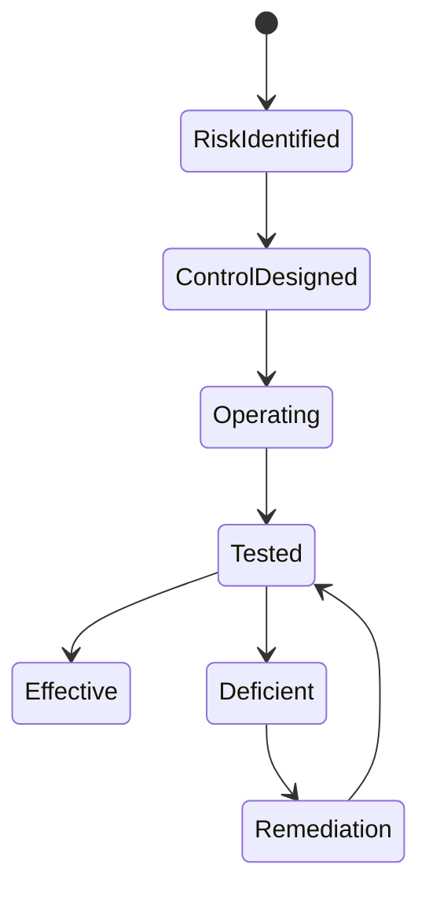

# P25 — Risk, Compliance and Business Continuity

Status: SOP-level business process specification · desk-research baseline

## 1. Purpose

Identify, control and evidence material retail operating risks; maintain statutory/fiscal evidence; and preserve minimum viable operations during outages or disruptions.

## 2. Scope

Includes:

- business-control catalogue;
- control ownership/testing;
- material exception escalation;
- fraud/anomaly response;
- tax/e-invoice operating evidence;
- regulatory change intake;
- outage/manual fallback procedure;
- recovery and reconciliation after disruption;
- incident evidence retention.

P08 Sales-to-Assurance remains the detailed sales-audit process; this SOP governs the broader control/compliance/continuity layer.

## 3. Actors

Risk/Internal Control, Finance/Tax, Store Operations, IT/Digital, Legal/Compliance where applicable, Security/Loss Prevention, Process Owners, External fiscal/payment providers, Store Manager.

## 4. Control domains

- sales/void/refund/discount;
- cash/tender;
- stock/count/adjustment;
- supplier/PO/receiving/AP;
- B2B credit/AR;
- master-data changes;
- loyalty/manual points;
- route stock/cash;
- fiscal/e-invoice;
- outage/manual operations.

## 5. Business-control lifecycle

## 6. Control design

For each material risk define:

- risk statement;
- process/owner;
- preventive/detective control;
- frequency;
- responsible performer;
- required evidence;
- approval/SoD;
- exception threshold;
- escalation path;
- retention expectation.

## 7. Fiscal / e-invoice operating process — Vietnam baseline

The current legal baseline must be validated against official law and tax guidance before operational go-live.

At business-process level:

1. identify transactions requiring fiscal/e-invoice treatment;
2. ensure seller/buyer/transaction information required by law/policy is available;
3. issue fiscal document at the required business moment;
4. deliver/retain evidence according to applicable rules;
5. monitor rejected/failed/pending issuance;
6. prevent duplicate issuance during retry;
7. process adjustment/replacement/cancellation through authorized procedure;
8. reconcile commercial transaction to fiscal-document outcome;
9. retain provider/tax-authority acknowledgement and exception evidence;
10. review regulatory changes and update SOP/policy.

Vietnam Government Decree 254/2026/NĐ-CP was issued 30 June 2026 and effective 1 July 2026, governing e-invoices/e-documents under the 2025 Tax Administration Law. It therefore supersedes older research assumptions that only cited Decree 70/2025 as the current top-level operating reference.

## 8. Regulatory-change process

1. receive official legal/regulatory update;
2. assign accountable owner;
3. assess impacted processes/forms/controls/training;
4. determine effective date;
5. approve policy/SOP change;
6. train affected operators;
7. implement before effective date;
8. verify readiness and retain evidence.

## 9. Business continuity — outage categories

- internet/network unavailable;
- POS/device failure;
- payment-provider outage;
- fiscal/e-invoice provider outage;
- power failure;
- central system unavailable;
- warehouse/store unable to access normal process;
- cyber/security incident;
- severe physical/store disruption.

## 10. Continuity flow

1. detect and classify incident;
2. determine whether business may safely continue;
3. activate approved fallback/manual/offline procedure;
4. preserve actor/time/transaction/evidence identity;
5. restrict high-risk actions if controls cannot operate;
6. communicate incident status and escalation;
7. recover normal service;
8. reconcile offline/manual activity to trusted records;
9. investigate gaps/duplicates/loss;
10. close incident with lessons/action.

## 11. Minimum continuity principles

- do not invent undocumented transactions;
- manual/offline records remain uniquely identifiable;
- duplicate payment/invoice risk explicitly controlled;
- cashier/store authority limits still apply where possible;
- high-risk operations may be prohibited during degraded mode;
- recovery includes reconciliation, not merely system restart;
- incident evidence retained.

## 12. Exceptions / incidents

- repeated fiscal issuance failure;
- duplicate invoice/payment risk;
- cash transaction captured manually but not synchronized;
- manual price/discount used during outage;
- stock sold while central availability stale;
- missing outage transaction sequence;
- control evidence unavailable;
- legal effective date approaching without readiness.

## 13. Controls

- official-source legal register;
- named compliance/process owner;
- material regulatory change tracked to closure;
- continuity playbook by incident class;
- manual/offline forms/evidence controlled;
- recovery reconciliation mandatory;
- sensitive actions reason/approval recorded;
- periodic control/continuity test;
- unresolved compliance/control deficiency escalated.

## 14. KPIs

- control effectiveness/pass rate;
- material control exceptions;
- open deficiency aging;
- fiscal issuance failure/rejection rate;
- unresolved fiscal discrepancy aging;
- outage duration;
- transactions processed in degraded mode;
- recovery reconciliation completion time;
- duplicate/missing transaction incidents;
- continuity-test completion.

## 15. Worked example

A payment provider times out after customer confirmation. The store must not immediately retry a charge and risk duplicate capture. Continuity procedure should preserve the transaction/payment reference, classify payment as uncertain, resolve status, and only then collect/retry according to policy.

## 16. Research anchors

- Vietnam Government Decree 254/2026/NĐ-CP: https://chinhphu.vn/?classid=1&docid=218689&pageid=27160
- Official gazette: https://congbao.chinhphu.vn/van-ban/nghi-dinh-so-254-2026-nd-cp-469957/66826.htm
- APQC PCF 8.0 governance/risk/process families.
- Oracle Retail Sales Audit as transaction-control benchmark.

## 17. Open retailer-policy questions

- control-risk taxonomy and severity;
- evidence-retention periods;
- fiscal provider/process ownership;
- outage actions allowed/prohibited;
- offline/manual transaction thresholds;
- incident severity/escalation;
- continuity-test cadence;
- legal update sign-off authority.
