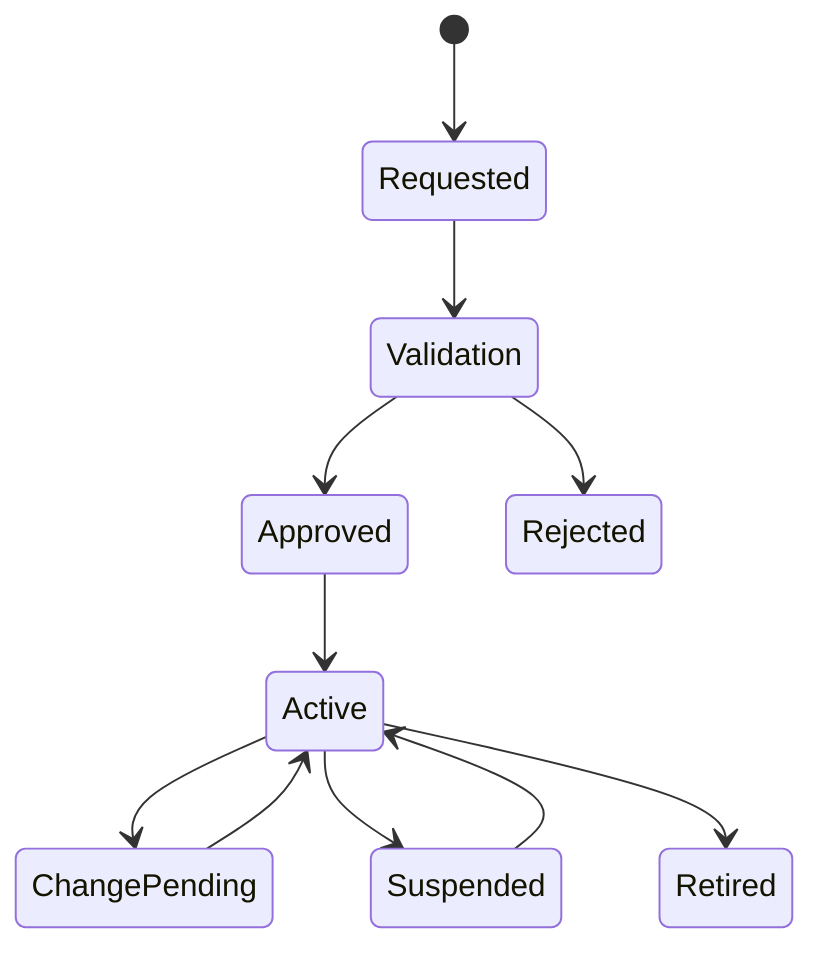

# P26 — Master Data, Reporting and KPI Governance

Status: SOP-level business process specification · desk-research baseline

## 1. Purpose

Govern the creation, change, quality and use of critical business master data and ensure operational/management reports and KPIs have defined ownership, formulas, cutoffs and exception handling.

## 2. Scope

Includes:

- product/SKU master governance;
- supplier master;
- store/location master;
- customer/B2B account master;
- employee/role reference data;
- price/promotion/reason-code reference data;
- report catalogue;
- KPI definition and ownership;
- data-quality monitoring;
- missing/duplicate/inconsistent data exception;
- change control and periodic review.

## 3. Actors

Data Steward/Master Data, Category, Procurement, Operations, Finance, HR/Workforce, CRM, Analytics/BI, Risk/Control, Process Owners.

## 4. Master-data lifecycle

## 5. Master-data request process

1. identify business need and master object;
2. collect mandatory evidence/attributes;
3. check duplicates/existing relationships;
4. validate ownership and commercial/legal attributes;
5. approve sensitive fields by authority;
6. publish effective-dated change where appropriate;
7. communicate downstream impact;
8. verify successful business use;
9. retain change history and reason.

## 6. High-risk master changes

Examples:

- product identifier/barcode;
- UOM/pack conversion;
- supplier/customer payment/bank details;
- tax/fiscal classification;
- cost/price source information;
- store/location status;
- customer credit terms/limit;
- employee authority;
- reason-code definitions affecting controls.

These require stronger approval/evidence than ordinary descriptive changes.

## 7. Data-quality dimensions

- completeness;
- uniqueness;
- validity;
- consistency;
- timeliness;
- referential/business relationship integrity;
- effective-date correctness.

## 8. Report governance

For every material report define:

- business purpose;
- owner;
- audience;
- source business events/data;
- cutoff/business date;
- filters/scope;
- reconciliation/control totals;
- refresh frequency;
- exception interpretation;
- retention/distribution rules.

## 9. KPI definition standard

Every KPI should document:

- name and business question;
- formula/numerator/denominator;
- unit;
- grain (store/SKU/customer/etc.);
- time basis/business date;
- inclusions/exclusions;
- source/evidence;
- owner;
- target/threshold;
- action expected when off target.

Avoid terms like “sales”, “margin”, “stockout” or “active customer” without definition.

## 10. KPI lifecycle

1. propose KPI from business objective;
2. define formula and source;
3. validate with process/finance/data owners;
4. test historical output;
5. approve target/threshold;
6. publish to report/scorecard;
7. monitor interpretation/data quality;
8. change definition only through versioned governance;
9. retire obsolete KPI explicitly.

## 11. Operational reporting families

- sales/store/day;
- price/promotion;
- returns/refunds;
- cash/tender;
- inventory/count/shrinkage;
- replenishment/OOS;
- supplier/PO/receipt;
- AP/AR/credit;
- loyalty/customer;
- wholesale/route;
- omnichannel fulfillment;
- control/compliance exceptions.

## 12. Data-quality exception process

1. detect anomaly/missing/duplicate/inconsistent data;
2. determine whether it is real business exception or data defect;
3. identify process/master/source owner;
4. contain downstream impact if material;
5. correct through authorized business process;
6. reconcile affected report/KPI;
7. record root cause;
8. monitor recurrence.

Do not “fix the dashboard” by editing historical facts without business evidence.

## 13. Controls

- named data owner/steward by domain;
- duplicate prevention/review;
- sensitive master-field approval;
- effective-date controls;
- change history/reason;
- report/KPI definitions versioned;
- financial/operational reconciliation for critical reports;
- material data-quality issue tracked to closure;
- access restricted for sensitive customer/employee/commercial data.

## 14. KPIs

- master-data completeness;
- duplicate rate;
- change turnaround time;
- rejected change rate;
- data-quality exception count/aging;
- report reconciliation failure rate;
- KPI definition coverage;
- stale/unused report rate;
- recurring defect rate.

## 15. Worked example

If “gross margin” in a store dashboard uses current product cost while Finance uses historical COGS, both reports may be internally consistent yet answer different questions. KPI governance must define the formula/source rather than treating the label as self-explanatory.

## 16. Research anchors

- APQC PCF 8.0 definitions/key measures and process taxonomy.
- Oracle Retail Merchandising item/supplier/location master references.
- GS1 identification standards for product/logistics identifiers.

## 17. Open retailer-policy questions

- master-data ownership by object;
- sensitive-field approval matrix;
- duplicate-resolution policy;
- business-date/cutoff standard;
- KPI dictionary owner;
- official-report hierarchy;
- report retention/distribution;
- data-quality severity/SLA.
