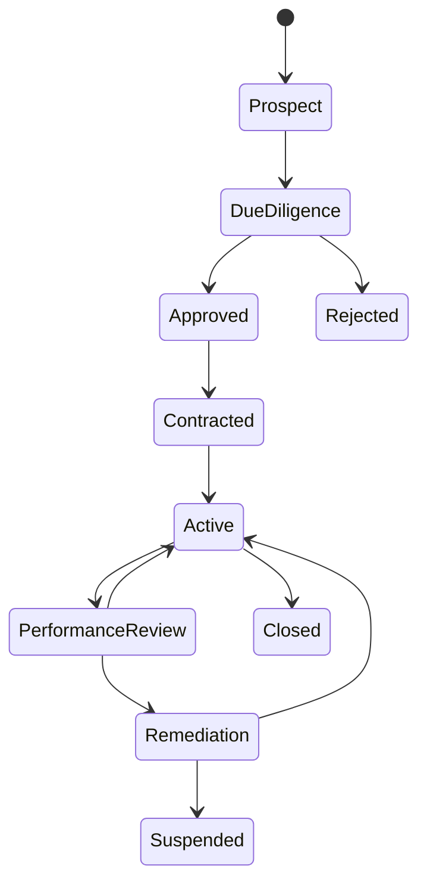
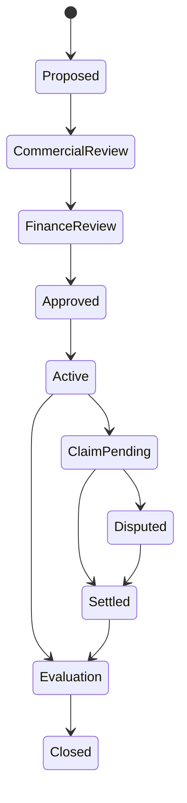

# P27 — Trade Promotion and Dealer Management

Status: SOP-level business process specification · desk-research baseline

## 1. Purpose

Govern dealer/distributor commercial terms, trade promotions, rebates and sell-in/sell-out performance so channel growth is measured against true commercial cost and agreed obligations.

## 2. Scope

Includes:

- dealer/distributor onboarding and tiering;
- territory/channel assignment;
- commercial agreement;
- trade-promotion planning;
- funding/budget approval;
- discount/rebate mechanics;
- execution evidence;
- sell-in/sell-out tracking;
- claim/accrual/settlement;
- post-event evaluation;
- dealer performance review.

Wholesale order/credit/delivery is covered in P13; route execution is covered in P14. This SOP covers channel-commercial management above those transactions.

## 3. Actors

Commercial Director, Key Account/Dealer Manager, Trade Marketing, Sales, Finance, Credit Control, Distributor/Dealer, Category/Product, Analytics.

## 4. Dealer commercial profile

Typical attributes/policies:

- account tier;
- territory/channel;
- authorized products;
- contract/customer price;
- payment/credit terms;
- standard discount;
- volume/rebate agreement;
- promotional support;
- display/listing/activation obligations;
- sales target;
- return/stock-rotation rights;
- reporting/sell-out obligations.

## 5. Dealer lifecycle

## 6. Trade-promotion lifecycle

## 7. Stage A — Promotion proposal

Define:

- objective;
- participating account/territory/channel;
- products/categories;
- period;
- mechanic;
- expected sell-in/sell-out uplift;
- funding owner;
- expected margin impact;
- execution evidence required;
- claim/settlement method;
- stop/overrun rules.

## 8. Promotion / rebate mechanics

Examples:

- invoice discount;
- off-invoice allowance;
- volume rebate;
- growth rebate;
- listing/display allowance;
- sell-out incentive;
- bundle/case deal;
- target achievement bonus;
- co-funded promotion.

SAP trade-promotion references explicitly support conditions and rebates and tiered growth rebates, demonstrating why rebate agreements are different from ordinary item price discounts.

## 9. Sell-in vs sell-out

- **Sell-in:** goods sold by manufacturer/wholesaler to dealer/distributor.
- **Sell-out:** dealer/distributor sale onward to retailer/end customer.

A promotion can create high sell-in without healthy sell-out, leading to channel stuffing/excess dealer stock. Performance review should separate these measures where data exists.

## 10. Stage B — Execution

1. communicate approved terms/mechanic;
2. ensure participating accounts/products/period are correct;
3. confirm stock readiness;
4. capture execution evidence where required;
5. monitor sell-in/sell-out and budget consumption;
6. manage account disputes/exception;
7. stop/adjust only through authorized change.

## 11. Claims and settlement

1. dealer submits or system calculates eligible claim/accrual;
2. validate period/product/customer/performance;
3. validate required proof/execution evidence;
4. compare claim to agreement/accrual;
5. approve, partially approve or reject;
6. issue credit/rebate settlement;
7. reconcile accrual vs actual;
8. close dispute and retain evidence.

## 12. Dealer performance review

Review:

- sell-in;
- sell-out;
- stock cover/aging where available;
- target achievement;
- payment behavior/overdue AR;
- returns/claims;
- rebate/trade-spend rate;
- distribution/coverage;
- promotion execution;
- margin after commercial support.

## 13. Exceptions

- claim exceeds agreement;
- duplicate claim;
- sales outside eligible period/product;
- target achieved through abnormal one-time stock loading;
- missing execution evidence;
- dealer overdue but promotion asks more credit/support;
- rebate tier disputed;
- sell-in high but sell-out weak;
- dealer territory/channel conflict;
- promotion budget exhausted.

## 14. Controls

- approved agreement before benefit;
- promotion/trade-spend budget ownership;
- dealer manager cannot unilaterally settle material claim;
- claim evidence and duplicate check;
- accrual and settlement reconciled;
- credit risk considered independently from sales target;
- changes effective-dated/versioned;
- sell-in and sell-out not conflated;
- post-promotion profitability reviewed.

## 15. KPIs

- sell-in growth;
- sell-out growth;
- dealer target attainment;
- trade spend % sales;
- rebate/accrual accuracy;
- claim dispute rate;
- claim settlement cycle time;
- net revenue after trade spend;
- dealer gross margin/contribution where available;
- stock cover/aging;
- distribution reach;
- promotion ROI/incrementality.

## 16. Worked example

Dealer receives a tiered annual rebate: 1% at 5% growth, 2% at 10%, 3% at 15%. If large December sell-in pushes growth to 15% but dealer sell-out and stock aging deteriorate sharply, management should see both rebate entitlement and channel-inventory risk rather than interpreting sell-in alone as successful demand.

## 17. Research anchors

- SAP Conditions and Rebates in Trade Promotions: https://help.sap.com/docs/SAP_CUSTOMER_RELATIONSHIP_MANAGEMENT/60f0c9d745b446b694566eef8fc46e14/4601a2638aa1703fe10000000a155369.html
- SAP Tiered Growth Rebates: https://help.sap.com/docs/SAP_CUSTOMER_RELATIONSHIP_MANAGEMENT/60f0c9d745b446b694566eef8fc46e14/692135d47b7c47acb977f2300c6dfc4f.html
- P13 Wholesale Order-to-Cash and P14 Route-to-Settlement.

## 18. Open retailer-policy questions

- dealer tiers and approval;
- territory exclusivity;
- eligible trade-spend mechanics;
- accrual basis;
- proof-of-performance requirements;
- sell-out data requirements;
- claim SLA/authority;
- rebate tiers;
- treatment of overdue dealers;
- promotion ROI threshold.
